# git图形化界面操作

<!-- toc -->

### IDEA中配置Git

1. 设置Git路径：

   在File-->Setting->Version Control-->Git-->Path to Git executable选择你的git安装后的git.exe文件，然后点击Test，测试是否设置成功。

   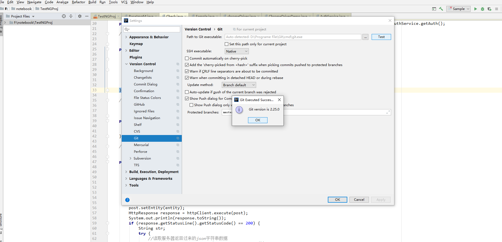

2. 设置GitHub账号信息：

   在File-->Setting->Version Control-->GibHub-->Add account中添加GitHub账号信息。

   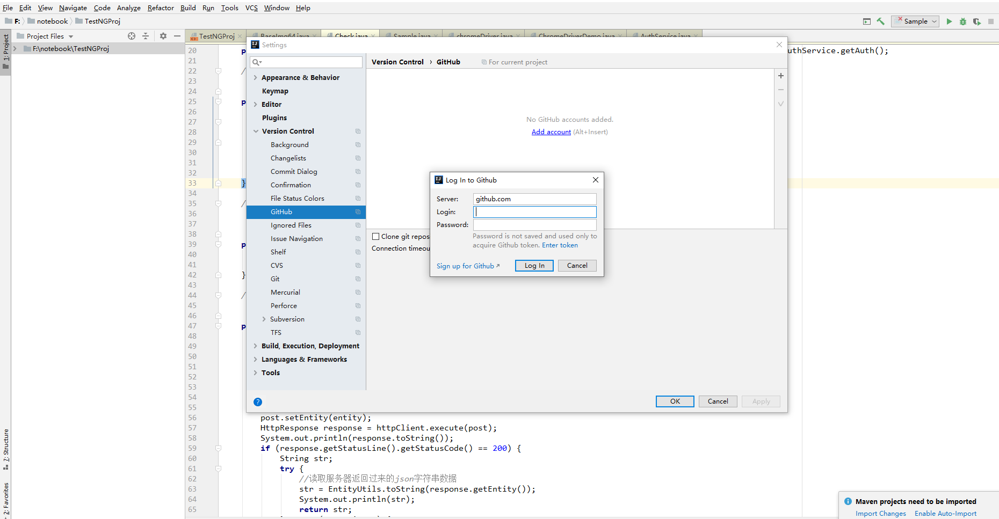

### IDEA中的Git操作

#### 新建本地仓库

 	在VCS-->Import into Version Control-->Create Git repoRepository，在弹框中选中项目所在的位置，点击OK，此时项目文件全部变成红色，表示文件未提交（若选中其他位置，则git-->add不可点选，不知为何）；

​	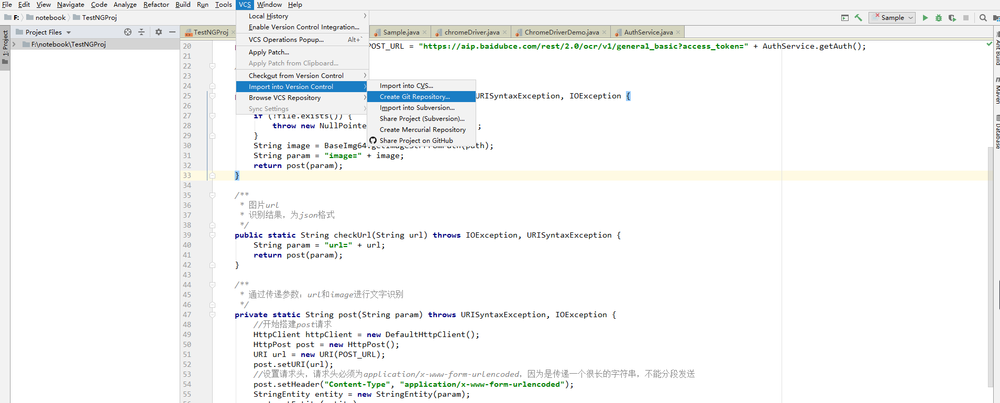

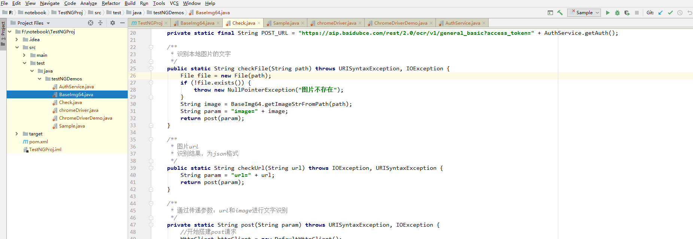

#### 忽略不必要文件

1. 编辑本地忽略文件配置:

   + GitHub官网样例文件：

     ```
     https://github.com/github/gitignore
     https://github.com/github/gitignore/blob/master/Java.gitignore
     ```

   + 在用户的根目录下新建忽略文件Java.gitignore(文件名随意)，将官网样例文件中的内容复制并保存；

   + 在~/.gitconfig文件（git的全局配置文件）中引入上述文件保存：

     ```
     [core]
     	excludesfile = C:/Users/oysx1/Java.gitignore
     ```

     ​	_一定要使用正斜线“/”，不能使用反斜线“\”_

   + 重启IDEA即可，已忽略的文件置灰

     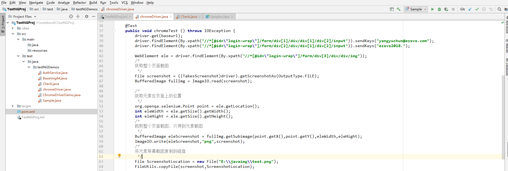

2. 在IDEA中安装插件进行忽略：

   + 安装.ignore插件：

     

   + 在项目中增加.gitingore文件：

     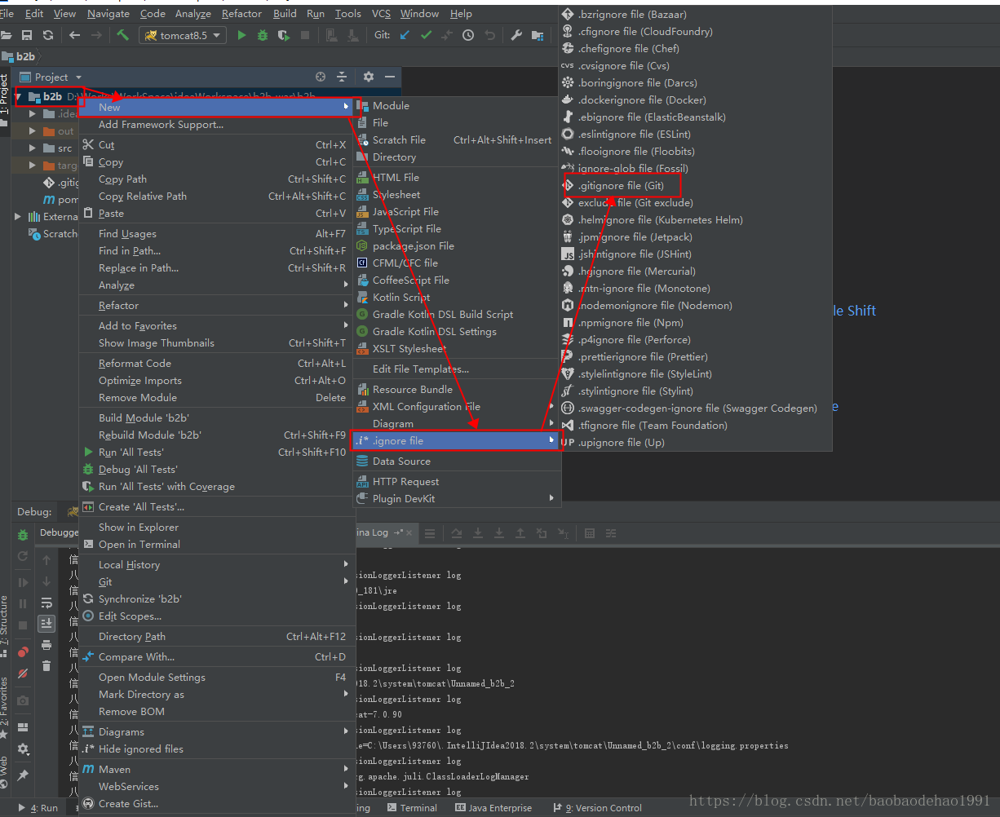

   + 配置过滤信息：

     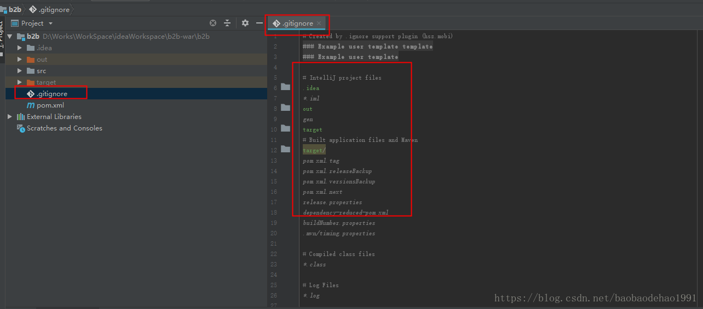

3. .gitignore只能忽略那些原来没有被track的文件，如果某些文件已经被纳入了版本管理中，则修改.gitignore是无效的。那么解决方法就是先把本地缓存删除（改变成未track状态），然后再提交：

   ```shell
   git rm -r –cached filePath
   git commit -m “remove xx”
   或者：
   git rm -r –cached .
   git add .
   git commit -m “update .gitignore”
   ```

   ​	_-r 是删除文件夹及其子目录 –cached 是删除暂存区里的文件而不删除工作区里的文件，第一种是删除某个文件，第二种方法就把所有暂存区里的文件删了，再加一遍，相当于更新了一遍_

#### IDEA中的本地库操作

1. 添加项目到暂存区：

   项目右键选择Git-->add，此时项目文件变成绿色，表示已经项目添加到暂存区，还未进入版本库；

   

   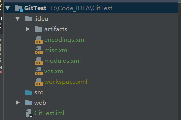

2. 添加项目到版本库：

   项目右键Git--> Commit Directory，在弹窗中输入Commit Message，点击commit，此时项目文件从暂存区真正进入版本库中，项目文件变成白色。

   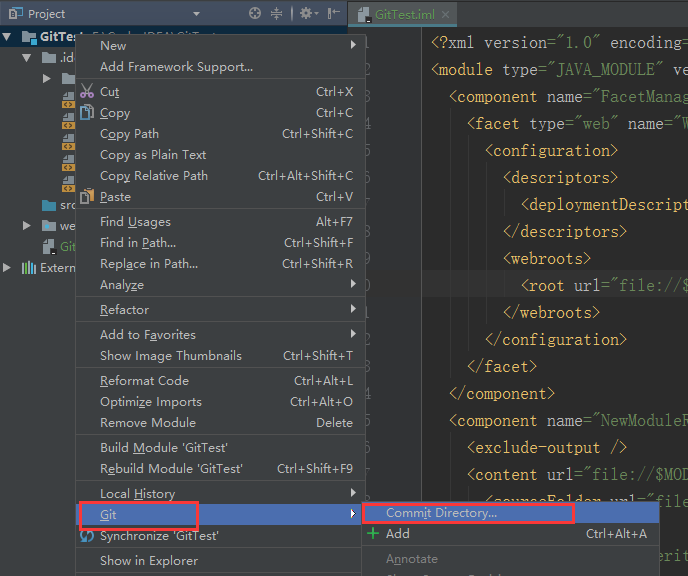

   


#### 推送远程仓库

1. 在GitHub中新建仓库，得到git地址；

2. IDEA中的项目提交到本地库之后，点击VCS>Git>push或者项目右键>Git>repoRepository>push；如果是第一次提交项目的话，Push Commit窗口是没有远程地址的，需要先进行添加，如果之前提交过的话，这里展示远程分支。

   

   


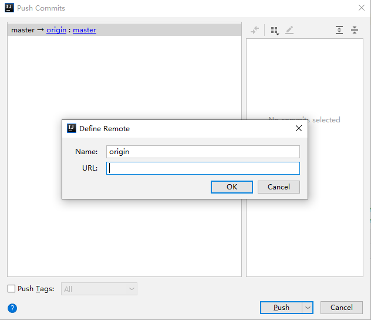

#### 从远程仓库克隆：

 + checkout

   菜单->VCS->Chekout from Version Control->Github（或者Git）

   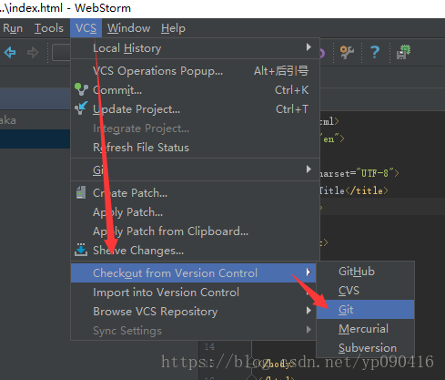

+ 输入项目参数，点击clone即可。

  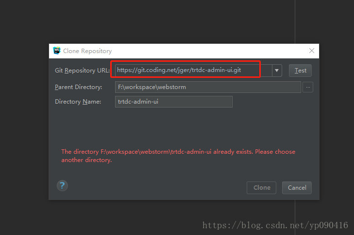

#### 更新项目、解决冲突

 + 按照图片中的步骤，顺序不能乱，先stash，然后pull，最后unstash；

   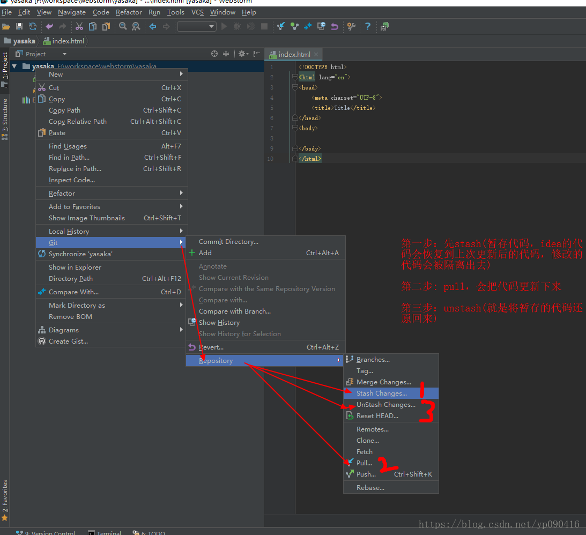

 + stash会让你输入标记名称，unstash的时候选择想要的标记；

   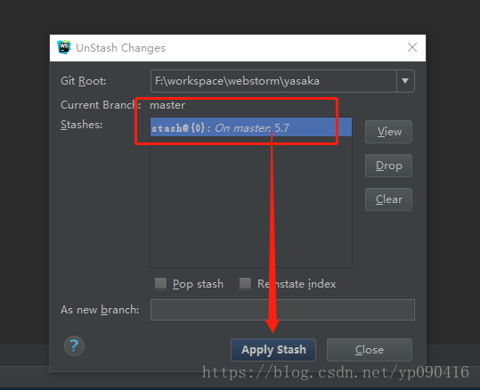

+ 如果代码有冲突，我们需要编辑冲突，我们一般选择merge，就是合并的意思，当然你也可以不合并直接使用线上的或者暂存里的代码；

  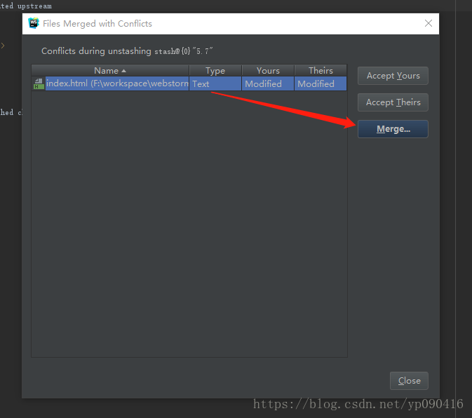

+ 合并代码的时候，图片中描述了，三屏分别对应的是什么；

  

#### 切换git分支

​	右下角有个当前分支名称，点击会谈出一分支信息。如果你想切换分支，选中分支，点击右键checkout即可。

​	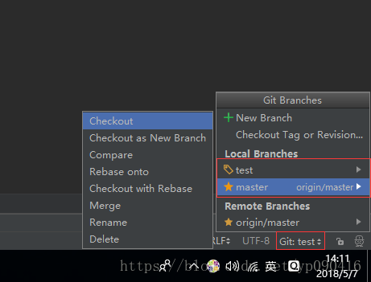


_该模块部分图片文字转自[腾讯云社区](https://cloud.tencent.com/developer/article/1147208),如有侵权，请联系删除_