# Git命令行操作
<!-- toc -->
### 本地库操作

#### 初始化操作

##### 本地库初始化

1. 命令：

   ```sh
   git init
   ```

2. 效果：

   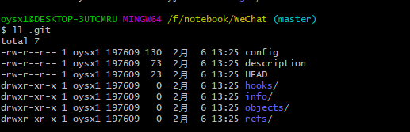

3. 注意：

   .git目录中存放的是本地库相关的子目录和文件，不要删除，也不要修改；

##### 设置签名

1. 形式：

   用户名：tom

   Email地址：helloworld@jack.com

2. 作用：

   区分不同开发人员的身份

3. 辨析：

   这里设置的签名和登录远程库（代码托管中心）的账号、密码没有任何关系

4. 命令：

   + 项目/仓库级别：仅在当前本地库范围有效

     ```shell
     git config
     git config user.name tom_pro
     git config user.email helloworld_pro@jack.com
     ```

      + 信息保存位置：.git/config文件

        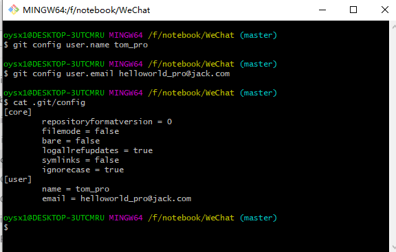

   + 系统用户级别：登录当前操作系统的用户范围

     ```shell
     git config --global
     git config --global user.name tom_glb
     git config --global user.email helloworld_glb@jack.com
     ```

     + 信息保存位置：~/.gitconfig文件

       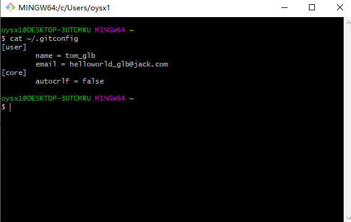

   + 优先级：

     + 就近原则：项目级别优先于系统用户级别，二者都有时采用项目级别的签名
     + 如果只有系统用户级别的签名，就以系统用户级别的签名为准
     + 二者都没有则不允许

#### 基本操作

##### 查看仓库状态

1. 命令：

   ```shell
   git status
   ```

2. 作用：

   查看工作区、暂存区状态

##### 添加到暂存区

1. 命令：

   ```shell
   git add [file name]
   ```

2. 作用：

   将工作区的“新建/修改”添加到暂存区

##### 提交操作

1. 命令：

   ```shell
   git commit -m "commit message" [file name]
   ```

2. 作用：

   将暂存区的内容提交到本地库

##### 查看历史记录

```shell
git log
```

​		

  + 多屏显示的控制方式：

    空格向下翻页

    b向下翻页

    q退出

```shell
git log --pretty=oneline
```

​		

```shell
git log --oneline
```

​		

```shell
git reflog
```

​		

​	**HEAD@{移动到当前版本需要多少步}**

##### 版本前进和后退

1. 前进后退历史版本操作记录的本质

   根据上图所示的HEAD指针进行移动

2. 基于索引值操作（推荐）

   ```shell
   git reset --hard [局部索引值]
   ```

   ​	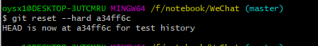

3. 使用^符号（只能后退）：

   ```shell
   git reset --hard HEAD^
   ```

   ​	注：一个^表示后退一步，多个^表示后退多步

   ​	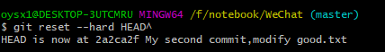

4. 使用~符号（只能后退）：

   ```shell
   git reset --hard HEAD~n
   ```

   ​	注：表示后退n步

   ​		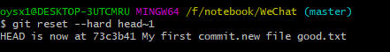

5. hard 和soft 以及mixed 参数对比

   + --soft参数:
     + 仅仅在本地库移动HEAD指针
   + --mixed参数：
     + 在本地库移动HEAD指针
     + 重置暂存区
   + --hard参数：
     + 在本地库移动HEAD指针
     + 重置暂存区
     + 重置工作区

##### 删除文件并找回

   + 前提：删除前，文件存在时的状态提交到了本地库

   + 操作：

     ```shell
     git reset --hard [指针位置]
     ```

     + 删除操作已经提交到本地库：指针位置指向的历史记录
     + 删除操作尚未提交到本地库：指针位置使用HEAD

##### 比较文件差异

```shell
git diff [file name]
```

   + 工作区中的文件和暂存区进行比较

```shell
git diff [本地库中历史版本][file name]
```

   + 将工作区中的文件和本地库历史记录比较

```shell
git diff
```

   + 不带文件名比较多个文件

#### 分支管理

##### 分支简介

​	在版本控制过程中，使用多条线同时推进多个任务。

​	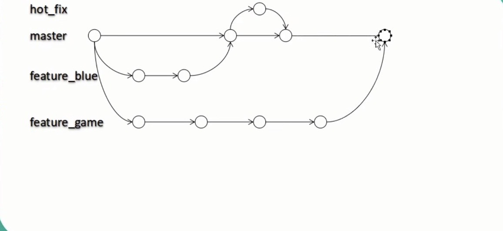

##### 分支优势

   + 同时并行推进多个功能开发，提高开发效率；
   + 各个分支在开发过程中，如果某一个分支开发失败，不会对其他分支有任何影响，失败的分支删除重新开始即可。

##### 分支操作

1. 创建分支：

   ```shell
   git branch [分支名]
   ```

2. 查看分支：

   ```shell
   git branch -v
   ```

3. 切换分支：

   ```shell
   git checkout [分支名]
   ```

4. 合并分支：

   + 第一步：切换到接收修改的分支上（被合并，增加新内容）

   ```shell
   git checkout [被合并的分支名]
   ```

   + 第二步：执行merge命令

   ```shell
   git merge [有新内容的分支]
   ```

5. 删除分支：

   ```shell
   #删除本地分支：
   git branch -d [本地分支名]
   #强制删除本地分支：
   git branch -D [本地分支名]
   #删除远程分支:
   git push origin --delete [远程分支]
   ```

   

6. 解决冲突：

   + 冲突的表现：

     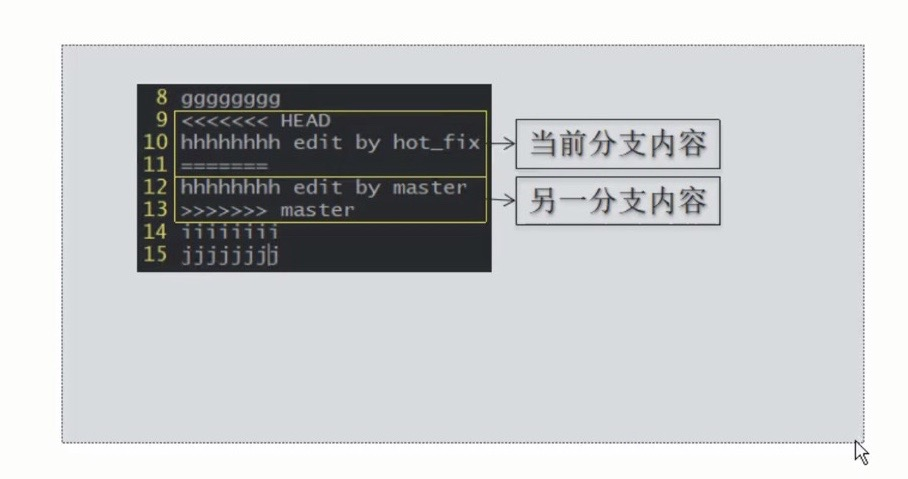

   + 冲突的解决：

     + 第一步：编辑文件，删除特殊符号；

     + 第二步：把文件修改到满意的程度，保存退出；

     + 第三步：git  add  [文件名]；

     + 第四步：git  commit  -m  "日志信息"

       ​	_注意：此时commit一定不能带具体文件名_

### Git基本原理

#### 哈希

 + 哈希是一个系列的加密算法，各个不同的哈希算法虽然加密强度不同，但有几个共同的特点，Git底层采用的是SHA-1的算法：

    + 不管输入的数据量有多大，输入同一个哈希算法，得到的加密结果长度固定；
    + 哈希算法确定，输入数据确定，输出数据能够保证不变；
    + 哈希算法确定，输入数据有变化，输出数据一定有变化，而且通常变化很大；
    + 哈希算法不可逆。

+ 哈希算法可以被用来验证文件，其原理如下：

  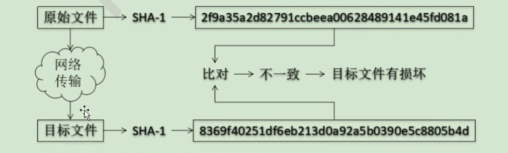

#### Git保存版本的机制

1. 集中式版本控制工具的文件管理机制：

   以文件变更列表的方式存储信息，这类系统将他们保存的信息看作是一组基本文件和每个文件随时间逐步累积的差异。

   ​	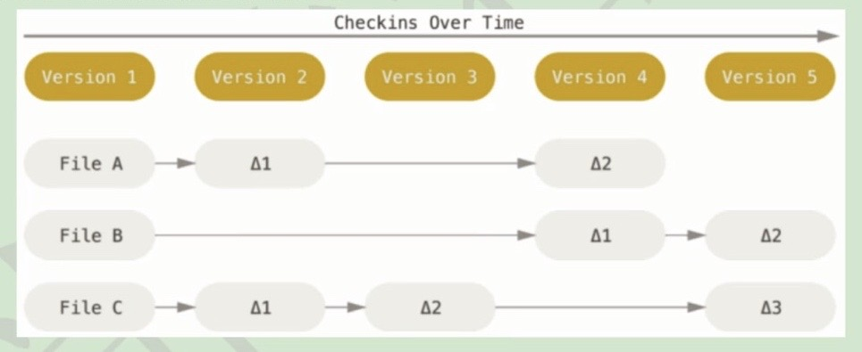

2. Git文件管理机制

   Git把数据看作是小型文件系统的一组快照，每次提交更新Git都会对当前的全部文件制作一个快照并保存这个快照的索引。为了高效，如果文件没有修改，Git不在重新存储该快照，而是保留一个链接指向之前存储的文件，所以Git的工作方式可以称为快照流。

   ​	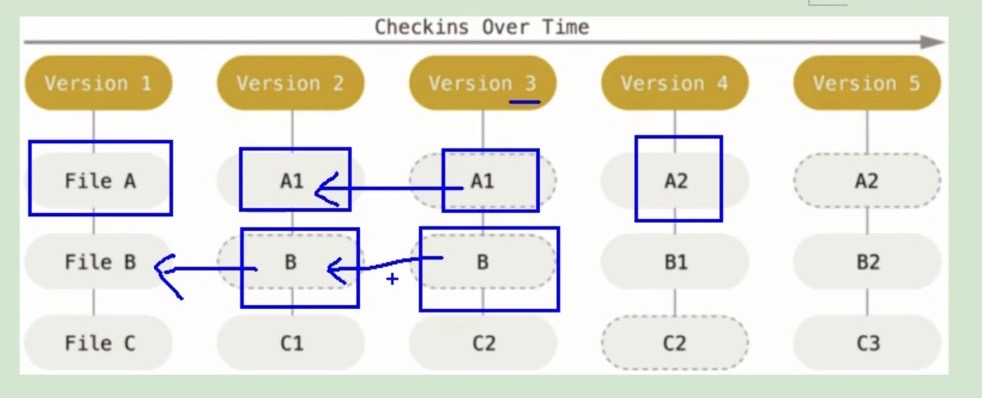

3. Git文件管理机制细节

   + Git的”提交对象“

     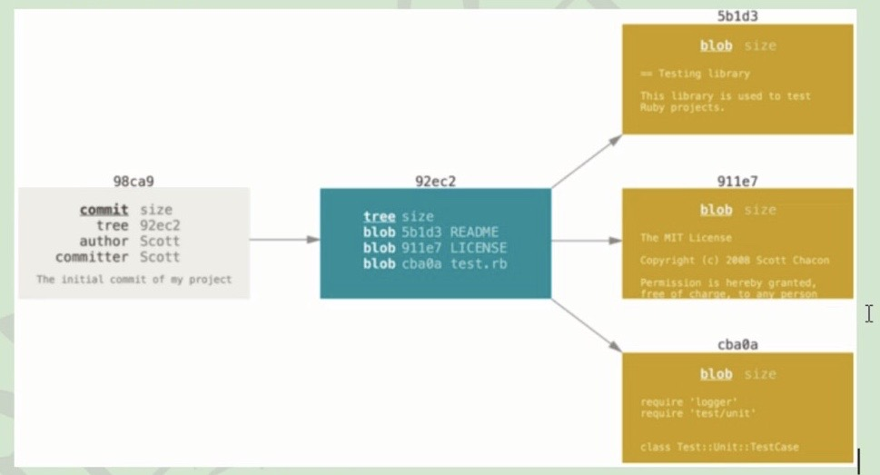

   + 提交对象及其父对象形成的链条

     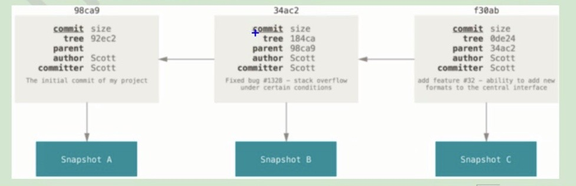

#### Git分支管理机制

1. 分支的创建：

   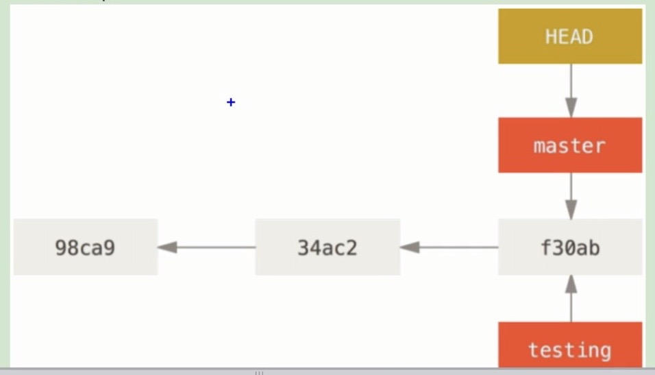

2. 分支的切换：

   创建分支是切换指针，切换分支是切换指针指向的位置。

### Github

#### 账号信息

​	https://github.com/

#### 创建远程库

​	登录Github创建远程库；

#### 本地创建远程库地址别名

   + 查看本地仓库中远程库地址别名：

     ```shell
     git remote -v
     ```

     ​	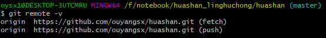

   + 建立远程库连接：

     ```shell
     git remote add origin [远程地址]
     ```

     ​	

     _注：origin是给远程地址起的别名，用origin代表远程地址https://github.com/ouyangsx/huashan.git_

#### 推送

```shell
git push origin [分支]
git push origin master
```

​	_注：master表示要推送到master分支上_

#### 克隆

 + 完整的把远程库下载到本地

 + 创建origin远程地址别名

 + 初始化本地库

   ```shell
   git clone [远程地址]
   ```

   ​	

#### 邀请团队成员

远程仓库>Settings>Collaboration>Add collaboration


#### 远程库修改的拉取

> pull = fetch + merge

```shell
#分开操作
git fetch [远程库地址别名][远程分支名]
git merge [远程地址别名/远程分支名]
```

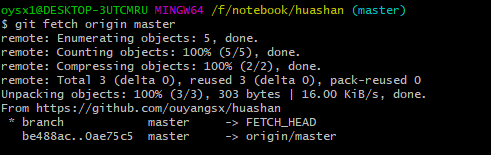

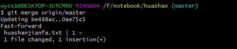

```shell
#合并操作
git pull [远程地址别名] [远程分支名]
```

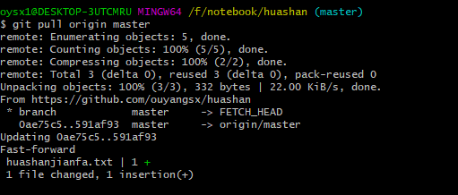

#### 解决冲突

 + 要点：

    + 如果不是基于Github远程库的最新版所作的修改，不能推送，必须先拉取；
    + 拉去下来后如果进入冲突状态，则按照“分支解决冲突”操作 解决即可；

+ 类比：

  + 债权人：老王
  + 债务人：小刘

  + 老王说：10天后归还，小刘接受，双方达成一致。
  + 老王媳妇说：5天后归还，小刘不能接受，老王媳妇需要找老王确认后再执行。

#### 跨团队协作操作

<iframe src="//player.bilibili.com/player.html?aid=24441039&cid=41039031&page=41" scrolling="no" border="0" frameborder="no" framespacing="0" allowfullscreen="true" width="500" height="500"> </iframe>
 + Fork

   

 + 本地修改，然后推送到远程

 + Pull Request

 + 审核代码

 + 合并代码

 + 将远程库修改拉取到本地

#### SSH免密登录

 + 进入当前用户的家目录：

   ```shell
   cd ~
   ```

 + 删除.ssh目录：

   ```shell
   rm -rvf .ssh
   ```

+ 运行命令生成.ssh密钥目录：

  ```shell
  ssh-keygen -t rsa-C [GitHub邮箱]
  ```

  ​	_注：此处的-C为大写的C_

+ 进入.ssh目录查看文件列表：

  ```shell
  cd .ssh
  ls -lF
  ```

+ 查看id_rsa.pub文件内容：

  ```shell
  cat id_rsa.pub
  ```

+ 复制id_rsa.pub文件内容，登录GitHub，点击头像>Settings>SSH and GPGkeys>New SSH Key；

+ 输入复制的密钥信息；

+ 回到Git Bash创建远程地址别名：

  ```shell
  git remote add origin_ssh [仓库ssh链接]
  ```

+ 推送文件进行测试

