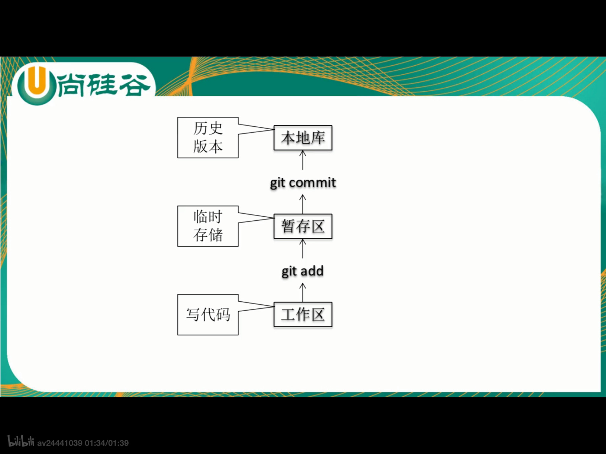
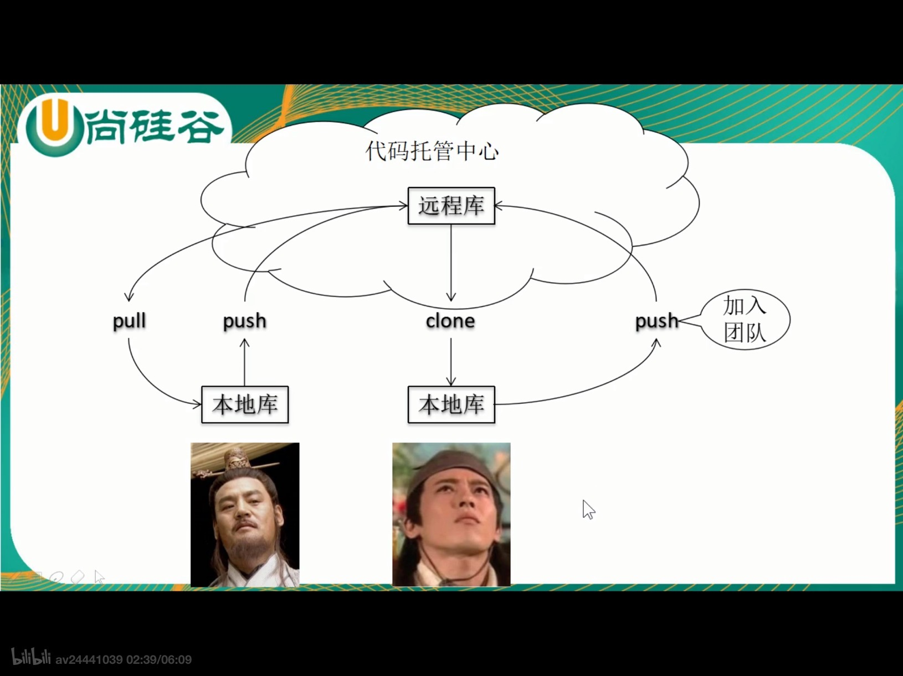
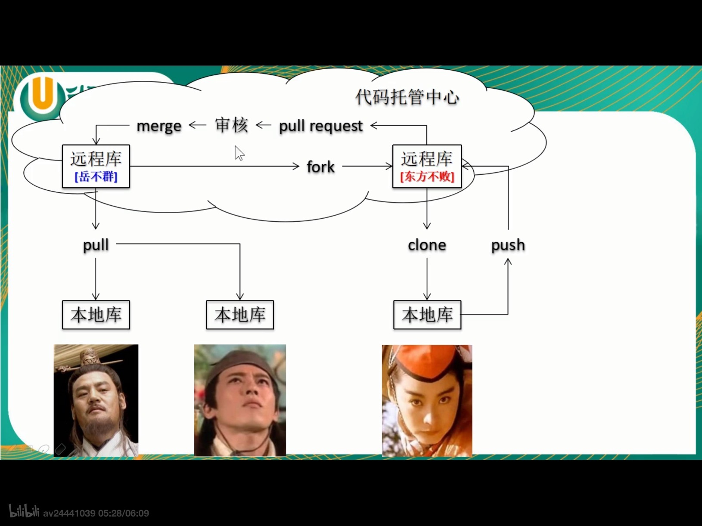
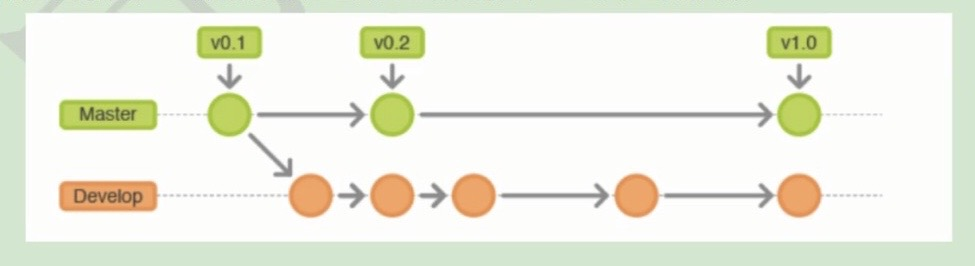
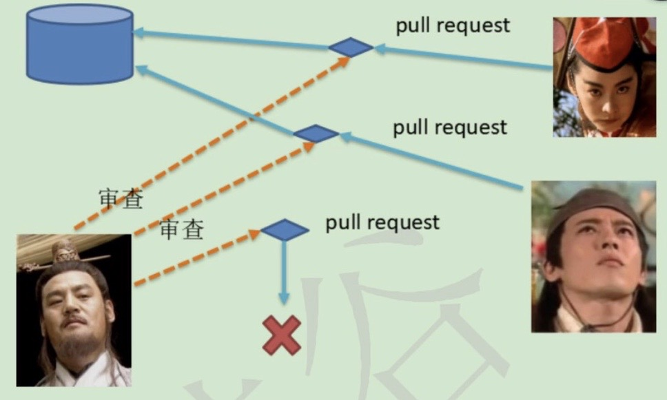
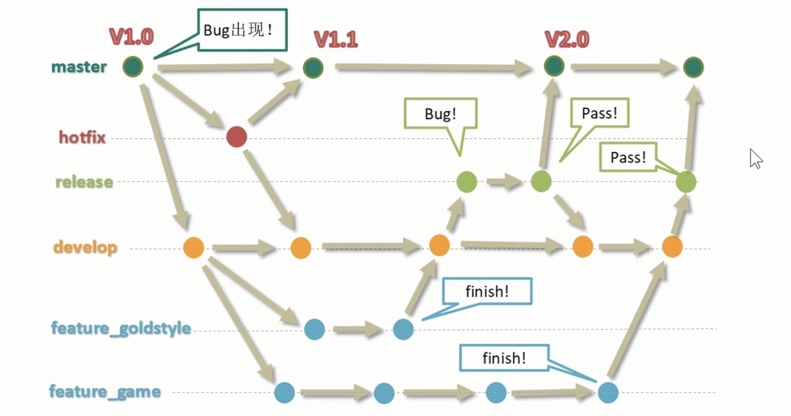

# Git介绍

<!-- toc -->

### 版本控制

1. 版本控制应该具备的功能：

   + 协同修改：
     + 多人并行不悖的修改服务器的同一个文件。
   + 数据备份：
     + 不仅保存目录和文件的当前状态，还能保存每一个提交过的历史状态。
   + 版本管理：
     + 在保存每一个版本的文件信息的时候要做到不保存重复数据，以节约存储空间，提高运行效率，这方面svn采用的是增量式管理的方式，而git采用了文件系统快照的方式。
   + 权限控制
     + 对团队中参与开发的人员进行权限控制。
     + 对团队外开发者贡献的代码进行审核——git独有。
   + 历史记录：
     + 查看修改人、修改时间、修改内容、日志信息。
     + 将本地文件恢复到某一个历史状态。
   + 分支管理：
     + 允许开发团队在工作过程中多条生产线同时推进，进一步提高效率。
2. 版本控制工具：
  
    1. 集中式版本控制工具（存在单点故障问题）：
    
       CVS、SVN、VSS、...
    
    2. 分布式版本控制工具(能够避免单点故障)：
    
       git、...

### Git介绍

1. Git的优势：

   + 大部分操作在本地完成，不需要联网；
   + 完整型保证；
   + 尽可能添加数据而不是删除或修改数据；
   + 分支操作非常快捷流畅
   + 与Linux命令全面兼容

2. Git结构：

   

3. Git和代码托管中心：

   代码托管中心的任务：维护远程库

   + 局域网环境下：
     + GitLab服务器：
   + 外网环境下：
     + GitHub
     + 码云

4. 本地库和远程库：

   + 团队内部协作

     > pull = fetch + merge

     

   + 跨团队协助
   
     

### Git工作流

1. 概念：

   在项目开发过程中使用git的方式。

2. 分类：

   + 集中式工作流：

     像SVN一样，集中式工作流以中央仓库座位所有修改的单点实体，所有修改都提到master分支上。这种方式与SVN的主要区别就是开发人员有本地库，GIt很多特性并没有用到。

     

   + GitFlow工作流：

     GitFlow工作流通过未功能开发、发布准备和维护设立了独立的分支，让发布迭代的过程更流畅，严格的分支模型也为大型项目提供了一些非常必要的结构。

     

   + Forking工作流

     Foring工作流是在GitFlow基础上，充分利用Git的Fork和pull request的功能以达到代码审核的目的，更适合安全可靠地管理大团队的开发者，而且能接受不信任贡献者的提交。

     

3. GitFlow工作流详解：

   + 分支种类：
     + 主干分支：master

       主要负责管理正在运行的生产环境代码，永远保持与正在运行的生产环境完全一致。

     + 开发分支：develop

       主要负责管理正在开发的代码，一般情况下应该是最新的代码。

     + bug修复分支：hotfix

       主要负责生产环境下出现的紧急修复的代码，从主干分支分出，修理完毕并测试上线后，并回主干分支，并回后，视情况可以删除分支。

     + 准生产分支：release

       较大的版本上线前，会从开发分支中分出准生产分支，进行最后阶段的集成测试，该版本上线后，会合并到主干分支，生产环境运行一段时间较为稳定后可视情况删除。

     + 功能分支：feature

       为了不影响较短周期的开发工作，一般会把中长期开发模块，会从开发分支中独立出来，开发完之后会合并到开发分支。

   + GitFlow工作流举例：

     