# javaSE一

<!-- toc -->

### 基本语法

#### 注释

+ 单行注释：//注释内容
+ 多行注释：/* 注释内容 */
+ 文档注释：/** 注释文档 */

#### 标识符

1. 含义：

   凡是Java中自己命名的，自己取名字的地方，如：类名、变量名、包名、方法名等。

2. 命名规则：

   + Java标识符只能使用26个英文字母、0-9的阿拉伯数字、下划线、美元符号，其他字符均不能用作标识符；
   + 标识符必须使用英文字母开头，数字不能开头；
   + Java的标识符严格区分大小写；
   + 不能使用Java的关键字、保留字和特殊值（一共53个），例如：class、public、static、void等；特殊值：true、false、null；

3. 命名规范：

   + 见名知意，动宾结构；
   + 驼峰命名法：
     + 类名、接口名：每一个单词的首字母大写；
     + 变量名、方法名：第一个单词首字母小写，其余单词首字母大写；
     + 包名：所有单词都小写，而且每一个单词之间使用“.”区分；
     + 常量名：所有单词都大写，而且每一个单词之间使用“_”连接；

#### 关键字、保留字和特殊值

1. 关键字：在Java中被赋予特定含义的单词：

   ```
   基本数据类型相关（8个）：byte、short、int、long、float、double、char、boolean
   流程控制语句相关（10个）：if、else、switch、case、default、break、for、while、do、continue
   判断某个对象是否是某种类型的实例对象运算符：instanceof
   定义类：class
   创建类的对象：new
   包相关：package、import
   权限修饰符：public、protected、（缺省）、private
   继承类：extends
   定义接口：interface
   实现接口：implements
   当前对象：this
   父类引用：super
   表示无返回值：void
   结束方法：return
   定义枚举：enum
   其他修饰符：abstract、static、final、native
   异常处理：try、catch、finally、throws、throw
   多线程同步和安全：synchronized、volatile
   和IO序列化相关：transient
   和单元测试相关：assert
   其他：strictfp
   ```

2. 保留字：在Java中注册但尚未使用：

   goto、const

3. 特殊值：

   true、false、null

#### 变量

1. 作用：

   保存数据，代表内存中的一块儿存储区域；本质是代表内存的一块存储区域

2. 变量的三个要素：

   + 变量名：见名知意，首字母小写，其余字母单词大写；
   + 变量值：
   + 变量的数据类型：决定变量的内存空间的大小，决定保存什么类型的值

3. 声明方式：

   数据类型  变量名；

   数据类型  变量名 = 初始化数据；

4. <a href='#class1'>分类：</a>

   + 局部变量；
   + 成员变量

   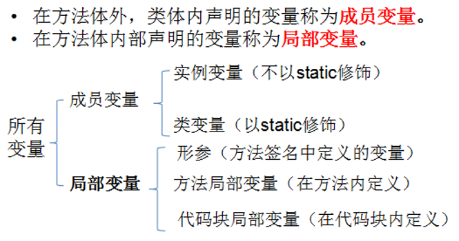

5. 要求：

   + 变量必须先声明，后使用；
   + 变量在使用之前必须有初始值；
   + <font color='red'>变量有作用域：从声明处开始，到所属的“}”结束；</font>
   + 变量的值要与变量的数据类型一致或者兼容；

#### 进制

1. 数据存储单位：

   计算机中最小的存储单位是bit位，一个字节由8个bit(比特)位组成。

2. 常见进制：

   十进制：0~9，逢10进1

   二进制：0、1，逢2进1，以0b或0B开头（字母B大小写均可）

   八进制：0~7，逢8进1，八进制数被冠以0来表示，有一些特殊情况下可以不使用0开头			（见转义字符中的\40展示）；

   十六进制：0~9，A~F，逢G进1，十六进制数被冠以0X来表示（字母X大小写均可），例				如：0x1234 0xABCD 0xabcd

   ```java
   class TestJinZhi {
   	public static void main(String[] args) {
   		int binary = 0b101;
   		System.out.println(binary);
   		int octal = 071;
   		System.out.println(octal);
   		int hex = 0XA1;
   		System.out.println(hex);
   	}
   }
   ```

#### 原码、反码和补码

​		所有数字在计算机底层都以二进制形式存在。一个数在计算机中的二进制表示形式, 叫做这个数的**机器数**。机器数是带符号的，在计算机用一个数的最高位存放符号, 正数为0, 负数为1。

​		Java整数常量默认是int类型，当用二进制定义整数时，其第32位是符号位；当是long类型时，二进制默认占64位，第64位是符号位。

​		计算机以补码的形式保存所有的整数。

​		正数的原码、反码、补码都相同

​		负数的补码是其反码加1。

1. 原码：

   原码即用第一位表示符号, 其余位表示值. 比如如果是8位二进制:

   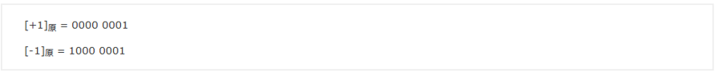

2. 反码：

   正数的反码是其本身；

   负数的反码是在其原码的基础上, 符号位不变，其余各个位取反；

   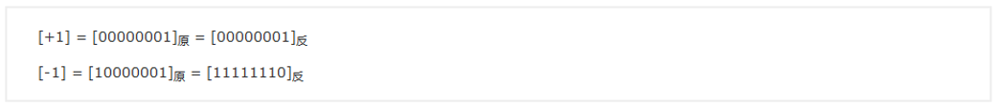

3. 补码：

   正数的补码就是其本身；

   负数的补码是在其原码的基础上, 符号位不变, 其余各位取反, 最后+1(即在反码的基础上+1)；

   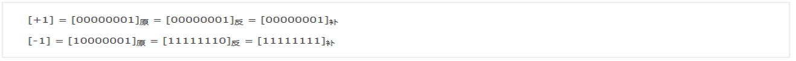

4. 特殊值：-128

   -1-127的结果应该是-128, 在用补码运算的结果中, [1000 0000]补 就应该是-128，但是此时-128，如果用补码到反码，再到原码去计算是不对的，所以-128是个特殊值。

   
   
5. ASCII码：

   数字 < 大写字母  < 小写字母，对应小写字母 - 对应大写字母 = 32

#### 字符集

文字对于电脑来说，都是图片，字符集就是当前电脑识别文件的方式，和对应的处理方式。

GBK：新国标，包含了简体中文所有的文字以及少数民族的文字；

GB2312：老国标，包含了简体中文所有的文字，以及一部分少数民族的文字

BIG5：中文繁体字编码集，主要用于中国台湾、香港、澳门、新加坡

UTF-8：万国码，包含了所有国家的文字，也是开发中使用最多的编码

ASCII：数字在前，大写在中，小写在后

#### 转义字符

功能是把无意义的字符转化为一个带有特殊含义的字符，或者把本身带有特殊含义的字符转换为无意义的字符；

转义字符是使用反斜杠开头的：

```
\n：换行
\t：制表符
\"："
\'：'
\\：\
```

来自2015年的面试题：请问"\40"是什么意思？

​	\之后的数字是八进制；

​	\之后的数字可以省略0；

​	\40是对应ASCII码的八进制展示方式，对应的字符是sp空格；

#### 数据类型

1. Java数据类型的分类：

   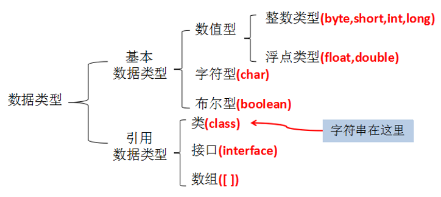

2. 基本数据类型：

   + 整型：

     + byte：1个字节（8bit），-128~127；
     + short：2个字节；
     + int：4个字节；
     + long：8个字节；

   + 浮点型：

     + float：4个字节；
     + double：8个字节；

   + 字符型：

     + char：2个字节，存储字符编码值，编码值无符号，0~65535（字符）；分为

       可见字符：字母、数字等；

       不可见字符：回车、退格、制表

   + 布尔类型：

     + boolean：true和false

3. 注意事项：

   + Java的整型常量默认是int类型，声明long型常量需后加“L”；
   + Java程序中声明常量为int类型，除非不足以表示大数，才使用long；
   + 计算机在存储数据时，会考虑数据的精度为首要的保证，float和double类型对比，double精度更高，保存的数据范围更广，计算机会认为3.14是一个double类型，这里使用一个double类型赋值给float类型，告知计算机当前使用的3.14是一个float类型。格式：float floatNumber = 3.14F；

4. 基本数据类型转换：

   + 自动类型转换：

     + byte，short，char-->int --> long-->float-->double，自动往上提升；

       + byte,short,char之间混合运算，或自己之间运算，结果都是int类型；
       + 存储范围小的变量的值或结果可以直接赋值给存储范围大的变量；
       + 存储范围小的变量与存储范围大的变量进行混合运算，结果升级为存储范围大的类型；
       + boolean不与任何类型转换
       + 任何类型与字符串进行“+”预算，结果都是字符串；

       ```java
       class TypeChange{
           public static void main(String[] args){
               //byte+byte运算
               byte b1 = 1;
               byte b2 = 2;
               /*
               	byte和byte运算，自动提升为int
                	byte he = b1 + b2;  ×
               */
               int he = b1 + b2;
               System.out.println("he=" + he);
           }
       }
       ```

   + 强制类型转换：

     + double-->float-->long-->int-->byte,short,char

       + 可以使用强制类型转换符()；
       + 强制类型转换有风险，溢出、损失精度；

       ```java
       class TypeChange2{
           public static void main(String[] args){
               //把int的值赋值给char
               int i = 65;
               char c = (char)i;
               System.out.prinln("c=" + c);
           }
       }
       ```

   + 关于double和float存储方式的不同：

     + float的4个字节却比long的8个字节的范围更大，因为float是用二进制的科学计数法表示，存储的是指数和位数；
     + float和double是不精确的；
     + float可以保证到十进制科学计数法小数点后6位有效精度和第7位精度部分，double可以保证十进制科学计数法小数点后15位有效精度和第16位精度部分；

#### 运算符

##### 算数运算符

+、-、*、/、% 

+ a%b：a是被模数，b是模数，被模数的符号正常运算，模数的符号忽略

##### 自增自减运算符

++、--

+ i++，++i：
  + ++i：先自增再赋值；
  + i++“先赋值，再自增；

##### 赋值运算符

=、+=、-=、*=、/=、%=

+ 把左边的变量的值与右边表达式的值相运算的结果再赋值给左边的变量；

+ 如果运算后的结果类型超过了左边的变量，那么还隐含强制类型转换；

  ```java
  public class OperatorMath {
      public static void main(String[] args) {
          byte b1 = 1;
          byte b2 = 2;
          b2 += b1;//b2 = byte(b1 + b2);
          System.out.println(b2);
      }
  }
  ```

##### 比较运算符

\>、<、>=、<=、!=、==

##### 逻辑运算符

逻辑与：&，两边的表达式同为true，结果才是true

逻辑或：|，两边的表达式只要有一个为true，结果就为true，否则为false

逻辑异或：^，两边的表达式的值不同时，最终的结果为true，相同时为false

逻辑非：！，一元运算符，取反

短路逻辑与：两边的表达式同为true，结果才是true；和逻辑与不同的是，当左边的表达式为		false时，右边的表达式不计算，因为结果已定为false；

短路逻辑或：||，两边的表达式只要有一个为true，结果就为true，否则为false；和逻辑或		不同的是，当左边的表达式为true，右边的表达式不计算，因为结果已定为true；

+ 逻辑运算符的结果是true和false；
+ 逻辑运算符的操作数是布尔值；

```java
public class Tset1 {
    public static void main(String[] args) {
        boolean x = true;
        boolean y = false;
        short z = 42;
        
        //z++ == 42等价于z==42,z++  true,z=43
        //y=true是一个赋值语句，不是比较表达式，y=true
        //该if语句执行的结果为true，z=44
        if ((z++ == 42) && (y = true)){z++;}
        
        //x=false是一个赋值表达式，不是比较表达式，x=false
        //+=z==45等价于++z,z==45   z=45,true
        //该if语句结果为true，执行z++
        if ((x = false) || (++z == 45)){z++;}
        
        System.out.println("z=" + z);//z = 46
    }
}
```

##### 条件运算符（三元）

条件表达式 ? 表达式1 ：表达式2

​	如果条件表达式为true，整个表达式的结果就取表达式1的值，否则就取表达式2的值

```java
public class ConditionOperator {
    public static void main(String[] args) {
        int age = 18;
        System.out.println(age>=18 ? "成年" : "未成年");//成年
    }
}
```

```java
public class ConditionOperator {
    public static void main(String[] args) {
        int x = 2;
        int y = 1;
        int z = 4;

        int max = x > y ? x : y;
        max = z >= max ? z : max;
        System.out.println(max);
    }
}
```

##### 位运算符

效率较高，直接拿二进制的补码进行运算

1. 按位与：&，1 & 1为1，其他都是0

   ```java
   public class BitOperator {
       public static void main(String[] args) {
           //1的二进制补码：0000 0001
           //2的二进制补码：0000 0010
           //1 & 2：0000 0000
           System.out.println(1 & 2); //0
   
           //-1的二进制原码：1000 0000 0000 0000 0000 0000 0000 0001
           //-1的二进制反码：1111 1111 1111 1111 1111 1111 1111 1110
           //-1的二进制补码：1111 1111 1111 1111 1111 1111 1111 1111
           //2的二进制补码：0000 0000 0000 0000 0000 0000 0000 0010
           //-1 & 2：0000 0000 0000 0000 0000 0000 0000 0000 0010
           System.out.println(-1 & 2);  //2
       }
   }
   ```

2. 按位或：|，0 | 0为0，其余都是1

   ```java
   public class BitOperator {
       public static void main(String[] args) {
           //1的二进制补码：0000 0001
           //2的二进制补码：0000 0010
           //1 | 2:0000 00011
           System.out.println(1 | 2); //3
   
           //-1的二进制补码：1111 1111 1111 1111 1111 1111 1111 1111
           //2的二进制补码：0000 0000 0000 0000 0000 0000 0000 0010
           // -1 |2:1111 1111 1111 1111 1111 1111 1111 1111
           System.out.println(-1 | 2);//-1
       }
   }
   ```

3. 按位异或：^，1 ^ 0为1，0 ^ 1为1，1 ^ 1为0，0 ^ 0为0（相同为0，不同为1）

   ```java
   public class BitOperator {
       public static void main(String[] args) {
           //-1的二进制补码：1111 1111 1111 1111 1111 1111 1111 1111
           //2的二进制补码：0000 0000 0000 0000 0000 0000 0000 0010
           //-1 ^ 2:1111 1111 1111 1111 1111 1111 1111 1111  补码
           //反码：补码-1
           //反码：1111 1111 1111 1111 1111 1111 1111 1110
           //原码：1000 0000 0000 0000 0000 0000 0000 0011
           System.out.println(-1 ^ 2); //-3
       }
   }
   ```

4. 按位取反：~，原来为1的变为0，原来为0的变为1

   ```java
   public class BitOperator {
       public static void main(String[] args) {
           //2的二进制补码：0000 0000 0000 0000 0000 0000 0000 0010
           //~2:1111 1111 1111 1111 1111 1111 1111 1111 1101  补码
           //原码：1000 0000 0000 0000 0000 0000 0000 0000 0011
           System.out.println(~2);
       }
   }
   ```

5. 左移：m<<n，相当于m乘2的n次方，往左边移，右边补0

   ```java
   public class BitOperator {
       public static void main(String[] args) {
           //2的二进制补码：0000 0000 0000 0000 0000 0000 0000 0010
           //2<<3：0 0000 0000 0000 0000 0000 0000 0010 000
           //相当于2*2^3:0000 0000 0000 0000 0000 0000 0001 0000
           System.out.println(2<<3);  //16
       }
   }
   ```

6. 右移：m>>n，相当于m除以2的n次方，往右边移，左边补什么看最高位，最高位是0则

   补0，最高位是1，则补1

   ```java
   public class BitOperator {
       public static void main(String[] args) {
           //-16的二进制原码：1000 0000 0000 0000 0000 0000 0001 0000
           //-16的反码：1111 1111 1111 1111 1111 1111 1111 1110 1111
           //-16的补码：1111 1111 1111 1111 1111 1111 1111 1111 0000
           //-16 >> 3:111 1111 1111 1111 1111 1111 1111 1111 1111 0  补码
           //反码：补码-1
           //反码：1111 1111 1111 1111 1111 1111 1111 1101
           //原码：1000 0000 0000 0000 0000 0000 0000 0010
   
           System.out.println(-16 >> 3); //-2
   
       }
   }
   ```

7. 无符号右移：>>>，往右边移，左边不管最高位是什么，都补0

   ```java
   public class BitOperator {
       public static void main(String[] args) {
           //-16的补码：1111 1111 1111 1111 1111 1111 1111 1111 0000
           //-16 >>> 3:000 1111 1111 1111 1111 1111 1111 1111 1111 0
           System.out.println(-16 >>> 3); //536870910
       }
   }
   ```

### 流程控制语句结构

#### 顺序结构

在同一个方法中从上往下执行；

+ 从键盘输入一个值，并打印输出：Scanner

  + 用核心类库中的类：String，System，Math，Scanner等，如果这个类型定义在java.lang包下，那么直接使用，无需导包，直接使用简名称；但是如果这个类型定义在其他包下，那么需要写全名称或导包。
  + 导包语句：
    + 格式：import 包.类名；
    + 位置：必须在源文件的上面；
  + 输入值：
    + byte：nextByte()
    + short：nextShort()
    + int：nextInt()
    + long：nextLong()
    + float：nextFloat()
    + double：nextDouble()
    + boolean：nextBoolean
    + String：next()，只接收这一行中空白符或回车符之前的内容
    + String：nextLine()，一行全部接收
  + char：没有直接的输入方式,char c = input.next().charAt(0);
      + 先输入字符串，String str = input.next();
      + 然后取出第一个字符,char c = str.charAt(0);
  
  ```java
  import java.util.Scanner;
  
  public class TestStatement {
      public static void main(String[] args) {
  
          //Scanner:键盘输入的工具类
          //input是一个变量名，自己命名
          Scanner input = new Scanner(System.in);
  
          System.out.println("请输入一个整数：");
          int num = input.nextInt();
          System.out.println("您输入的整数是：" + num);
  
          System.out.println("请输入一个小数:");
          double d = input.nextDouble();
          System.out.println("您输入的小数是：" + d);
      }
  }
  ```

#### 分支结构

##### 条件判断类型分支结构

1. 单分支结构：

   ```java
   if(条件表达式){
       条件表达式成立需要执行的语句块;
   }
   ```

   *if(){}中的{}可以省略，但是一旦省略，默认只执行相邻的一句*

2. 双分支结构：

   ```java
   if(条件表达式){
       如果条件表达式为true，需要执行的语句块;
   }else{
       如果条件表达式为false，需要执行的语句块;
   }
   ```

3. 多分支结构：

   ```java
   if(条件表达式1){
       当条件表达式1成立时执行的语句块;
   }else if(条件表达式2){
       当条件表达式2成立时执行的语句块;
   }else{
       当以上条件都不成立时执行的语句块;
   }
   ```

   + 多个else if的条件的范围：

     + 互斥关系，没有重叠部分，顺序随意；

       ```java
       public static void main(String[] args) {
       		int score = 89;
       		if(score>90 && score<=100){
       			System.out.println("优秀");
       		}else if(score>80 && score<=90){
       			System.out.println("良好");
       		}else if(score>60 && score<=80){
       			System.out.println("及格");
       		}else{
       			System.out.println("不合格");
       		}
       	}
       
       ```

     + 包含关系，有重叠部分，顺序有要求，范围小的在上面，大的在下面

       ```java
       public static void main(String[] args) {
       		int score = 89;
       		if(score>90){
       			System.out.println("优秀");
       		}else if(score>80){
       			System.out.println("良好");
       		}else if(score>60){
       			System.out.println("及格");
       		}else{
       			System.out.println("不合格");
       		}
       	}
       }
       ```

4. 条件判断结构练习：

   + 编写程序：由键盘输入三个整数分别存入变量num1、num2、num3，对它们进行排序(使用 if-else if-else),并且从小到大输出。

     ```java
     //方式一：使用罗列所有情况
     import java.util.Scanner;
     
     public class TestCase3 {
         public static void main(String[] args) {
     
             Scanner input = new Scanner(System.in);
     
             System.out.println("请输入第一个数字：");
             int num1 = input.nextInt();
     
             System.out.println("请输入第二个数字：");
             int num2 = input.nextInt();
     
             System.out.println("请输入第三个数字：");
             int num3 = input.nextInt();
     
             //方法一：罗列所有情况
             if (num1 <= num2 && num2 <= num3){
                 System.out.println(num1 + "<=" + num2 + "<=" + num3);
             }else if (num1 <= num3 && num3 <= num2){
                 System.out.println(num1 + "<=" + num3 + "<=" + num2);
             }else if (num2 <= num3 && num3 <= num1){
                 System.out.println(num2 + "<=" + num3 + "<=" + num1);
             }else if (num2 <= num1 && num1 <= num3){
                 System.out.println(num2 + "<=" + num1 + "<=" + num3);
             }else if (num3 <= num1 && num1 <= num2){
                 System.out.println(num3 + "<=" + num1 + "<=" + num2);
             }else {
                 System.out.println(num3 + "<=" + num2 + "<=" + num1);
             }
         }
     }
     //方式二：使用嵌套
     import java.util.Scanner;
     
     public class TestCase3 {
         public static void main(String[] args) {
     
             Scanner input = new Scanner(System.in);
     
             System.out.println("请输入第一个数字：");
             int num1 = input.nextInt();
     
             System.out.println("请输入第二个数字：");
             int num2 = input.nextInt();
     
             System.out.println("请输入第三个数字：");
             int num3 = input.nextInt();
     
             if (num1 <= num2){
                 if (num2 <= num3) {
                     System.out.println(num1 + "<=" + num2 +"<=" + num3);
                 }else {
                     //num1 <= num2 && num3 < num2
                     if (num1 <= num3){
                         System.out.println(num1 + "<=" + num3 + "<=" + num2);
                     }else{
                         //num1 <= num2 && num3 <= num1 && num3 <= num2
                         System.out.println(num3 + "<=" + num1 + "<=" + num2);
                     }
                 }
             }else{
                 //num1 > num2
                 if (num3 > num1){
                     //num3>num1>num2
                     System.out.println(num2 + "<=" + num1 + "<=" + num3);
                 }else{
                     //nm1 > num2 && num1 > num3
                     if (num2 <= num3){
                         System.out.println(num2 + "<=" + num3 + "<=" + num1);
                     }else{
                         //num1 > num2 && num1 > num3 && num2 > num3
                         System.out.println(num3 + "<=" + num2 + "<=" + num1);
                     }
                 }
             }
     
         }
     }
     ```
   
   + 男大当婚，女大当嫁。那么女方家长要嫁女儿，当然要提出一定的条件：高：180cm以上；富：财富1千万以上；帅：是。
   
     如果这三个条件同时满足，则：“我一定要嫁给他!!!”
   
     如果三个条件中有为真的情况，则：“嫁吧，比上不足，比下有余。”
   
     如果三个条件都不满足，则：“不嫁！”
   
     ```java
     import java.util.Scanner;
     
     public class TestCase {
         public static void main(String[] args) {
             Scanner input = new Scanner(System.in);
     
             System.out.println("身高：（cm）");
             int heght = input.nextInt();
     
             System.out.println("财富：（千万）");
             double money = input.nextDouble();
     
             //方式一：使用boolean进行接收
             /**
             System.out.println("帅否：（true/false）");
             boolean h = input.nextBoolean();
     
             if (heght >= 180 && money >= 1 && h == true){
                 System.out.println("我一定要嫁给他");
             }else if (heght >= 180 || money >= 1 || h == true){
                 System.out.println("嫁吧，比上不足，比下有余");
             }else{
                 System.out.println("不嫁");
             }
              */
     
             //方式二：使用String进行接收
             /*
             System.out.println("帅否：（是/否）");
             String h = input.next();
     
             if (heght >= 180 && money >= 1 && h.equals("是")){
                 System.out.println("我一定要嫁给他");
             }else if (heght >= 180 || money >= 1 || h.equals("是")){
                 System.out.println("嫁吧，比上不足，比下有余");
             }else{
                 System.out.println("不嫁");
             }
             */
     
             //方式三：使用char进行接收
             System.out.println("帅否：");
             char h  = input.next().charAt(0);
     
             if (heght >= 180 && money >= 1 && h == '是'){
                 System.out.println("我一定要嫁给他");
             }else if (heght >= 180 || money >= 1 || h == '是'){
                 System.out.println("嫁吧，比上不足，比下有余");
             }else {
                 System.out.println("不嫁");
             }
         }
     }
     ```
   
   + 求ax2+bx+c=0方程的根。a,b,c分别为函数的参数，如果：b2-4ac>0，则有两个解；b2-4ac=0，则有一个解；b2-4ac<0，则无解；
   
     ```java
     import java.util.Scanner;
     
     public class Function {
         public static void main(String[] args) {
     
             Scanner input = new Scanner(System.in);
     
             System.out.println("请输入方程的三个系数：ax^2+bx+c=0");
             System.out.println("a=");
             int a = input.nextInt();
     
             System.out.println("b=");
             int b = input.nextInt();
     
             System.out.println("c=");
             int c = input.nextInt();
     
             System.out.println(a + "x^2+" + b + "x+" + c + "=0");
     
             double temp = b*b - 4*a*c;
     
             if (b*b -4*a*c > 0){
     
                 double x1 = (-b + Math.sqrt(temp))/(2*a);
                 double x2 = (-b - Math.sqrt(temp))/(2*a);
     
                 System.out.println("x1=" + x1 + "," + "x2=" + x2);
     
             }else if (b*b -4*a*c == 0){
     
                 double x = -b/(2*a);
     
                 System.out.println("只有一个解，为：" + x);
                 
             }else{
                 System.out.println("方程无解");
             }
         }
     }
     ```
   

##### switch ... case

1. 语法：

   ```java
   switch(表达式){
           case 常量值1：
               语句块1;
           	【break;】
           case 常量值2：
               语句块2;
           	【break;】
           case 常量值3：
               语句块3;
           	【break;】
           case 常量值4：
               语句块4;
           	【break;】
           ....
           【default:
           	语句块n+1;
           	【break;】
           】
   }
   ```

2. swith说明：

   + 表达式的类型：byte，char，int，short，jdk1.5之后枚举，jdk1.7之后String；
   + <font color='red'>执行的特点：</font>
     + 入口：
       + 当表达式值与其中一个case后面的常量值匹配，一旦进入从上往下执行；
       + 如果所有的case都不满足，如果存在default，不管default在哪里，那么从default进入，从上往下执行；
     + 出口：
       + 自然出口：switch的结束大括号；
       + 突破口：break；
     + case后面一定是常量值或常量表达式，不能是变量；
     + 所有case后面的常量值不相等；
     + case后面常量的类型应该与表达式的类型一致或兼容

   ```java
   import java.util.Scanner;
   
   public class TestSwitch {
       public static void main(String[] args) {
           Scanner input = new Scanner(System.in);
   
           System.out.println("请输入参数：");
           int week = input.nextInt();
   
           switch (week) {
                 //如果default在此处，从default进入后会一直执行，直到遇到break或自然结束
   //            default:
   //                System.out.println("非法参数");
                     
               case 1:
                   System.out.println("今天星期" + week);
                   break;
               case 2:
                   System.out.println("今天星期" + week);
                   break;
               case 3:
                   System.out.println("今天星期" + week);
                   break;
               case 4:
                   System.out.println("今天星期" + week);
                   break;
               case 5:
                   System.out.println("今天星期" + week);
                   break;
               case 6:
                   System.out.println("今天星期" + week);
                   break;
               case 7:
                   System.out.println("今天星期日");
               default:
                   System.out.println("非法参数");
                   break;
           }
       }
   }
   ```

   ```java
   //根据用于指定月份，打印该月份所属的季节:3,4,5 春季 6,7,8 夏季  9,10,11 秋季 12, 1, 2 冬季
   import java.util.Scanner;
   
   public class TestMonth {
       public static void main(String[] args) {
           Scanner input = new Scanner(System.in);
           System.out.println("请输入当前月份：");
   
           int month = input.nextInt();
           switch (month){
               case 3:
               case 4:
               case 5:
                   System.out.println("春季");
                   break;
               case 6:
               case 7:
               case 8:
                   System.out.println("夏季");
                   break;
               case 9:
               case 10:
               case 11:
                   System.out.println("秋季");
                   break;
               case 12:
               case 1:
               case 2:
                   System.out.println("冬季");
                   break;
   
               default:
                   System.out.println("非法的月份");
           }
       }
   }
   //使用 switch 把小写类型的 char型英文字母转为大写。只转换 a, b, c, d, e. 其它的输出 “other”。
   import java.util.Scanner;
   
   public class TestLetter {
       public static void main(String[] args) {
           Scanner input = new Scanner(System.in);
           System.out.println("请输入一个字母");
   
           char leter = input.next().charAt(0);
           
           switch (leter){
               //a=97,A=65
               //b=98,B=66
               case 'a':
               case 'b':
               case 'c':
               case 'd':
               case 'e':
                   leter = (char)(leter - 32);
                  System.out.println(leter);
                  break;
               default:
                   System.out.println("Other");
           }
       }
   }
   
   import java.util.Scanner;
   
   public class TestLetter {
       public static void main(String[] args) {
           Scanner input = new Scanner(System.in);
           System.out.println("请输入一个字母");
   
           char leter = input.next().charAt(0);
   
           switch (leter){
               case 'a':
                   System.out.println("A");
                   break;
               case 'b':
                   System.out.println("B");
                   break;
               case 'c':
                   System.out.println("C");
                   break;
               case 'd':
                   System.out.println("D");
                   break;
               case 'e':
                   System.out.println("E");
                   break;
               default:
                   System.out.println("Other");
           }
       }
   }
   
   //从键盘分别输入年、月、日，判断这一天是当年的第几天,
   //注：判断一年是否是闰年的标准：
          //1）可以被4整除，但不可被100整除
          //2）可以被400整除
   import java.util.Scanner;
   
   public class TestDayOfYear {
       public static void main(String[] args) {
           Scanner input = new Scanner(System.in);
   
           System.out.println("年：");
           int year = input.nextInt();
   
           System.out.println("月：");
           int month = input.nextInt();
   
           System.out.println("日：");
           int day = input.nextInt();
   
           int days = day;
   
           //加前面几个月的满月天数
           switch (month){
               case 12:
                   //前面11个月的总天数
                   //days += 第11月的天数
                   days += 30;
               case 11:
                   //前面10个月的总天数
                   //days += 第10月的天数
                   days += 31;
               case 10:
                   days += 30;//九月
               case 9:
                   days += 31;//八月
               case 8:
                   days += 31;//七月
               case 7:
                   days += 30;//六月
               case 6:
                   days += 31;//五月
               case 5:
                   days += 30;//四月
               case 4:
                   days += 31;//三月
               case 3:
                   days += 28;//二月
                   if (year % 4 == 0 && year % 100 != 0 || year % 400 == 0){
                       days++;
                   }
               case 2:
                   days += 31;//一月
           }
       }
   }
   ```

   ```java
   /**
   假设你想开发一个玩彩票的游戏，程序随机地产生一个两位数的彩票，提示用户输入一个两位数，然后按照下面的规则判定用户是否能赢。
   1)如果用户输入的数匹配彩票的实际顺序，奖金10 000美元。
   2)如果用户输入的所有数字匹配彩票的所有数字，但顺序不一致，奖金 3 000美元。
   3)如果用户输入的一个数字仅满足顺序情况下匹配彩票的一个数字，奖金1 000美元。
   4)如果用户输入的一个数字仅满足非顺序情况下匹配彩票的一个数字，奖金500美元。
   5)如果用户输入的数字没有匹配任何一个数字，则彩票作废。
   */
   import java.util.Scanner;
   
   public class TestCaiPiao {
       public static void main(String[] args) {
   
           int number = (int)(Math.random() * 90 + 10);//得到[10，00)
           System.out.println(number);
   
           int numberShi = number / 10;
           int numberGe = number % 10;
   
           //2.用户输入一个两位数
           Scanner input = new Scanner(System.in);
           System.out.println("请输入一个两位数");
           int guess = input.nextInt();
   
           int guessShi = guess / 10;
           int guessGe = guess % 10;
   
           if (number == guess) {
               System.out.println("奖金10000美元");
           } else if (numberShi == guessGe && numberGe == guessShi) {
               System.out.println("奖金3000美元");
           } else if (numberShi == guessShi || numberGe == guessGe) {
               System.out.println("奖金1000美元");
           } else if (numberShi == guessGe || numberGe == guessShi) {
               System.out.println("奖金500美元");
           } else {
               System.out.println("没中奖");
           }
   
       }
   }
   
   /**
   赌数游戏：随机产生3个1-6的整数，如果三个数相等，那么称为“豹子”，如果三个数之和大于9，称为“大”，如果三个数之和小于等于9，称为“小”，用户从键盘输入押的是“豹子”、“大”、“小”，并判断是否猜对了
   */
   import java.util.Scanner;
   
   public class GuessNumber {
       public static void main(String[] args) {
           //1.产生一个[1-6]的数
           int num1 = (int)(Math.random() * 6 + 1);
           System.out.println(num1);
           int num2 = (int)(Math.random() * 6 + 1);
           System.out.println(num2);
           int num3 = (int)(Math.random() * 6 + 1);
           System.out.println(num3);
   
           String result = "大";
           if (num1 == num2 && num2 == num3){
               result = "豹子";
           } else if (num1 + num2 + num3 < 9){
               result = "小";
           }
   
           //2.用户输入猜的结果
           Scanner input = new Scanner(System.in);
           System.out.println("请押宝，买定离手：");
           String guess = input.next();
   
           //3.判断结果
           if (result.equals(guess)) {
               System.out.println("猜对了");
           } else {
               System.out.println("猜错了");
           }
       }
   }
   
   /**
   编写一个程序，为一个给定的年份找出其对应的中国生肖。中国的生肖基于12年一个周期，每年用一个动物代表：rat、ox、tiger、rabbit、dragon、snake、horse、sheep、monkey、rooster、dog、pig。
   提示：2017年：鸡   2017 % 12 == 1
   */
   import java.util.Scanner;
   
   public class TestShengXiao {
       public static void main(String[] args) {
           Scanner input = new Scanner(System.in);
           System.out.println("请输入年份：");
   
           int year = input.nextInt();
   
           switch (year % 12) {
               case 1 :
                   System.out.println("鸡年");
                   break;
               case 2:
                   System.out.println("狗年");
                   break;
               case 3 :
                   System.out.println("猪年");
                   break;
               case 4:
                   System.out.println("鼠年");
                   break;
               case 5 :
                   System.out.println("牛年");
                   break;
               case 6:
                   System.out.println("虎年");
                   break;
               case 7 :
                   System.out.println("兔年");
                   break;
               case 8:
                   System.out.println("龙年");
                   break;
               case 9 :
                   System.out.println("蛇年");
                   break;
               case 10:
                   System.out.println("马年");
                   break;
               case 11 :
                   System.out.println("羊年");
                   break;
               case 12:
                   System.out.println("猴年");
                   break;
               default:
           }
       }
   }
   ```

#### 循环结构

##### for循环

1. 语法：

   ```java
   for(初始化表达式;循环条件表达式;迭代表达式){
       循环体;
   }
   ```

2. 说明：

   + for中的两个“;”不能省略；
   + for(初始化表达式;循环条件表达式;迭代表达式)中的三个表达式可以省略，可以省略一个或者多个；

3. 执行过程：

   + 先执行初始化表达式1；
   + 判断循环条件表达式2；
   + 如果条件成立，执行循环体；
   + 执行迭代表达式；
   + 判断循环条件是否成立；
   + ....
   + 直到条件表达式不成立，退出循环

   ```java
   //求1-100的和
   public class TotalSum {
       public static void main(String[] args) {
           int sum = 0;
   
           for (int i = 1;i <= 100;i++){
               sum += i;
           }
           System.out.println("1-100的和是：" + sum);
       }
   }
   //求1-100之间的偶数
   public class EvenNumbers {
       public static void main(String[] args) {
           System.out.println("1-100之间的偶数有：");
           for (int i=2; i<=100; i=i+2){
               System.out.println(i);
           }
   
   //        for (int i = 1;i <= 100;i++) {
   //            if (i % 2 == 0) {
   //                System.out.println(i);
   //            }
   //        }
       }
   }
   ```

##### while循环

1. 语法：

   ```java
   while(循环条件) {
       循环体;
   }
   ```

2. 说明：

   + 循环条件必须是布尔值；
   + 当循环条件成立，就执行循环体；不成立就结束

   ```java
   //3000米的绳子，每天减一半，多少天后绳子长度小于5米（不考虑小数）
   public class TestWhile {
       public static void main(String[] args) {
           int num = 3000;
           int sum = 0;
           while (num >= 5){
               num = num / 2;
               sum++;
           }
           System.out.println("3000米的绳子，每天减一半，" + sum + "天后绳子小于5米");
       }
   }
   ```

##### do ... while循环

1. 语法：

   ```java
   do {
       循环体;
       循环条件变更;
   } while (循环条件);
   ```

2. 说明：

   + 先不判断条件，先do一次循环体，循环体至少执行一次；
   + 执行完一次循环体之后，在判断条件，是否需要下一次；

   ```java
   /**
   随机生成一个100以内的数，猜数字游戏(do...while/while_true+break)
   从键盘输入数，如果大了提示，大了，如果小了，提示小了，如果对了，就不再猜了，并统计一共猜了多少次
   */
   import java.util.Random;
   import java.util.Scanner;
   
   public class TestDoWhileLoop {
       public static void main(String[] args) {
           Random rand = new Random();
           //产生的是任意大小的整数
           //int num = rand.nextInt();
           //产生的是[0，100)的整数
           int num = rand.nextInt(100);
           System.out.println(num);
   
           Scanner input = new Scanner(System.in);
           int guess;
           int count = 0;
   
           do {
               System.out.println("请输入一个整数：");
               guess = input.nextInt();
   
               count++;
   
               if (guess > num) {
                   System.out.println("大了");
               } else if (guess < num) {
                   System.out.println("小了");
               } else {
                   System.out.println("对了");
               }
           } while (guess != num);
           
           System.out.println("一共猜了"+ count + "次");
       }
   }
   ```

3. 循环练习：

   ```java
   //输出所有的水仙花数，所谓水仙花数是指一个3位数，其各个位上数字立方和等于其本身。
   public class Exer5FlowerNumber {
       public static void main(String[] args) {
           System.out.println("水仙花数有以下：");
           for (int i=100;i<=999;i++) {
               int x = i / 100;
               int y = i / 10 % 10;
               int z = i % 10;
   
               if (x*x*x + y*y*y + z*z*z == i){
                   System.out.println(i);
               }
           }
       }
   }
   /**
   编写程序FooBizBaz.java，从1循环到150并在每行打印一个值，另外在每个3的倍数行上打印出“foo”,在每个5的倍数行上打印“biz”,在每个7的倍数行上打印输出“baz”。
   */
   public class FooBizBaz {
       public static void main(String[] args) {
           for (int i=1;i<=150;i++){
               //1.打印数字
               System.out.print("第一行：" + i);
   
               //2.是否打印foo,biz,baz
               if (i % 3 == 0) {
                   System.out.print("\tfoo");
               }
               if (i % 5 == 0) {
                   System.out.print("\tbiz");
               }
               if (i % 7 == 0) {
                   System.out.print("\tbaz");
               }
   
               //3.打印换行
               System.out.println();
           }
       }
   }
   ```

##### foreach

1. foreach是jdk1.5之后引入，作用是遍历数组或集合

2. 语法格式：

   ```java
   for(元素的数据类型类型 元素名：数组名) {
       
   }
   ```

3. 优势：

   + 简单、效率高；

4. for和foreach的区别：

   + foreach是没有下标信息的；
   + foreach遍历的时候不能修改元素的值，但是通过元素修改属性可以

5. 选择：

   + 如果仅仅是遍历查看，选择foreach比较简单快速
   + 如果涉及到下标，那么选择for

   ```java
   import java.util.Arrays;
   
   public class TestForAndForeach {
       public static void main(String[] args) {
           int[] array = {3,4,2,6,8};
   
           //找出最大值及其下标
           //找到数组中的3，修改为30
           for (int i = 0; i < array.length; i++) {
               if (array[i] == 3) {
                   array[i] = 30;
               }
           }
           System.out.println(Arrays.toString(array));
       }
   }
   ```
   
6. 二维数组的foreach循环遍历：

   ```java
   public class TestExer2 {
       public static void main(String[] args) {
           int[][] array = new int[5][5];
   
           for (int i = 0; i < array.length; i++) {
               for (int j = 0; j < array[i].length; j++) {
                   array[i][j] = i+1;
                   System.out.print(array[i][j] + "\t");
               }
               System.out.println();
           }
   
           //外层循环：把二维数组看出是一维数组，元素是一个一维数组，类型是int[]
           for (int[] hang: array) {
               //内存循环：每一行就是一个一维数组
               for (int column:hang) {
                   System.out.print(column + "\t");
               }
               System.out.println();
           }
       }
   }
   ```


#### break关键字

1. switch：用于switch-case语句中当前case的结束，继续执行下面的case，除非还有	break；

2. <font color='red'>循环：跳出当前循环，提前结束当前循环（例如结束当前内循环的进行，执行外循环）</font>

   ```java
   /**
   随机生成一个100以内的数，猜数字游戏(do...while/while_true+break),从键盘输入数，如果大了提示，大了，如果小了，提示小了，如果对了，就不再猜了，并统计一共猜了多少次
   */
   import java.util.Random;
   import java.util.Scanner;
   
   public class TestBreak {
       public static void main(String[] args) {
           //1.随机产生一个100以内的数
           Random rd = new Random();
           int num = rd.nextInt(100);
   
           //2.从键盘输入数
           int count = 0;
           Scanner input = new Scanner(System.in);
           while (true) {
               System.out.println("请输入整数：");
               int guess = input.nextInt();
   
               count++;
   
               if (guess > num) {
                   System.out.println("大了");
               } else if (guess < num) {
                   System.out.println("小了");
               } else  {
                   System.out.println("猜对了");
                   break;
               }
           }
           System.out.println("随机产生的数是："+ num + ",您一共猜了" + count + "次");
   
       }
   }
   /**
   输入两个正整数m和n，求其最大公约数和最小公倍数（break）
   */
   import java.util.Scanner;
   
   public class Exer7 {
       public static void main(String[] args) {
           Scanner input = new Scanner(System.in);
   
           System.out.println("请输入m的值：");
           int m = input.nextInt();
           System.out.println("请输入n的值：");
           int n = input.nextInt();
   
           System.out.println("m=" + m + ",n=" + n);
   
           /**功能可以实现，但是如果m比较大、n比较小，会导致循环次数较多，无用的循环较多
           for (int i = m;i>=1;i--){
               if (m % i == 0 && n % i == 0) {
                   System.out.println(i);
                   break;
               }
           }
            */
           System.out.print("m和n的最大公约数是：");
           int max = m >= n ? m : n;
           int min = m < n ? m : n;
           for (int i = min;i>=1;i--){
               if (m % i == 0 && n % i == 0) {
                   System.out.println(i);
                   break;
               }
           }
   
           System.out.print("m和n的最小公倍数是：");
           for (int i=max;i<=m*n;i++) {
               if (i % m ==0 && i %n == 0) {
                   System.out.println(i);
                   break;
               }
           }
       }
   }
   /**
   点餐
   */
   public class DianCan {
       public static void main(String[] args) {
           int choose = 0;
           boolean flag = false;
           Scanner sc = new Scanner(System.in);
   
           while(true){
               System.out.println("客官，您要点点啥？");
               System.out.println("1.烤面筋");
               System.out.println("2.鸡蛋灌饼");
               System.out.println("3.炸串");
               System.out.println("4.肉夹馍");
               System.out.println("5.下单");
   
               choose =sc.nextInt();
   
               switch (choose){
                   case 1:
                       System.out.println("1.5块/串");
                       break;
                   case 2:
                       System.out.println("5块");
                       break;
                   case 3:
                       System.out.println("3块");
                       break;
                   case 4:
                       System.out.println("6块");
                       break;
                   case 5:
                       flag = true;
                       default:
               }
               if (flag) {
                   System.out.println("下单");
                   break;
               }
           }
       }
   }
   ```

#### continue关键字

<font color='red'>只能用于循环，结束本次循环，提前进入下一次循环（例如结束内循环中的本次循环，继续内循环中的其他循环）</font>

```java
/**
打印1-100之间数，其中3、5、7的倍数不打印（continue）
*/
public class TestContinue {
    public static void main(String[] args) {
        for (int i = 1; i <= 100; i++) {
            //如果是3、5、7的倍数，就跳过打印语句，提前进入下一次循环的迭代语句i++
            if (i % 3 == 0 || i % 5 == 0 || i % 7  == 0) {
                //提前结束本次循环，进入迭代语句i++
                continue;
            }
            System.out.println(i);
        }
    }
}

public class Exer8 {
    public static void main(String[] args) {
        for (int i = 1; i<= 100; i++) {
            //打印不是3、5、7的倍数
            if (i % 3 != 0 && i % 5 != 0 && i % 7 != 0) {
                System.out.println(i);
            }
        }
    }
}
```

```java
/**
打印九九乘法表
*/
public class Exer10 {
    public static void main(String[] args) {
        for (int i =1;i <= 9; i++) {
            for (int j = 1; j <= i; j++) {
                System.out.print(j + "×" + i + "=" + i * j +"\t");
            }
            System.out.println();
        }
    }
}
/**
 * 一个数如果恰好等于它的因子之和，这个数就称为"完数"。（因子：除去这个数本身的约数）
 * 例如6=1＋2＋3.编程 找出1000以内的所有完数
 */
public class Exer9 {
    public static void main(String[] args) {
        System.out.println("1-1000之间的所有完数有：");
        for (int i =1; i <= 1000; i++){
            //判断i是否是完数
            //（1）把i的所有因子累加
            int sum = 0;
            //求i的所有因子，除了i以外的约数
            //[1,i)之间能把i整除的就是i的因子

            for (int j = 1;j < i; j++){
                if (i % j == 0) {
                    sum += j;
                }
            }
            //（2）用因子的累加和与i比较，如果相等，那么i就是完数，打印i
            if (sum == i) {
                System.out.println(i);
            }
        }
    }
}
/**
 * 打印直角三角形
 */
public class RighTriangle {
    public static void main(String[] args) {
        for (int i = 1; i<= 5; i++){
            for (int j = 1; j <= i; j++) {
                System.out.print("*");
            }
            System.out.println();
        }
    }
}
/**
打印等腰三角形
*/
public class DengYaoTriangle {
    public static void main(String[] args) {
        for (int i = 1; i <= 5; i++) {
            //1.打印空格
            for (int j = 1; j <= 5 - i; j++) {
                System.out.print(" ");
            }
            //2.打印星号
            for (int k = 1; k <= i * 2 - 1; k++) {
                System.out.print("*");
            }
            //3.打印换行
            System.out.println();
        }
    }
}
/**
打印菱形
*/
public class DengYaoTriangle {
    public static void main(String[] args) {
        //上半部分
        for (int i = 1; i <= 5; i++) {
            for (int j = 1; j <= 5 - i; j++) {
                System.out.print(" ");
            }
            for (int k = 1; k <= i * 2 - 1; k++) {
                System.out.print("*");
            }
            System.out.println();
        }

        //下半部分
        for (int i = 1;i <= 4;i++){
            for (int j = 1;j <= i;j++){
                System.out.print(" ");
            }
            for (int k = 1;k <= 2*(4-i)+1;k++) {
                System.out.print("*");
            }
            System.out.println();
        }
    }
}
/**
 * 从键盘输入年月日，假设从1970年1月1日开始“三天打鱼，两天晒网”，问今天是打鱼还是晒网？
 */
import java.util.Scanner;

/**
 * 从键盘输入年月日，假设从1970年1月1日开始“三天打鱼，两天晒网”，问今天是打鱼还是晒网？
 */
public class DaYuShaiWang {
    public static void main(String[] args) {
        Scanner input =  new Scanner(System.in);
        System.out.println("请输入年：");
        int year = input.nextInt();
        System.out.println("请输入月：");
        int month = input.nextInt();
        System.out.println("请输入日：");
        int day = input.nextInt();

        int days = 0;
        //1.计算[1970,year]一共多少天,累加每一个全年的总天数
        //有闰年平年
        for (int i=1970; i<year; i++) {
            if (i%4==0 && i%100==0 || i%400==0) {
                days += 366;
            }else {
                days += 365;
            }
        }

        //2.计算year年一共几天
        switch (month) {
            case 12:
                days += 30;//十一月
                break;
            case 11:
                days += 31;//十月
                break;
            case 10:
                days += 30;//九月
                break;
            case 9:
                days += 31;//八月
                break;
            case 8:
                days += 31;//七月
                break;
            case 7:
                days += 30;//六月
                break;
            case 6:
                days += 31;//五月
                break;
            case 5:
                days += 30;//四月
                break;
            case 4:
                days += 31;//三月
                break;
            case 3:
                days += 28;
                if (year% 4==0 && year%100==0 || year%400==0) {
                    days ++;
                }
                break;
            case 2:
                days += 31;//一月
                break;
                default:
        }

        //3.累加day
        days += day;

        //4.判断打鱼还是晒网
        if (days%5==1 ||days%5==2 || days%5==3) {
            System.out.println("打鱼");
        } else {
            System.out.println("晒网");
        }
    }
}
/**
 * 打印1-100之间的质数，质数：这个数的约束只有1和它本身的数
 */
public class ZhiShu {
    public static void main(String[] args) {
        System.out.println("1-100之间的质数是：");
        for (int i=1; i<=100;i++){
            //判断i是不是质数
            //1.找出i的所有约数，统计约束的个数
            int count = 0;
            //[1,i]之间能把i整除的都是i的约数约数
            for (int j=1; j<=i; j++) {
                if (i % j == 0) {
                    count++;
                }
            }

            //2.如果i的约数的个数是2，那么i就是质数
            if (count == 2) {
                System.out.println(i);
            }
        }
    }
}
```

#### 使用总结

+ switch-case/if-else：
  + 所有情况都可以使用if-else，凡是使用switch-case的地方都可以使用if-else；
  + 只有少数情况可以使用switch-case：
    + 当表达式的类型满足byte，short，int，枚举，字符串；
    + 当表达式的值是与几个常量比较时使用，不适用于范围的比较；
  + 如果可以使用switch-case的情况下使用switch-case效率较高；
+ for/while/do..while：
  + 三种都是用于需要重复执行的代码结构，三种可以随意替换；
  + 当循环的次数比较明显，从什么时候开始到什么时候结束，这类情况使用for更合适；
  + 当循环无论如何，循环体至少要执行1次，选择do...while；

### 方法

​	一段代码使用了三遍，请把它封装成一个方法；一堆方法使用了三遍，请把它封装成一个工具类；一个工具类使用了三遍，请把它写成一个博客。

#### 方法

1. 含义：

   方法又称为函数，是一个功能的定义，是一个类中最基本的功能单元。

2. 方法的声明：

   方法=方法头+方法体

   ```java
   【修饰符】返回值类型 方法名(【形参列表】) {
       方法体;
   }
   //方法的签名(方法头)：【修饰符】返回值类型 方法名(【形参列表】)
   ```

3. 语法要求：

   + <font color='red'>声明方法的位置：只能在类中、方法外</font>；

     ```java
     class TestMethod{
         public static void manin(String[] args){
             //错误的声明位置，在main中
             //public static void test(){}
         }
         //正确的声明位置
         public static void test() {}
     }
     ```

   + 如果方法没有返回值，不需要返回结果，那么返回值类型的位置统一写void，不能省略；

   + 如果方法没有形参，那么()为空但不能省略；

4. 方法的声明形式：

   + 无参无返回值的方法；
   + 有参无返回值的方法；
   + 无参有返回值的方法；
   + 有参有返回值的方法

5. 方法的调用：

   + 方法只声明不调用是不会被执行的，调用一次执行一次；
   + 通过方法名调用，如果方法有形参，就传实参，如果方法有返回值就可以接收，没有返回值就不能就收；

##### 无参无返回值的方法

1. 声明形式：

   ```java
   【修饰符】 void 方法名(){
       方法体;
   }
   ```

2. 方法声明的具体要求：

   + 方法名要遵守命名的规范：第一个单词首字母小写，其余单词首字母大写；
   + 方法名是体现方法功能的，因此要见名知意；

   ```java
   public class TestNoParamsNoReturnValue {
       
       //声明一个无参无返回值的方法：
       // 打印矩形的5行5列由星号组成的举行
       public static void printRectangle() {
           for (int i=1; i<=5; i++) {
               for (int j =1; j<=5; j++) {
                   System.out.print("*");
               }
               System.out.println();
           }
       }
   }
   ```

3. 方法的调用：

   无参无返回值的方法调用，只能单独成一个语句，语句后面加分号；

   ```java
   方法名();
   ```

   ```java
   public class TestNoParamsNoReturnValue {
       public static void main(String[] args) {
           //无参无返回值方法的调用
           printRectangle();
       }
       //声明一个无参无返回值的方法：
       // 打印矩形的5行5列由星号组成的举行
       public static void printRectangle() {
           for (int i=1; i<=5; i++) {
               for (int j =1; j<=5; j++) {
                   System.out.print("*");
               }
               System.out.println();
           }
       }
   }
   ```

##### 有参无返回值的方法

1. 声明格式：

   ```java
   【修饰符】void 方法名(形参列表){
       方法体;
   }
   ```

2. 说明：

   + 形参：本质上也是一个变量（数据类型、变量名、变量值）；
   + 在方法声明的位置，就叫形参；
   + 形参声明的格式：同变量声明的格式；
     + 一个形参：(数据类型 变量名 )
     + 两个形参：(数据类型 变量名，数据类型 变量名)
     + 多个形参：(数据类型 变量名，数据类型 变量名，数据类型 变量名，...)

3. 什么情况下需要声明形参：

   ​	在声明方法时，完成功能缺少需要的数据数据，此时就声明形参，由方法的调用者提供数据；

4. 调用格式：

   ```java
   方法名(实参列表);
   ```

   + 实参的概念：

     调用方法()中的参数，叫做实参；因为在调用方法时，这个参数的值是确定的，必须有实际的值；

   + 如何传实参：

     + 实参的类型、顺序、类型要与形参一一对应；
     + 实参可以说常量值、变量、表达式等；
     + 本质上是把实参的值赋值给形参，隐含了：形参名 = 实参

   ```java
   public class TestHasParamsNoReturnValue {
       public static void main(String[] args) {
           //2.方法的调用
           printRectangle(7,8,"*");
       }
   
       //1.声明一个有参无返回值的方法
       //声明一个方法，功能是可以用任意指定的字符，打印指定行数，指定列数的矩形
       //字符、行数、列数由调用方法时决定
       //line:行数；column:列数；sign:组成举行的符号
       //指定行数、列数、符号的方式也由调用者决定，而不局限于用键盘输入
       public static void printRectangle(int line,int column,String sign){
           for (int i=1; i<=line; i++){
               for (int j=1; j<=column; j++){
                   System.out.print(sign);
               }
               System.out.println();
           }
       }
   }
   ```

##### 无参有返回值的方法

1. 声明格式；

   ```java
   【修饰符】返回值类型 方法名(){
       方法体;
   }
   ```

2. 说明：

   + 返回值类型：不是void

     返回值类型可以说Java的任意类型（基本数据类型、引用数据类型）

   + 如果声明了返回值的类型，就表示方法有返回值需要返回，那么方法中一定要有return语句；

   + 要保证方法无论从哪个分支结束，都需要有return返回值；

   + <font color="red">return返回值的作用：</font>

     + 可以返回结果，return后面的返回值的类型要与方法签名中的返回值类型一致或兼容；
     + 可以结束方法（方法体中return后面的语句不执行）；

3. 方法的调用：

   + 用变量接收返回值；

     ```java
     变量 = 方法名();
     ```

     *注意：变量的类型与被调用的方法的返回值类型要一致或者兼容；*

   + 直接打印返回值：

     ```java
     System.out.println(方法名());
     ```

   + 方法的返回值作为表达式的一部分；

   ```java
   import java.util.Scanner;
   
   public class TestNoParamsHasReturnValue {
   
       public static void main(String[] args) {
           //方法调用1
           int num = getMaxOfTwoNumbers();
           System.out.println(num);
   
           //方法调用2
           System.out.println(getMaxOfTwoNumbers());
   
           //方法调用3
           //得到两个数的最大值，加2
           int sum = getMaxOfTwoNumbers() + 2;
           System.out.println("最大值+2的结果是：" + sum);
       }
   
       //声明一个无参有返回值的方法
       //功能：可以从键盘输入两个整数，并且能够比较这两个整数的大小，返回较大者
       public static int getMaxOfTwoNumbers(){
           Scanner input = new Scanner(System.in);
           System.out.println("请输入第一个数：");
           int a = input.nextInt();
   
           System.out.println("请输入第二个数：");
           int b = input.nextInt();
   
           int max = a > b ? a : b;
   
           return max;
       }
   }
   ```

##### 有参有返回值的方法

1. 声明格式：

   ```java
   【修饰符】返回值类型 方法名(形参列表){
       方法体;
   }
   ```

2. 调用：

   + 变量 = 方法名(实参)；
   + 直接打印；
   + 作为表达式

   ```java
   public class TestHasParamsHasReturnValue {
       public static void main(String[] args) {
           int result = getMaxOfTwoNumbers(5,8);
           System.out.println(result);
   
           int x = 5;
           int y = 8;
           int z = 9;
   
           int temp1 = getMaxOfTwoNumbers(x,y);
           int temp2 = getMaxOfTwoNumbers(temp1,z);
           System.out.println(temp2);
   
           int value = getMaxOfTwoNumbers(getMaxOfTwoNumbers(x,y),z);
           System.out.println(value);
       }
   
       public static int getMaxOfTwoNumbers(int num1,int num2) {
           int max = num1 > num2 ? num1 :num2;
           return max;
       }
   }
   ```

##### 小结

1. 方法的声明格式：

   声明方法是不会被执行的，只有调用才会执行，而且调用一次，执行一次；

   ```java
   【修饰符】返回值类型/void 方法名(【形参列表】){
       方法体;
   }
   ```

2. 名词：

   + 形参：在方法声明中的()；

   + 实参：在方法调用中的()；

   + 实参的值会赋值给形参，实参的个数、类型、个数要与形参一致；如果声明的时候没有形参，调用的时候也没有实参，如果声明的时候有形参，调用的时候也必须有实参，且实参与形参个数、类型、顺序一致；

   + 声明方法时：

     ​		如果没有返回值，也就是说，方法的功能没有结果返回，那么声明时在返回值类型的位置必须写void；如果有返回值，也就是说方法的功能有结果需要返回，那么声明时返回值类型的位置就必须写对应的类型，而且在方法体中必须有return语句；

   + 调用方法时：

     + 如果被调用的方法没有返回值，那么调用方法的语句，只能单独成一个语句：

       ​	方法名()；

       ​	方法名(实参列表)；

     + 如果被调用的方法有返回值，那么调用方法的语句，需要用变量接收返回值；
     
     + <font color='red'>在static方法中，不能直接调用同一个类中的非static方法</font>
     
       ```java
       public class TestMethod {
           public static void main(String[] args) {
               //调用不被允许
               test();
           }
       
           public void test() {
       
           }
       }
       ```
     
       

3. 什么情况下需要形参：

   在完成方法的功能时，在当前方法中可以获取的合适的数据进行计算的就不需要传参数；

   如果无法获取，那么完成功能就缺少数据，此时就声明形参，由方法的调用者提供数据。

```java
/**
1.声明一个方法，求两个整数中的最小值；
2.声明一个方法求三个整数中的最小值，要求调用1的方法完成功能
*/
//声明一个方法，求两个整数中的最小值；
package compare;

public class GetMinNumber {
    public static void main(String[] args) {
        int Min = getMinNumber(5,3);
        System.out.println(Min);
    }

    public static int getMinNumber(int num1,int num2){
        int min = num1 > num2 ? num2 :num1;
        return min;
    }
}
//声明一个方法求三个整数中的最小值，要求调用1的方法完成功能
import compare.GetMinNumber;

public class GetMinOfThreeNumber {

    public static void main(String[] args) {
        int result = getMinOfThreeNumber(6,5,8);
        System.out.println(result);
    }
    
    public static int getMinOfThreeNumber(int a,int b,int c){
        int min = GetMinNumber.getMinNumber(a,b);
        min = GetMinNumber.getMinNumber(min,c);
        return min;
    }
}
```

#### 跨类调用方法

一个源文件中可以声明多个类；一个源文件编译可以产生1个或多个.class文件，产生几个.class文件由源文件中声明几个类决定；

如果源文件中有一个类是public的，那么这个源文件的名称必须和这个类相同，如果所有的类都不是public，那么随意；

+ 被调用的方法有static：

  类名.方法名；

+ 被调用的方法无static：

  对象.方法名；

不管调用的是本类的还是其他类的方法，是否传实参、是否接收返回值，规则一样；

```java
public class InvokeOtherClassMethon {
    public static void main(String[] args) {
        //在这里调用Other类的test()方法
        //被调用的方法是static
        Other.test();
        //被调用的方法是非static
        Other oter = new Other();
        oter.print();
    }
}

class Other {
    public static void test() {
        System.out.println("其他类的方法");
    }

    public void print() {
        System.out.println("其他类的另一个方法");
    }

}
```

#### 方法的重载Overload

1. <font color='red'>概念：</font>

   在**同一个类**中，如果存在两个或多个方法，这些方法的**名称相同**，**形参列表不同**，那么这几个方法就叫做方法的重载/重载的方法，和返回值类型无关，至于修饰符没有要求，但是建议一致；

2. 形参列表不同：

   + 个数不同；
   + 类型不同；

   ```java
   public class TestOverload {
   
       public static void main(String[] args) {
           System.out.println(getMax(4,8));
   
           System.out.println(getMax(4,8,2));
   
           System.out.println(getMax(2.4, 5.5));
   
       }
   
       //声明一个方法，求两个小数的最大值
       public static double getMax(double num1, double num2) {
           System.out.println("两个double类型的getMax()");
           return num1 > num2 ? num1 : num2;
       }
   
       //声明一个方法，求两个整数的最大值
       public static int getMax(int num1, int num2) {
           System.out.println("两个int类型参数的getMax()");
           return num1 > num2 ? num1 : num2;
       }
   
       //声明一个方法，求三个整数的最大值
       public static int getMax(int num1, int num2, int num3) {
           System.out.println("三个int类型参数的getMax()");
           return num3 > getMax(num1, num2) ? num3 : getMax(num1, num2);
       }
   }
   ```

#### 方法的参数传递机制：值传递机制

​	实参给形参赋值，实参的值复制copy给了形参，那么形参对值的修改不会影响实参，只是修改了复印件；

​	基本数据类型：实参给形参的是数据值，<font color='red'>当将基本数据类型的变量作为实参传递给被调用的方法，被调用的方法运行结束后，原值不会发生改变。即基本数据的形参值改变不会影响基本数据类型的实参值。</font>

​	引用数据类型：实参给形参的是某个对象的地址值；

​	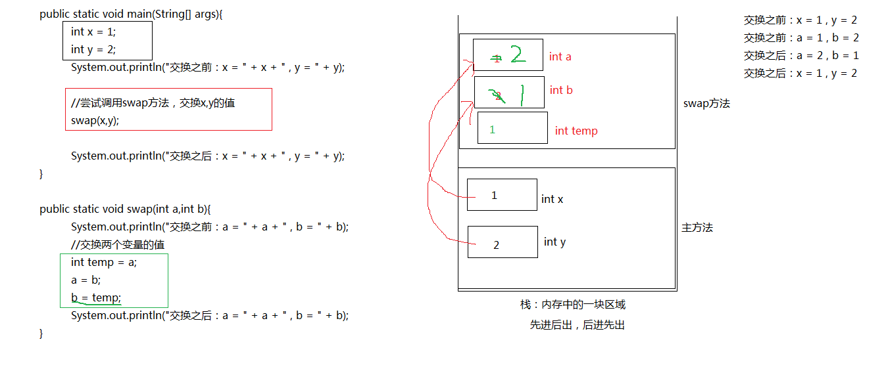

```java
public class TestParams {
    public static void main(String[] args) {
        int x = 3;
        int y = 5;
        System.out.println("交换之前的x=" + x + ",y=" + y);
        swap(x,y);
        System.out.println("交换之后的x=" + x + ",y=" + y);
        /*
        交换之前的x=3,y=5
        交换之前的a=3,b=5
        交换之后的a=5,b=3
        交换之后的x=3,y=5
         */

        String s1 = "hello";
        String s2 = "world";
        System.out.println("交换之前的s1=" + s1 + ",s2=" + s2);
        swap(s1,s2);
        System.out.println("交换之后的s1=" + s1 + ",s2=" + s2);
        /*
        交换之前的s1=hello,s2=world
        交换之前的str1=hello,str2=world
        交换之后的str1=world,str2=hello
        交换之后的s1=hello,s2=world
         */
    }

    //尝试定义一个方法，功能：交换两个变量的值，例如两个整数
    public static void swap(int a, int b) {
        System.out.println("交换之前的a=" + a + ",b=" + b);
        int temp = a;
        a = b;
        b = temp;
        System.out.println("交换之后的a=" + a + ",b=" + b);
    }

    public static void swap(String str1,String str2) {
        System.out.println("交换之前的str1=" + str1 + ",str2=" + str2);
        //交换两个变量的值
        String temp = str1;
        str1 = str2;
        str2 = temp;

        System.out.println("交换之后的str1=" + str1 + ",str2=" + str2);

    }
}
```

### 面向对象OOP

面向过程POP：注重步骤

面向对象：注重行为属于谁，面向对象仍有面向过程的影子，或者说面向过程是面向对象的基础

面向的对象的学习：

​	类、对象等的相关概念及关系

​	面向对象的基本特征和Java的高级特性

​	关键字和核心API

#### 类和对象

##### 类、对象

1. 概念：

   类：具有相同特征的一类事物的抽象描述，用一个Java类进行描述；

   对象：是某一类事物的某一个具体的个体；

2. 类和对象的关系：

   类是很多对象的共同特征的抽象描述的概念；对象是类的一个具体的实实在在的个体；

   类是创建对象的模板和设计图，对象是类的实例；

   ```java
   public class TestClassObject {
       public static void main(String[] args) {
           //用Student类创建对象
           Student s1 = new Student();
           Student s2 = new Student();
   
           //为对象的属性赋值
           //局部变s1，成员变量name
           s1.name = "张登";
           s1.age = 23;
           s1.gender = '男';
           //调用对象的方法
           s1.eat();
           s1.sleep();
           s1.study();
   
           //为对象的属性赋值
           s2.name = "张萌";
           s2.age = 25;
           s2.gender = '女';
           //调用对象的方法
           s2.eat();
           s2.sleep();
           s2.study();
       }
   }
   //声明一个类
   class Student {
       //属性，字段，成员变量
       String name;
       int age;
       char gender;
   
       //方法
       public void eat() {
           System.out.println(name + "吃饭");
       }
   
       public void sleep() {
           System.out.println(name + "睡觉");
       }
   
       public void study() {
           System.out.println(name + "学Java");
       }
   }
   ```

##### 属性

   1. 概念：

      属性也称为字段，成员变量，每一个对象的属性值是独立的，每一个对象都有哪些属性是在类中定义的；

   2. 变量：

   ​	局部变量：方法中

   ​	成员变量：<font color='red'>类中方法外，有默认值：</font>

   ​						byte/short/int/long：0；

   ​						float/double：0.0；

   ​						char：\u0000；

   ​						boolean：false；

   ​						引用数据类型：null

   new：表示创建一个对象，本质上就是在“堆”内存中申请一块空间用来存储对象的信息；

   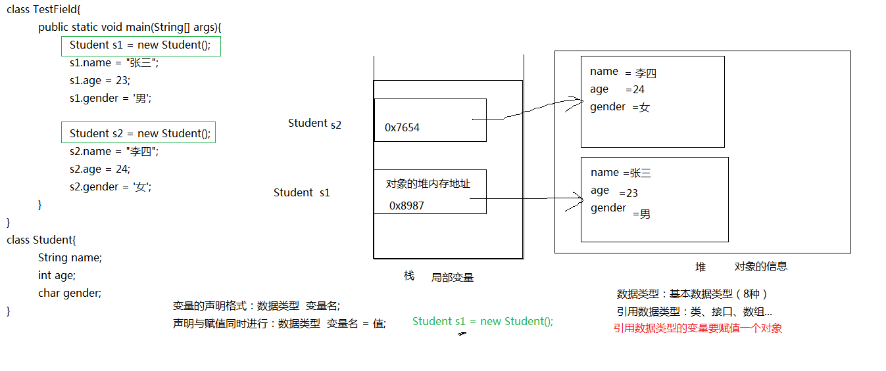

##### 方法：成员方法

+ 静态的：不会因为对象的不同而不同，所有对象都是一样的，和静态相关的词：全局的、共享的；
+ 非静态的：
  + 每一个对象不同；
  + 这个行为应该是某个对象发出的

```java
public class TestMemberMethod {
    public static void main(String[] args) {
        Student1 s1 = new Student1();
        s1.name = "朱一龙";
        //s1.age = 25;
        //s1.gender = '男';

        Student1 s2 = new Student1();
        s2.name = "张承";
        //s2.age = 20;
        //s2.gender = '男';

        s1.eat();

        //s1在未赋值的情况下，打印的是成员变量的默认值
        String str = s1.getInfo();
        System.out.println(str);
    }
}

class Student1 {
    String name;
    int age;
    char gender;

    public  void eat() {
        //在成员方法中，可以直接使用本类的成员变量、属性
        System.out.println(name + "吃饭");
    }

    public String getInfo() {
        return "我的名字是" + name + "，年龄是" + age + "，性别是" + gender;
    }
}
```

```java
/**
 * 声明一个原型类，属性为半径，方法为计算圆的面加，在主方法中进行实例化，显示圆的面加
 */
public class TestCircle {
    public static void main(String[] args) {
        Circle cir1 = new Circle();
        cir1.radius = 3;
        double area1 = cir1.area();

        System.out.println(area1);

        Circle cir2 = new Circle();
        cir2.radius = 2.5;
        double area2 = cir2.area();
        System.out.println(area2);
    }
}

class Circle {
    double radius;

    public double area() {
        return Math.PI * radius * radius;
    }
}
/**
声明一个矩形类，输出周长和面积
*/
public class TestRectangle {
    public static void main(String[] args) {
        Rectangle rectangle = new Rectangle();
        rectangle.length = 4;
        rectangle.width = 5;

        double area = rectangle.area();
        double perimeter = rectangle.perimeter();
        System.out.println("面积：" + area + ",周长：" + perimeter);
    }

}

class Rectangle{
    double length;
    double width;

    public double area() {
        return length * width;
    }

    public double perimeter() {
        return (length + width) * 2;
    }
}
```

+ <a name='class1'><font color='red'>成员变量与局部变量的区别：</font></a>
  + 声明的位置不同：
    + 局部变量声明在方法中：方法体中{}，方法的签名中(形参)；代码块
    + 成员变量声明在类中方法外，即属性；
  + 值存储的位置不同：
    + 局部变量：栈中，属于哪个方法；
    + 成员变量：堆中，每一个对象是独立的；
  + 初始化方式不同：
    + 局部变量：必须手动初始化，否则在使用时会报错，报“变量未初始化”的错误；
    + 成员变量：如果没有赋值，有默认值，自动初始化
      + byte\short\int\long：0；
      + float\double：0；
      + char：\u0000；
      + boolean：false；
      + 引用数据类型：null
  + 作用域：
    + 局部变量：成声明开始到所属的“}”结束；
    + 成员变量：在整个类中；
  + 生命周期：
    + 局部变量：方法被调用，局部变量被分配空间，存储值，方法执行结束，立刻收回；
    + 成员变量：创建对象，成员变量随之分配空间，每创建一个对象，分配一次，每个对象是相互独立的；一直等到这个对象被垃圾回收机制收回时才结束;
  + 修饰符：
    + 局部变量：final，表示常量；
    + 成员变量：权限修饰符、static、final等

##### 方法的参数传递机制

方法的参数传递机制：值传递机制

实参的值赋值给形参：基本数据类型      数据值

​										引用数据类型      地址值

<font color='red'>形参的值的修改不影响实参，但是，如果形参是个引用数据类型，通过“形参**.**”修改属性，那么会影响实参的属性值，原因是形参和实参此时指向同一个对象；</font>

```java
public class TestPassParamsValue {
    public static void main(String[] args) {
        int a = 10;
        System.out.println("修改之前a = " + a);
        //尝试调用changeValue方法修改a的值
        changeValue(a);
        System.out.println("修改之后a的值：" + a);
        /*
        修改之前a = 10
        修改之前num的值：10
        修改之后num的值：100
        修改之后a的值：10
         */

        Circle1 circle = new Circle1();
        circle.radius = 1.2;
        System.out.println("修改之前圆的半径circle：" + circle.radius);
        changeCircleRadius(circle);
        System.out.println("修改之后圆的半径circle：" + circle.radius);
        /*
        修改之前圆的半径circle：1.2
        修改之前圆的半径c：1.2
        修改之后圆的半径c：100.0
        修改之后圆的半径circle：100.0
         */
    }

    //尝试修改某个变量的值
    public static void changeValue(int num) {
        System.out.println("修改之前num的值：" + num);
        num = 100;
        System.out.println("修改之后num的值：" + num);
    }

    //尝试修改圆的半径
    public static void changeCircleRadius(Circle1 c) {
        System.out.println("修改之前圆的半径c：" + c.radius);
        c.radius = 100;
        System.out.println("修改之后圆的半径c：" + c.radius);
    }
}

class Circle1 {
    double radius;
}
```

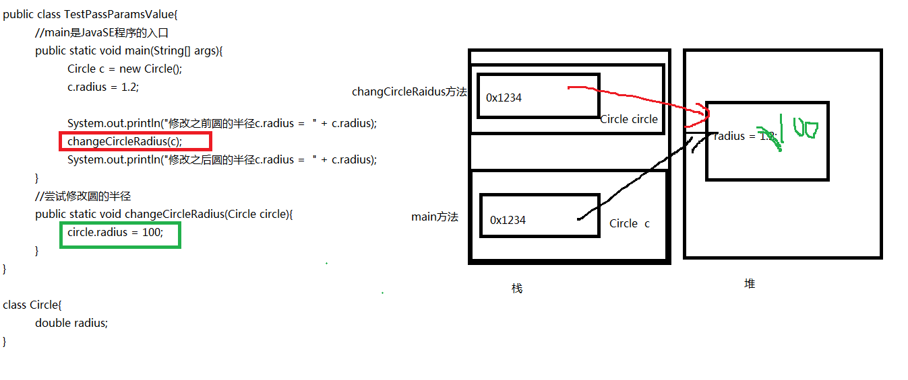

##### 类类型补充

+ 一个类就是一个数据类型

+ 数据类型有：变量的类型、形参的类型、属性的类型、返回值类型

  + 类作为变量的类型：

    + 变量名/对象名 = new 类名()；==>Circle circle = new Circle()；

  + 类作为形参的类型：

    + public void printAreas(Circle2 c,int times) {}

  + 类作为属性的类型：

    + 类名 属性名；==>

      ```java
      class Husband {
          String name;
          int age;
          Wife wife;
      }
      ```

  + 类作为返回值的类型：

    + public String getInfo()

```java
对象作为参数传递练习
/**
 * （1）定义一个Circle类，包含一个double型的radius属性代表圆的半径，一个getArea()方法返回圆的面积。
 * （2）定义一个类PassObject，在类中定义一个方法printAreas()，该方法的定义如下：public void printAreas(Circle c, int times)
 * 在printAreas方法中依次将Circle对象的半径设置为1到times之间的每个整数半径值，并求出对应的面积。例如，times为5，则输出半径1，2，3，4，5，以及对应的圆面积。
 * （3）在main方法中创建Circle对象，并调用printAreas()方法，调用完毕后输出圆当前半径值。
 */
public class TestObjectParams {
    public static void main(String[] args) {
        //创建圆对象
        Circle2 circle = new Circle2();

        //调用printAreas()方法
        PassObject p = new PassObject();
        p.printAreas(circle,5);
        //输出圆当前的半径值
        System.out.println("圆现在的半径值是：" + circle.radius);
    }
}

class Circle2 {
    double radius;

    public double getRadius() {
        return Math.PI * radius * radius;
    }
}

class PassObject {
    public void printAreas(Circle2 c,int times) {
        //在这个方法中圆对象是c，即把c的半径设置为1=times之间
        for (int i=1; i<=times; i++) {
            //为c圆对象的半径赋值
            c.radius = i;
            //根据c.radius求面积
            //c对象自己有求面积的功能
            double sq= c.getRadius();
            System.out.println("半径为" + c.radius + "时，圆的面积为：" + sq);
        }
    }
}

对象作为属性传递练习
/**
 * 定义一个丈夫Husband类，有姓名、年龄、妻子属性
 * 定义一个妻子Wife类，有姓名、年龄、丈夫属性
 * 丈夫类中有一个getInfo方法，其中，能显示自己的姓名，年龄，和他的妻子的姓名，年龄
 * 妻子类中有一个getInfo方法，其中，能显示自己的姓名，年龄，和她的丈夫的姓名，年龄
 * 定义一个测试类，创建妻子和丈夫对象，然后测试
 */
public class TestObjectPass {
    public static void main(String[] args) {
        Husband han =new Husband();
        han.name = "张登";
        han.age = 18;

        Wife w = new Wife();
        w.name = "如花";
        w.age = 18;

        //建立关系
        //为丈夫的妻子属性赋值
        han.wife = w;
        w.husband = han;

        //java.lang.NullPointerException空指针异常，如果出现这个异常，一定是对象是null,然后却调用了对象的属性和方法
        System.out.println(han.getInfo());
        System.out.println(w.getInfo());
    }
}


class Husband {
    String name;
    int age;
    Wife wife;

    public String getInfo() {
        return "丈夫的姓名" + name + ",年龄：" + age + ",他妻子的姓名：" + wife.name + ",他妻子的年龄：" + wife.age;
    }
}

class Wife {
    String name;
    int age;
    Husband husband;

    public String getInfo() {
        return "妻子的姓名" + name + ",年龄：" + age + ",她丈夫的姓名：" + husband.name + ",她丈夫的年龄：" + husband.age;
    }
}
```

##### 内存区域

1. 内存区域：

   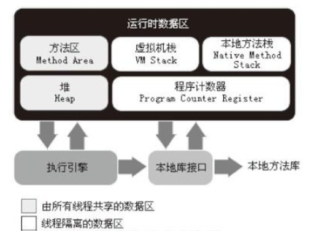

   堆（Heap）：此内存区域的唯一目的就是存放对象实例，几乎所有的对象实例都在这里						分配内存；在Java虚拟机规范中的描述是：所有的对象实例以及数组都要·						在堆上分配。

   栈（Stack）：是指虚拟机栈。虚拟机栈用于存储局部变量表等。局部变量表存放了编译						期可知长度的各种基本数据类型（boolean、byte、char、short、int、						float、long、double）、对象引用（reference类型，它不等同于对象本						身，是对象在堆内存的首地址）。 方法执行完，自动释放。

   方法区（Method Area）：用于存储已被虚拟机加载的类信息、常量、静态变量、即时						编译器编译后的代码等数据。

2. Java中的内存管理：

   分配：由JVM自动为其分配相应的内存空间

   释放：由JVM提供垃圾回收机制自动的释放内存空间

   垃圾回收机制（GC：Garbage Collection）：将垃圾对象所占用的堆内存进行回收。						Java的垃圾回收机制是JVM提供的能力，由单独的系统级垃圾回收线程在						空闲时间以不定时的方式动态回收。

   垃圾对象：不再被任何引用指向的对象。

   System.gc();或Runtime.gc();通知垃圾回收机制可以回收内存，该调用并不会立刻启动垃圾回收机制开始回收，但会加快垃圾回收机制的运行。

#### 面向对象的基本特征

##### 封装：Encapsulation

1. 作用：隐藏实现细节，更为安全

2. 含义：将对象的属性和行为封装起来，其载体就是类，类通常对客户隐藏其实现细节，封装需要通过访问控制修饰符（权限修饰符）来实现。广义上的封装包含属性、方法、类、组件、系统等；

   + 方法：封装一个功能；
   + 类：封装某一类事物的特征；
   + 包：某一系列的类；
   + 组件：网银、支付宝 等；

3. Java封装属性：

   + 属性的封装：<font color='red'>属性私有化（private），提供公共的（public）的getter/setter方法</font>
     + 属性通过private修饰：这个属性只能在本类中使用；
     + 通过get/set方法来访问和操作私有的属性；
     + get：获取，用于获取、访问属性的值；
     + set：用于为属性赋值；
   + 要求：
     + set用于为属性赋值；
     + get用于获取属性值；
     + get/set方法的命名有要求：set/get+属性名，但是属性名首字母大写；
     + 如果是布尔类型的属性，get方法命名为：is+属性名，属性名首字母大写；
   + 小结：
     + 一个JavaBean没有特殊要求，属性都要私有化，并且提供公共的get/set

   ```JAVA
   public class TestEncapsulation {
       public static void main(String[] args) {
           //类的使用者
           Student student = new Student();
           //student.age = 60;
           //student.age = -10;
           System.out.println(student.getInfo());
           //为student的age赋值
           student.setAge(18);
   
           //为student的name赋值
           student.setName("张三");
           System.out.println("年龄：" + student.getAge());
           System.out.println("姓名：" + student.getName());
           System.out.println(student.getInfo());
       }
   }
   
   //类的设计者
   class Student {
       private String name;
       private int age;//设计者希望年龄限定在18-35岁之间
   
       //当使用者调用这个方法时，可以获取某个学生对象的age的值
       public int getAge(){
           return age;
       }
       //当使用者调用这个方法时，可以为某个学生对象设置age的值
       //参数：完成为age赋值的功能，数据未知：设置什么值
       public void setAge(int a) {
           //为age赋值，限制age的范围
           //设计者对于这个操作变得可控
           if (a>=18 && a<=35) {
               age = a;
           }
       }
   
       public String getName() {
           return name;
       }
       public void setName(String str) {
           name = str;
       }
   
       public String getInfo() {
           //在本类中可以使用private的属性
           return "姓名:" + name + ",年龄：" + age;
       }
   }
   ```

   ```java
   /**
   编写类Triangle，声明私有的底边长base和高height，同时声明公共方法访问私有变量；
   在TriangleManager类中，定义一个方法：public static double getArea(Trangle t)计算三角形的面积,在测试类中测试
    */
   public class Exer3 {
       public static void main(String[] args) {
           Triangle t = new Triangle();
           t.setBase(2);
           t.setHeight(5);
   
           double area = TriangleManager.getArea(t);
           System.out.println("三角形的面积是：" + area);
       }
   }
   
   class Triangle {
       private double base;
       private double height;
   
       public double getBase() {
           return base;
       }
       public void setBase(double base) {
           this.base = base;
       }
   
       public double getHeight() {
           return height;
       }
       public void setHeight(double height) {
           this.height = height;
       }
   }
   
   class TriangleManager {
       public static double getArea(Triangle t) {
           return t.getBase() * t.getHeight() / 2;
       }
   }
   /**
   定义一个丈夫Husband类，有姓名、年龄、妻子属性，其中妻子属性没有getter和setter，而是通过marry方法，赋值，妻子是私有的不提供公共的getter方法。
   定义一个妻子Wife类，有姓名、年龄、丈夫属性，其中丈夫属性没有getter和setter，而是通过marryTo方法，赋值，丈夫是私有的不提供公共的getter方法
   丈夫类中有一个getInfo方法，其中，能显示自己的姓名，年龄，和他的妻子的姓名，年龄
   妻子类中有一个getInfo方法，其中，能显示自己的姓名，年龄，和他的丈夫的姓名，年龄
   */
   public class Exer4 {
       public static void main(String[] args) {
           Husband husband = new Husband();
           husband.setName("张合");
           husband.setAge(25);
   
           Wife wife = new Wife();
           wife.setName("李欣");
           wife.setAge(22);
   
           //此处不建立关联 会报空指针异常
           husband.marry(wife);
           wife.marryTo(husband);
   
           System.out.println(husband.getInfo());
           System.out.println(wife.getInfo());
       }
   }
   
   class Husband {
       private String name;
       private int age;
       private Wife wife;
   
       public String getName() {
           return name;
       }
   
       public void setName(String name) {
           this.name = name;
       }
   
       public int getAge() {
           return age;
       }
   
       public void setAge(int age) {
           this.age = age;
       }
   
       public void marry(Wife w) {
           this.wife = w;
       }
   
       public String getInfo() {
           return "丈夫的姓名是：" + this.name + ",年龄是：" + this.age + ",他妻子的姓名是：" + wife.getName() + ",年龄是：" + wife.getAge();
       }
   }
   
   class Wife {
       private String name;
       private int age;
       private Husband husband;
   
       public String getName() {
           return name;
       }
   
       public void setName(String name) {
           this.name = name;
       }
   
       public int getAge() {
           return age;
       }
   
       public void setAge(int age) {
           this.age = age;
       }
   
       public void marryTo(Husband h) {
           this.husband = h;
       }
   
       public String getInfo() {
           return "妻子的姓名是：" + this.name + ",年龄是：" + this.age + ",他丈夫的姓名是：" + husband.getName() + ",年龄是：" + husband.getAge();
       }
   }
   ```

   

##### 构造器/构造方法Constructor

1. 构造器的作用：

   + 和new一起使用时创建对象；StudentA stu = new StudentA();
   + 为属性赋值；

2. 构造器的声明：

   + 无参构造，空参构造：

     ```java
     【修饰符】构造器名称() {}
     ```

   + 有参构造：

     ```java
     【修饰符】构造器名称(形参列表) {}
     ```

3. 说明：

   + 构造器没有返回值类型；
   + 构造器的名称必须和类名一样；
   + 每一个类都有构造器，但是如果这个类没有手动定义任何构造器，那么编译器将自动添加一个默认的无参构造；
   + 如果类中声明了构造器，那么编译器将不再自动提供无参构造，如果需要无参构造，需要手动编写；
   + 构造器可以重载；
+ 每一个类的构造器中一定会调用父类的构造器，默认调用父类的无参构造，如果父类没有无参构造，那么必须在首行用super(实参列表)调用有参构造；
  
   ```java
   public class TestConstructor {
       public static void main(String[] args) {
           StudentA stu = new StudentA();
           System.out.println(stu.getInfo());
   
           StudentA student = new StudentA("张登",23);
           System.out.println(student.getInfo());
   
           StudentA s = new StudentA("朱一龙");
           System.out.println(s.getInfo());
       }
   }
   
   class StudentA {
       private String name;
       private int age;
   
       //构造器可以重载
       StudentA() {
           System.out.println("无参构造器");
       }
   
       StudentA(String a) {
           System.out.println("一个参数构造器");
       }
   
       StudentA(String a, int b) {
           System.out.println("两个参数构造器");
           //为属性赋值
           name = a;
           age = b;
       }
   
       public String getInfo() {
           return "姓名：" + name + ",年龄：" + age;
       }
   }
   ```
```java
   /**
   Room类： 
   属性：房号、面积、地址，使用封装
   方法：getDetails 返回String，描述房间详细信息
   构造器：0-3个参数的重载构造器，使用this（）调用
   TestRoom类： 
   分别用4个构造器创建4个room对象，打印对象的详细信息
   */
   public class TestRoom {
       public static void main(String[] args) {
           Room r1 = new Room();
           r1.setAddress("天津");
           r1.setId(0);
           r1.setArea(50);
           System.out.println(r1.getDetails());
   
           Room r2 = new Room(1);
           System.out.println(r2.getDetails());
   
           Room r3 = new Room(2, 100);
           System.out.println(r3.getDetails());
   
           Room r4 = new Room(3, 120, "北京");
           System.out.println(r4.getDetails());
       }
   }
   
   class Room {
       private int id;
       private double area;
       private String address;
   
       public int getId() {
           return id;
       }
   
       public void setId(int id) {
           this.id = id;
       }
   
       public double getArea() {
           return area;
       }
   
       public void setArea(double area) {
           this.area = area;
       }
   
       public String getAddress() {
           return address;
       }
   
       public void setAddress(String address) {
           this.address = address;
       }
   
       public String getDetails() {
           return "房间编号是：" + this.id + ",房间面积是：" + this.area + ",房间地址是：" + this.address;
       }
   
       Room(){
           System.out.println("没有参数的构造器");
       }
       Room(int id) {
           this();
           this.id = id;
       }
       Room(int id,double area) {
           this(id);
           this.area = area;
       }
       Room(int id,double area,String address) {
           this(id, area);
           this.address = address;
       }
   }
```

##### 包

1. 包的作用：

   + 避免类的重名；
   + 可以对类起到访问控制的问题，如果希望某个类或某个成员仅限于本类或本报中使用，那么修饰符缺省即可；
   + 可以对类按模块进行分类管理；

2. 如何声明包：

   + 位置要求：

     + 必须在源文件的代码首行（注释不算）

   + 格式：

     ```java
     package 包名;
     ```

   + 包的命名规范：

     + 全部字母都小写，用.分割到每一级；
     + 习惯上，每一个项目使用公司的域名倒置，加模块；（com.ezsvs.oa）

3. 一旦源文件中声明了包，那么源文件中的所有类的全名称就变成了：包.类名;

4. 编译：

   + 原来：javac 源文件名.java
   + 现在：javac -d . 源文件名.java

5. 运行：

   + 原来：java 类名
   + 现在：java 包.类名

6. 如果其他包的类要使用当前包的类，需要导包；只要不是java.lang包下的类，都需要导包；

7. 导包：

   + 格式：
     + import 包.类名;
   + 位置：
     + 在package的下一行开始（package和class中间）；

##### 继承:Inheritance

1. 举例：

   ```java
   定义一个学生类：Student
       属性：姓名、性别、年龄、电话、地址...
       方法：eat()、sleep()、coding()....
   定义一个教师类：
       属性：姓名、年龄、性别、电话、工资....
       方法：eat()、sleep()、working()...
   把这两个类甚至多个类的共同部分抽象出一个 父类：Person
       属性：姓名、性别、年龄、电话...
       方法：eat()、sleep()
   ```

2. 作用：

   + 代码的重用、复用（父类用于表示共同的部分）、扩展（每一个子类可以有不同的部分）
   + 子类又称为派生类，SubClass；
   + 父类又称为超类/基类，SuperClass；

3. 如何实现继承：

   ```java
   【修饰符】class 子类名 extends 父类名 {
       
   }
   ```

4. 继承的特点：

   + 子类会继承父类的所有的属性和方法，包括私有的，但是因为private关键字的原因，在子类中不能直接使用，只能通过get/set方式；
   + 子类可以扩展自己的属性和方法；
   + 一个父类可以有多个子类，子孙满堂；
   + 子类还可以有自己的子类；
   + 一个子类只能有一个直接的父类，只能继承一个类，Java有单继承的限制，只有一个亲生父亲；
   + 子类会继承父类的、父类的父类的信息，代代相承；
   + <font color='red'>子类不能继承父类的构造器，但是在创建子类对象时一定且必须会去调用父类的构造器，而且默认调用的是父类的无参构造，如果父类没有无参构造，子类需要手动调用父类的有参构造==》最好父类保留无参构造</font>；

5. 如何调用父类的有参构造：必须在子类的构造器中

   + 调用父类的无参构造：

     + 默认也会调用，也可以手动调用父类的的无参构造；

       ```java
       super();
       ```

   + 调用父类的有参构造：

     ```java
     super(实参列表)
     ```

6. 如果一个类没有指明它的父类，那么它的父类就默认为java.lang.Object，是根父类；

   ```java
   public class TestInherinatance {
       public static void main(String[] args) {
           Student1 stu = new Student1("张华");
           stu.setName("张登");
           stu.eat();
   
           System.out.println(stu.getInfo());
   
           Teacher teacher = new Teacher("王晓");
           teacher.setSalary(10000);
           teacher.setName("朱一龙");
           teacher.setAge(18);
           System.out.println(teacher.getName() + teacher.getSalary());
       }
   }
   
   class Animals  {
       public Animals() {
           System.out.println("Animals的构造器");
       }
   
       public void eat() {
           System.out.println("吃饭");
       }
   
       public void sleep() {
           System.out.println("睡觉");
       }
   }
   
   class Person extends Animals{
       private String name;
       private char gender;
       private int age;
       private String tel;
   
       public Person(String name) {
           this.name = name;
       }
   
       public String getName() {
           return name;
       }
   
       public void setName(String name) {
           this.name = name;
       }
   
       public char getGender() {
           return gender;
       }
   
       public void setGender(char gender) {
           this.gender = gender;
       }
   
       public int getAge() {
           return age;
       }
   
       public void setAge(int age) {
           this.age = age;
       }
   
       public String getTel() {
           return tel;
       }
   
       public void setTel(String tel) {
           this.tel = tel;
       }
   }
   
   class Student1 extends Person{
       private int score;
   
       public Student1(String name) {
           super(name);
       }
       public int getScore() {
           return score;
       }
   
       public void setScore(int score) {
           this.score = score;
       }
   
       public String getInfo() {
           return "学生的姓名：" + getName() + ",成绩：" + score;
       }
   }
   
   class Teacher extends Person{
       private double salary;
   
       public Teacher(String name) {
           super(name);
       }
   
       public double getSalary() {
           return salary;
       }
   
       public void setSalary(double salary) {
           this.salary = salary;
       }
   }
   ```

##### 重写:Override

1. 含义：

   + 当父类的方法的实现，即方法体不适合子类的对象，子类可以重写父类的方法；
   + 只针对方法，不针对属性，属性没有重写；

2. 子类重写父类的方法，要求名称相同，形参列表相同，方法体不同；

   + 两同：
     + 方法名必须相同；
     + 形参列表必须相同，如果不同，就变成了重载；
   + 返回值类型（两小）：
     + 返回值类型是基本数据类型或void，那么子类重写的方法必须和父类重写的方法相同；
     + 返回值类型是引用数据类型，那么子类重写的方法的返回值类型<=父类被重写方法的返回值类型（规定子类小于父类）；
   + 抛出的异常（两小）：
   + 权限修饰符（一大）：
     + 子类重写方法的权限修饰符应该>=父类被重写方法的权限修饰符，规定：public>protected>缺省>private；

   ```java
   public class TestOverride {
       public static void main(String[] args) {
           Person1 person1 = new Person1();
           person1.eat();
   
           Man man = new Man();
           man.eat();
   
           Woman woman = new Woman();
           woman.eat();
       }
   }
   
   class Person1 {
       public void eat() {
           System.out.println("吃饭");
       }
   }
   
   //男的调用：吃饭是狼吞虎咽
   class Man extends Person1{
       //重写
       @Override
       public void eat() {
           System.out.println("狼吞虎咽");
       }
       //重载
       public void eat(String food) {
           System.out.println("细嚼慢咽");
       }
   }
   
   //女的调用：吃饭是细嚼慢咽
   class Woman extends Person1{
       @Override
       public void eat() {
           System.out.println("细嚼慢咽");
       }
   }
   ```

3. private：

   + 如果父类的方法是private修饰，那么子类无法对它进行重写；

4. static：

   + 如果父类的方法是static修饰的，那么表示这个方法是属于父类的，通过类名调用，而不是通过对象调用，子类不能进行重写；

5. @Override：

   + 加在方法上，称为注解，作用是对当前方法进行检查，看是否是一个重写的方法，看是否满足重写的要求；

6. 重写和重载的区别：

   + 概念解释：

   + 各自要求：

     <table>
         <tr>
             <td>名词</td>
             <td>Overload重载的方法</td>
             <td>Override重写的方法</td>
         </tr>
         <tr>
             <td>位置</td>
             <td>同一个类中</td>
             <td>在父子类中</td>
         </tr>
        	<tr>
             <td>方法名</td>
             <td>必须相同</td>
             <td>必须相同</td>
         </tr>
         <tr>
             <td>形参列表</td>
             <td>必须不同</td>
             <td>必须相同</td>
         </tr>
         <tr>
             <td>返回值类型</td>
             <td>无关</td>
             <td> 如果返回值类型是void和基本数据类型，那么必须一致，如果是引用	数据类型，重写方法的返回值类型可以和被重写方法的返回值类型一样或是它的子类
     		</td>
         </tr>
         <tr>
             <td>抛出的异常列表</td>
             <td>无关</td>
             <td>重写方法抛出的异常类型要么和被重写方法一样，要么是被重写方法抛出异常的子类
             </td>
         </tr>
         <tr>
             <td>权限修饰符</td>
             <td>无关(建议一致)</td>
             <td>写方法的权限修饰符要么和被重写方法一样，要么比被重写方法的权限范围大
             </td>
         </tr>
     </table>

##### 多态:Polymorphism

1. 含义：

   + 多种形态，每一个事物都会出现多种形态；

2. 作用：

   + 代码功能更丰富、灵活
   + 为实现 动态绑定、虚方法调用提供支持

3. 在Java中如何体现多态：

   + 重载和重写：

     + 一个方法功能的方法体出现多种形态；

   + 对象的多态性：

     + 多态引用：父类的变量指向了子类的对象；

     + 编译时类型和运行时类型不一致：编译时看左边，运行时看右边：

       Person person1 = new Man()；

       编译时以“左边/父类”的类型为准，父类的方法可以调用，父类没有的方法不能调用；运行时以“右边/子类对象”的类型为准，执行的是子类重写过的方法体；

   + 对象多态性的前提：

     + 继承；
     + 多态引用；
     + 子类重写了父类的方法；

   ```java
   public class TestPolymorphism {
   	public static void main(String[] args) {
           Person person = new Person();
           person.walk();//本态引用
   
           Man man = new Man();
           man.walk();
   
           Woman woman = new Woman();
           woman.walk();
   
           //多态引用
           Person person1 = new Man();
           person1.eat();
           person1.walk();
       }
   }
   
   class Person {
       public void eat(){
           System.out.println("吃饭");
       }
       public void walk() {
           System.out.println("走路");
       }
   }
   
   class Man extends Person{
       @Override
       public void eat() {
           System.out.println("狼吞虎咽");
       }
   
       @Override
       public void walk() {
           System.out.println("龙行虎步");
       }
   
       public void smoke() {
           System.out.println("吞云吐雾");
       }
   }
   
   class Woman extends Person{
       @Override
       public void eat() {
           System.out.println("细嚼慢咽");
       }
   
       @Override
       public void walk() {
           System.out.println("婀娜多姿");
       }
   }
   ```

4. 多态的应用：

   + 多态参数：

     + 形参是父类的类型，那么可以接收父类的对象和子类的对象；
     + 用父类的类型声明形参，可以接收父类的对象作为实参或子类的对象作为实参

     ```java
     /*
     有一个图形类：Graphic
     有两个子类：Circle和Rectangle，希望打印其面积
      */
     
     public class TestUse {
         public static void main(String[] args) {
             //Circle circle = new Circle(1.3);
             //Recaangle recaangle = new Recaangle(3, 5);
     
             Graphic circle = new Circle(2);
             Graphic recaangle = new Recaangle(2,5);
             //多态引用
             print(circle);//实参circle的值赋值给形参，Graphic g = circle;
             print(recaangle);//实参recaangle的值赋值给形参，Graphic g = recaangle;
         }
     
         //声明一个方法，可以打印不同图形的面积，如果子类太多，则重载不变
     //    public static void print(Circle c) {
     //        System.out.println(c.getArea());
     //    }
     //
     //    public static void print(Recaangle r) {
     //        System.out.println(r.getArea());
     //    }
     
         public static void print(Graphic c) {
             System.out.println(c.getArea());
         }
     }
     
     class Graphic{
         private int num;
     
         public int getNum() {
             return num;
         }
     
         public void setNum(int num) {
             this.num = num;
         }
     
         public double getArea() {
             return 0;
         }
     }
     
     class Circle extends Graphic {
         private double radius;
     
         public Circle() {
         }
     
         public Circle(double radius) {
             super();
             this.radius = radius;
         }
     
         public double getRadius() {
             return radius;
         }
     
         public void setRadius(double radius) {
             this.radius = radius;
         }
     
         @Override
         public double getArea() {
             return Math.PI * radius * radius;
         }
     }
     
     class Recaangle extends Graphic{
         private double length;
         private double width;
     
         public Recaangle() {
         }
     
         public Recaangle(double length, double width) {
             super();
             this.length = length;
             this.width = width;
         }
     
         public double getLength() {
             return length;
         }
     
         public void setLength(double length) {
             this.length = length;
         }
     
         public double getWidth() {
             return width;
         }
     
         public void setWidth(double width) {
             this.width = width;
         }
     
         @Override
         public double getArea() {
             return length * width;
         }
     }
     ```

   + 多态数组：

     + 用父类的类型来声明一个数组，可以装父类的对象、子类的对象；

     ```java
     public class TestUse2 {
         public static void main(String[] args) {
             //用一个数组来装各种图形
             Circle c1 = new Circle(2);
             Circle c2 = new Circle(3);
             Recaangle r1 = new Recaangle(3, 5);
             Recaangle r2 = new Recaangle(5, 5);
     
     //        Circle[] array = new Circle[5];
     //        array[0] = c1;
     //        array[2] = c2;
     //        array[3] = r1;//Circle类型的数组，无法装Recaangle类型的对象
             Graphic[] array = new Graphic[4];
             array[0] = c1;//多态引用，左边的类型Graphic = 右边的对象Circle
             array[1] = c2;//多态引用，左边的类型Graphic = 右边的对象Circle
             array[2] = r1;//多态引用，左边的类型Graphic = 右边的对象Recaangle
             array[3] = r2;//多态引用，左边的类型Graphic = 右边的对象Recaangle
     
             for (int i = 0; i < array.length; i++) {
                 System.out.println(array[i].getArea());
             }
         }
     }
     ```

5. 类型转换：一般同instanceof搭配使用

   + 向上转型upCasting：子类转父类，系统自动完成

     + 多态引用

     注意：一个引用类型变量如果声明为父类的类型，但实际引用的是子类对象，那么该变量就不能再访问子类中添加的属性和方法

   + 向下转型downCasting：父类转子类，强制类型转换

     + 语法：

       ```java
       子类的类型 变量名 = (子类的类型)父类的对象名;
       ```

     注意：前提父类原先指向的就是本身对象才能向下转型成功，如果父类原先指向的是其他类型（父类的，兄弟类的）的对象，那么就会发生java.lang.ClassCastException类型转换异常，可以使用instanceof来判断是否是子类的对象；

     ```java
     public static void main(String[] args) {
     		//基本数据类型
     		int i = 12;
     		long myLong = i;//自动类型转化，存储范围小的自动转为大的
     		int n = (int)myLong;//强制类型转换，存储范围大的强制转为小的，损失精度
     		
     		//多态引用
     		Human m = new Man();//向上转型
     		Human w = new Woman();//向上转型
     		
     		Man man = new Man();//本态引用
     		Human h1 = man;//多态引用，向上转型
     		Man m1 = (Man)h1;//向下转型
     		
     		//Man m2 = (Man)w;//从概念上来说,w是Human类型，强制转为Man类型，存在风险。w本身指向的是Woman，如果强制转为Man就会出现异常java.lang.ClassCastException: 
     	
     		Human h3 = new Human();
     	//	Man m3 = (Man)h3;//java.lang.ClassCastException: 
     	}
     ```

     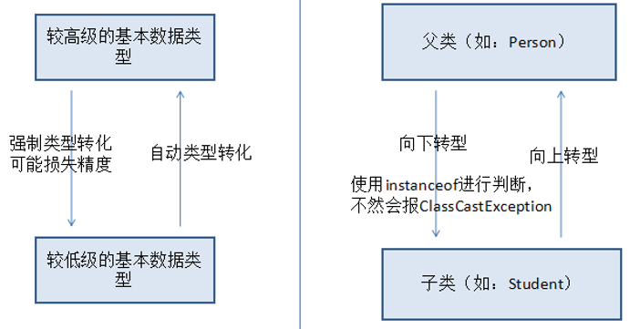

#### 数组

##### 一维数组

1. 概念：

   + 数组：就是相同数据类型的元素按一定顺序排列的集合，就是把有限个类型相同的变量用一个名字命名，以便统一管理他们，然后用编号区分他们，这个名字称为数组名，编号称为下标或索引。组成数组的各个变量称为数组的元素。数组中元素的个数称为数组的长度。
   + 元素：数组名[下标]，下标要求从0开始，到数组的length-1

2. 数组的声明和使用：

   + 格式：

     ```java
     元素的数据类型[] 数组名;//元素的类型是int，数组的类型是int[]（引用数据类型）
     ```

   + 初始化数组：

     ```java
     数组名 = new 元素的类型[数组的长度];
     ```

   + 为数组的元素赋值：

     ```java
     数组名[下标] = 值;
     ```

   + 数组的静态初始化：

     ```java
     数组名 = new 元素的数据类型[]{元素1的值,元素2的值,...}//数组的长度由{}中元素的个数决定
     ```

   + 访问数组元素：数组的元素好比是数组对象的属性/成员变量，所以<a href='#class1'>数组的元素有默认值</a>，规则和属性的默认值一样。

     ```java
     数组名[下标]
     ```

   + 如何表示数组的长度：[0,array.length-1]

     ```java
     数组名.length
     ```

   + 遍历数组：

     ```java
     for(int i=0; i<=array.length; i++) {
         数组名[i]就表示一个元素;
     }
     ```

   ```java
   public class Review {
       public static void main(String[] args) {
           int[] array = new int[5];;
           array[0] = 5;
   
           String[] strings = new String[5];
           strings[0] = "hello";
   
           Student[] stu = new Student[5];//创建数组对象
           stu[0] = new Student("张登",22);//通过构造函数实例化学生对象
           stu[1] = new Student("朱一龙");
           stu[2] = new Student();
           stu[2].setName("王可");
           System.out.println(stu[2].getName());
           System.out.println(stu[1].getName());
           stu[0].setName("高飞");
           System.out.println(stu[0].getName() + stu[0].getAge());
       }
   }
   
   class Student {
       private String name;
       private int age;
   
       public Student() {
       }
   
       public Student(String name) {
           this.name = name;
       }
   
       public Student(String name, int age) {
           this.name = name;
           this.age = age;
       }
   
       public String getName() {
           return name;
       }
   
       public void setName(String name) {
           this.name = name;
       }
   
       public int getAge() {
           return age;
       }
   
       public void setAge(int age) {
           this.age = age;
       }
   }
   /*
   创建一个长度为10的数组，用随机数为元素赋值，随机数是100以内，并显示数组中的值，求出最大值
    */
   import java.util.Random;
   
   public class TestExer1 {
       public static void main(String[] args) {
           int[] array = new int[10];
           Random random = new Random();
   
           for (int i=0; i<array.length; i++) {
               array[i] = random.nextInt(100);
               System.out.println(array[i] + "");
           }
   
           //找最大值
           int max = array[0];
           //用max的值和array[1]~array[9]依次比较，如果max的值，小于array[i]，那么把max的值修改为array[i]
           for (int i = 1; i < array.length; i++) {
               if (max < array[i]) {
                   max = array[i];
               }
           }
           System.out.println("最大值是：" + max);
       }
   }
   /**
    * 使用数组和循环实现求今天或任意一天是这一年的第几天
    */
   
   public class Exer3 {
       public static void main(String[] args) {
           int year = 2018;
           int month = 12;
           int day = 31;
   
           //定义数组保存每一个月的天数
           int[] monthDays = {31,28,31,30,31,30,31,31,30,31,30,31};
   
           //1.计算第month个月的天数，即累加day
           int sum =day;
           //2.计算[0，month-1]的总天数
           for (int i = 1; i <= month-1; i++) {
               sum += monthDays[i-1];
   
               //2月份需要单独考虑
               if (i == 2) {
                   //是否是闰年
                   if (year % 4 == 0 && year % 100 != 0 || year % 400 == 0) {
                       sum++;
                   }
               }
           }
           System.out.println("这一天是这一年的第" + sum + "天");
       }
   }
   ```

3. 数组的特点：

   + 数组的长度一旦确定就不能修改；
   + 创建数组对象会在内存中开辟一整块连续的空间，而数组名中引用的是这块连续空间的首地址；
   + 遍历数组和获取某个元素的速度快，因为可以通过署名下标值，直接定位到任意一个元素。

   ```java
   /**
   求数组的最小值及下标
   创建一个长度为5的数组，赋值100以内的随机整数，显示数值中元素的值，并找出最小值及其下标
    */
   import java.util.Random;
   
   public class TestArrayMinIndex {
       public static void main(String[] args) {
   
           Random random = new Random();
           int[] array = new int[5];
   
           for (int i = 0; i <= array.length-1; i++) {
               array[i] = random.nextInt(100);
               System.out.println(array[i] + "");
           }
           int min = array[0];
           int index = 0;
           for (int i = 1; i < array.length-1; i++) {
               if (min > array[i]) {
                   min = array[i];
                   index = i;
               }
           }
           System.out.println("最小值是：" + min + ",下标值是：" + index);
       }
   }
   /*
   创建一个长度为5的数组，赋值100以内的随机整数，显示数值中元素的值，并求和和平均值
    */
   
   import java.util.Random;
   
   public class TestArraySumAndAvg {
       public static void main(String[] args) {
   
           Random random = new Random();
           int[] array = new int[5];
   
           for (int i = 0; i <= array.length-1; i++) {
               array[i] = random.nextInt(100);
               System.out.println(array[i] + "");
           }
           double sum = 0;
           double avg = 0;
           for (int i = 0; i < array.length; i++) {
               sum += array[i];
           }
           avg = sum / array.length;
           System.out.println("数组的和是：" + sum + ",平均值是：" + avg);
       }
   }
   /*
   数组反转
    */
   //方法一：交换
   public class SwarArrayElement {
       public static void main(String[] args) {
           int[] array = {1,2,3,4,5};
   
           //交换length/2次
           for (int i = 0; i < array.length/2; i++) {
               int temp = array[i];
               array[i] = array[array.length-1-i];
               array[array.length-1-i] = temp;
           }
           for (int i = 0; i < array.length; i++) {
               System.out.print(array[i] + "\t");
           }
       }
   }
   //方法二：借用临时数组
   public class SwapArrayElement2 {
       public static void main(String[] args) {
           int[] array = {1, 2, 3, 4, 5};
           int temp[] = new int[array.length];
   
           for (int i = 0; i < array.length; i++) {
               temp[i] = array[array.length - 1- i];
           }
   
           for (int i = 0; i < temp.length; i++) {
               System.out.println(temp[i] + "");
           }
       }
   }
   ```
   
4. 命令行参数：

   + 给主方法的实参，就叫做命令行参数；

5. 可变参数：

   + 可变参数可变的是参数的个数，即实参的列表长度

   + 可变参数的声明：

     + 形参：数据类型... 形参名
     + 可变参数的实参：可变参数的位置可以是0~n个实参；

   + 说明：

     + 可变参数在声明它的方法中是做数组使用的；
     + 一个方法只能有一个可变参数；
     + 可变参数必须是最后一个参数；
     + 可变参数的位置可以传对应类型的数组；

     ```java
     public class TestVarParams {
         public static void main(String[] args) {
             int max = getMax(2, 3, 1);
             System.out.println(max);
         }
     
         public static int getMax(int a, int... nums) {
             int max = nums[0];
             for (int i = 1; i < nums.length; i++) {
                 if (max < nums[i]) {
                     max = nums[i];
                 }
             }
             return max;
         }
     }
     ```

   + 可变参数的陷阱：

     + 重载时考虑：

     ```java
     陷阱1：
     public class TestVar {
         public static void main(String[] args) {
             test(1,2);
             test(1);
             //test(1,2,3)在执行时不知道调用哪个方法
             //test(1,2,3);
     
         }
         public static void test(int a) {
             System.out.println("1个参数");
         }
     
         public static void test(int a,int b){
             System.out.println("2个参数");
         }
     
         //重载问题
         public static void test(int a,int... nums) {
             System.out.println("1个+多个参数");
         }
     
         public static void test(int... nums) {
             System.out.println("n个参数");
         }
     }
     陷阱2：
     public class TestVar1 {
         public static void main(String[] args) {
             int[] array = new int[] {1,2,3};
             print1(array);
         }
     //    //编译认为这两个方法是一样的，实际上是有区别的
     //    public static void test(int[] args) {
     //
     //    }
     //
     //    public static void test(int... args) {
     //
     //    }
         //实参必须是一个数组，
         public static void print1(int[] args) {
     
         }
     
         //实参可以是一个数组，也可以是罗列几个元素
         public static void print2(int... args) {
     
         }
     }
     ```

     

##### 数组的相关算法

+ 找数组最大/小值及下标；数组的反转；数组的复制：

  ```java
  /*
  定义一个数组的工具类，声明如下几个静态方法；
  1.可以返回整型数组中的最大值；
  2.可以返回整型数组中最大值的下标；
  3.可以返回整型数组的最小值
  4.可以反转一个整型数组的元素
  5.可以反转一个整型数组的[start,end）之间的元素，0<=start<=end<=数组的长度
  6.可以复制一个整型数组，和原数组一样长
  7.可以复制一个整型数组，从原数组的[0]开始复制元素到新数组，新数组的长度由使用者决定
  8.可以复制一个整型数组，从原数组的[start]开始复制元素到新数组，新数组的长度由使用者决定，start也由使用者决定
   */
  
  public class MyArraysUtils {
      //1.功能：返回一个数组中的最大值
      public static int getMaxValue(int[] array) {
          int indexValue = 0;
          for (int i = 0; i < array.length; i++) {
              if (array[indexValue] < array[i]) {
  
                  //使用下标值这一个变量求取最大值时，必须先让indexValue等于最大值的下标，否则将导致array[0] = 最大值
                  indexValue = i;
                  array[indexValue] = array[i];
              }
          }
          return array[indexValue];
      }
  
      //2.找出数组最大值下标:两个变量
      public static int getMaxValueIndex1(int[] array) {
          int max = array[0];
          int index = 0;
          for (int i = 1; i < array.length; i++) {
              if (max < array[i]) {
                  max = array[i];
                  index = i;
              }
          }
          return index;
      }
  
      //2.找出数组的最大值下标：一个变量
      public static int getMaxValueIndex2(int[] array) {
          int indexValue = 0;
          for (int i = 0; i < array.length; i++) {
              if (array[indexValue] < array[i]) {
                  indexValue = i;
              }
          }
          return indexValue;
      }
  
      //3.返回整型数组的最小值
      public static int getMinValue(int[] array) {
          int index = 0;
          for (int i = 1; i < array.length; i++) {
              if (array[index] > array[i]) {
                  index = i;
                  array[index] = array[i];
              }
          }
          return array[index];
      }
  
      //4.反转一个整型数组的元素
      public static int[] swapArray(int[] array) {
          int[] temp = new int[array.length];
          for (int i = 0; i < array.length; i++) {
              temp[i] = array[array.length-i-1];
          }
          return temp;
      }
  
      //4.反转一个整型数组的元素，方法二
      public static void reverse(int[] array) {
          //长度为length的数组，交换length/2次
          for (int i = 0; i < array.length/2; i++) {
              int temp = array[i];
              array[i] = array[array.length-1-i];
              array[array.length-1-i] = temp;
          }
      }
  
      //5.反转一个整型数组的[start,end）之间的元素，0<=start<=end<=数组的长度
      public static void reverse(int[] array,int start, int end) {
          if (array == null ||start < 0 || end > array.length || start > end) {
              return;//结束方法
          }
  
          //交换(end-start)/2,array[end]不参与交换
          for (int i = 0; i < (end-start)/2; i++) {
              //array[start+i]~array[end-1-i]
              int temp = array[start+i];
              array[start+i] = array[end-1-i];
              array[end-1-i] = temp;
  
          }
      }
  
      //6.复制一个整型数组，和原数组一样长
      //src是原件，返回值是复印件
      public static int[] copy(int[] src) {
          //先创建一个新数组，新数组长度和原数组一样，元素的数据类型也一样
          int[] newArray= new int[src.length];
          //把原数组的元素一一复制到新数组中
          //newArray[i] = src[i]
          for (int i = 0; i < newArray.length; i++) {
              newArray[i] = src[i];
          }
          return newArray;
      }
  
      //7.复制一个整型数组，从原数组的[0]开始复制元素到新数组，新数组的长度由使用者决定
      public static int[] copy(int[] src,int newLength) {
          //先创建一个数组，新数组长度为newLength，元素的数据类型也一样
          int[] newArray = new int[newLength];
          //把原数组中的元素一一复制到新数组中
          //为了不使下标越界，i需要同时小于两个数组的长度
          for (int i = 0; i < src.length && i < newLength; i++) {
              newArray[i] = src[i];
          }
          return newArray;
      }
  
      //8.复制一个整型数组，从原数组的[start]开始复制元素到新数组，新数组的长度由使用者决定,start也由使用者决定
      public static int[] copy(int[] src, int start,int newLength) {
          //先创建一个数组，新数组长度为newLength，元素的数据类型也一样
          int[] newArray = new int[newLength];
          //把原数组的元素一一复制到新数组中
          for (int i = 0; start+i < src.length && i < newLength; i++) {
              newArray[i] = src[start+i];
          }
          return newArray;
      }
  }
  
  测试类：
  public class TestMyArrayUtils {
      public static void main(String[] args) {
          int[] array = {1,5,2,8,3,9};
          for (int i = 0; i < array.length; i++) {
              System.out.print(array[i] + "\t");
          }
          System.out.println();
  //
  //        //测试1
  //        int max = MyArraysUtils.getMaxValue(array);
  //        System.out.println("最大值是" + max);
  //
  //        //测试2
  //        int maxIndex = MyArraysUtils.getMaxValueIndex1(array);
  //        System.out.println("最大值下标是：" + maxIndex);
  //
  //        //测试3
  //        int min = MyArraysUtils.getMinValue(array);
  //        System.out.println("最小值是：" + min);
  //
          //测试4
  //        int[] temp = MyArraysUtils.swapArray(array);
  //        for (int i = 0; i < temp.length; i++) {
  //            System.out.print(temp[i] + "\t");
  //        }
  //        System.out.println();
  
  //        //测试4
  //        MyArraysUtils.reverse(array);
  //        for (int i = 0; i < array.length; i++) {
  //            System.out.print(array[i] + "\t");
  //        }
  //        System.out.println();
  
  //        //测试5
  //        MyArraysUtils.reverse(array,1,4);
  //        for (int i = 0; i < array.length; i++) {
  //            System.out.print(array[i] + "\t");
  //        }
  
  //        //测试6
  //        int[] copy = MyArraysUtils.copy(array);
  //        //证明是复制品
  //        for (int i = 0; i < copy.length; i++) {
  //            System.out.print(copy[i] + "\t");
  //        }
  //        //测试7
  //        int[] copy = MyArraysUtils.copy(array,11);
  //        for (int i = 0; i < copy.length; i++) {
  //            System.out.print(copy[i] + "\t");
  //        }
  
          int[] copy = MyArraysUtils.copy(array,2,1);
          for (int i = 0; i < copy.length; i++) {
              System.out.print(copy[i] + "\t");
          }
      }
  }
  ```

+ 数组的工具类：

  + Java的核心类库中，也提供了一个数组的工具类：java.util.Arrays；
  + public static int binarySearch(int[] a,int key)：
    + 检索key在数组中的下标，要求数组必须进行排序，不排序无法保证结果；
    + 如果检索的key不在数组中，则返回（-插入点-1）
  + public static int[] copyOf(int[] original,int newLength)：
    + 复制数组，newLength为新数组的长度；
  + public static float[] copyOfRange(float[] original,int from,
    int to)：
    + 将指定数组的指定范围复制到新数组中；
    + 这里to不包括：to可能超过原数组的下标范围
  + System.arraycopy(src，srcPods,dest，destPos，length)：复制数组：
    + src：被复制的原数组；
    + srcPods：从原数组的哪个位置开始复制；
    + dest：新数组；
    + destPos：新数组从哪个位置开始存储；
    + length：一共要复制几个参数；
  + public static void fill(int[] a,int val)：
    + 把a数组用val装满；
  + public static void sort(int[] a)：排序
    + 基本数据类型：按照数值大小；
    + 字符串：按照字符的Unicode编码值；
    + 字母、数字等和ASCII值一致；
    + 默认情况下，自定义类型对象是不具备可比较性的，不能使用sort进行排序，除非它可以比较大小
  + public static String toString(int[] a)：
    + 把数组的元素用字符串的形式进行拼接，元素之间使用逗号分隔，开始和结尾用[]，返回字符串的结果]

+ 冒泡排序：

  + 通过数组的相邻元素的比较，如果前一个元素比后一个元素大，则进行交换，经过多轮达到排序的效果；
  + 冒泡的轮次：arr.length - 1
  + 每轮比较的次数：arr.length - 第几轮

  ```java
  方案1：
  import java.util.Arrays;
  
  public class TestPubSort1 {
      public static void main(String[] args) {
          int[] array = {3,2,5,8,1};
  
          //比较的轮次：n-1
          for (int i = 1; i <= array.length-1 ; i++) {
              //每一轮比较的次数：数组的长度-第几轮
              /**
               * 第一轮：array[0]与array[1],array[1]与array[2],array[2]与array[3],array[3]与array[4]
               */for (int j = 0; j < array.length-i; j++) {
                  //相邻元素比较
                  if (array[j] > array[j+1]) {
                      int temp = array[j];
                      array[j] = array[j+1];
                      array[j+1] = temp;
                  }
              }
          }
          System.out.println(Arrays.toString(array));
      }
  }
  
  方案2：
  import java.util.Arrays;
  
  public class TestPubSort {
      public static void main(String[] args) {
          int[] array = {3,2,5,8,1};
  
  //        //比较的轮次：n-1
  //        for (int i = 1; i <= array.length-1 ; i++) {
  //            //次数：array.length-轮次
  //            for (int j = 0; j < array.length-i; j++) {
  //                if (array[array.length-1-j] < array[array.length-1-j-1]) {
  //                    int temp = array[array.length-1-j];
  //                    array[array.length-1-j] = array[array.length-1-j-1];
  //                    array[array.length-1-j-1] = temp;
  //                }
  //            }
  //        }
  //        System.out.println(Arrays.toString(array));
  
          for (int i = 1; i <= array.length-1; i++) {
              for (int j = array.length-1; j >=i ; j--) {
                  if (array[j] < array[j-1]) {
                      int temp = array[j];
                      array[j] = array[j-1];
                      array[j-1] = temp;
                  }
              }
          }
          System.out.println(Arrays.toString(array));
      }
  }
  
  /**
   * 定义一个数组保存本组成员的成绩，从键盘输入成绩，并使用冒泡排序从大到小实现排序
   */
  
  import java.util.Arrays;
  import java.util.Scanner;
  
  public class Exer2 {
      public static void main(String[] args) {
          int[] arr = new int[5];
          Scanner input = new Scanner(System.in);
          for (int i = 0; i < arr.length; i++) {
              System.out.println("请输入第" + (i+1) + "位学员的成绩：");
              arr[i] = input.nextInt();
          }
          System.out.println(Arrays.toString(arr));
  
          for (int i = 1; i <= arr.length-1; i++) {
              for (int j = 0; j < arr.length-i; j++) {
                  if (arr[j] < arr[j+1]) {
                      int temp = arr[j];
                      arr[j] = arr[j+1];
                      arr[j+1] = temp;
                  }
              }
          }
          System.out.println(Arrays.toString(arr));
      }
  }
  ```

+ 直接选择排序：

  + 将待排序的元素分为已排序(初始为空)和未排序两组，依次将未排序的元素中值最小的元素放入已排序的组中；
  + 直接选择排序简单直观，但性能略差；堆排序是以中较为高效的选择排序方法，但实现起来略微复杂。

  ```java
  /*
  直接选择排序：
  {3，1，6，，8，0}从小到大排序
  
  第一次：所有元素都排序
      在所有元素中找到最小值及下标[index]
      把它放到[0]的位置，即和[0]进行交换
  第二次：[0]属于已排序，剩下的是未排序的
      在剩下的未排序的元素中，再找最小值，及其下标[index]
      把它和[1]位置的元素进行交换
      
      ...
  共进行n-1次
   */
  public class TestSelectSort {
      public static void main(String[] args) {
          int[] array = {3,1,6,8,0};
          
          //次数：n-1次
          for (int i = 0; i < array.length-1; i++) {
              //1.找出本次的最小值及其下标
              //查找的范围是[i,array.length-1]
              int min = array[i];
              int index = i;
              for (int j = i+1; j < array.length; j++) {
                  if (min > array[j]) {
                      index = j;
                  }
              }
              //2.和[i]的范围进行交换
              if (index != i) {
                  int temp = array[i];
                  array[i] = array[index];
                  array[index] = temp;
              }
          }
      }
  }
  ```

##### 动态数组

因为数组的长度一旦确定，就不能修改，有的时候不够存，需要自己设计一个容器，这个容器大小可以自动扩容，对于使用这个容器的人来说，不用关心容器被装满，可以一直往里装，还可以在这个容器中进行增删改查等操作

```java
import java.lang.reflect.Array;
import java.util.Arrays;

public class MyArrayList {
    private String[] data = new String[5];
    //记录装了几个
    private int total = 0;

    //(1)提供添加元素到当前容器中的方法
    public void add(String str) {
        if (total >= data.length) {

//        //如果data满了，修改data的容量
//        //data[下标] = str
//        //换一种方式，
          //1.新创建一个数组，长度可以是原来的2倍
//        //2.把原来data中的东西搬过来
//        //3.把新数组的地址给data
//        String[] newData = new String[data.length*2];
//        for (int i = 0; i < data.length; i++) {
//            newData[i] = data[i];
//        }
//        data = newData;
            data = Arrays.copyOf(data, data.length * 2);
        }

        data[total++] = str;
    }
    //功能1：返回实际存储的元素的个数
    public int size() {
        return total;
    }

    //功能2：返回当前数组容器的容量
    public int capacity() {
        return data.length;
    }

    //返回当前容器中存储的所有数据
    public String[] getAll() {
        return Arrays.copyOf(data,total);
    }

    //功能3：返回指定索引处的元素
    public String get(int index) {
        if (index < 0 || index >= total) {
            return null;
        }
        return data[index];
    }

    //功能4：修改：替换某个索引处的元素
    public void set(int index,String value) {
        if (index<0 || index>=total) {
            return;
        }
        data[index] = value;
    }

    //功能5修改：替换某个字符串str为新字符串value，找到的第一个字符串str
    public void set(String old,String value) {
        //找到old的位置index
        int index = find(old);
        //替换index位置的元素为value
        set(index,value);
    }

    public int find(String old) {
        int index = -1;
        if (old == null) {
            for (int i = 0; i < total; i++) {
                //old和data[i]比较
                if (old == data[i]) {
                    index = i;
                    break;
                }
            }
        }else {
            for (int i = 0; i < total; i++) {
                //old和data[i]比较
                if (old.equals(data[i])) {
                    index = i;
                    break;
                }
            }
        }
        return index;
    }

    //功能6：删除：删除指定位置的元素
    public void delete(int index){
        if (index < 0 || index >= total) {
            //抛异常
            return;
        }
        //方案1：该位置直接是空,不够好
        //方案2：把index后面的元素一一向左移动
        //(1)从哪里开始移动；(2)一共移动几个元素;(3)data[total-1] = null
        //(1)从index+1开始移动
        //(2)移动几个元素：total-index-1
        //方案一：
//        for (int i = 0; i < total-index-1; i++) {
//            data[index+i] =data[index+i+1];
//        }
        //方案二：
        System.arraycopy(data,index+1,data,index,total-index-1);

        data[--total] = null;

    }

    //功能7：删除：删除指定的字符串，以找到的第一个为准
    public void delete(String old) {
        //找到old的位置
        int index = find(old);
        //删除指定位置的元素
        delete(index);
    }
}
测试：
import java.util.Arrays;

public class TestMyArrayList {
    public static void main(String[] args) {
        MyArrayList my = new MyArrayList();

        //my就是一个容器，可以往容器添加数据，即元素
        my.add("hello");
        my.add("world");
        my.add("OK");
        my.add(null);
        my.delete(1);
        System.out.println("元素的个数是：" + my.size());
        System.out.println("容器的容量是：" + my.capacity());

        String[] all= my.getAll();
        System.out.println(Arrays.toString(all));

        String string = my.get(1);
        System.out.println(string);

        my.set(2,"hello");
        all= my.getAll();
        System.out.println(Arrays.toString(all));

        my.set(1,"hello");
        my.set(null,"hello");
    }
}
```

##### 对象数组

当元素是引用数据类型时，称为对象数组；

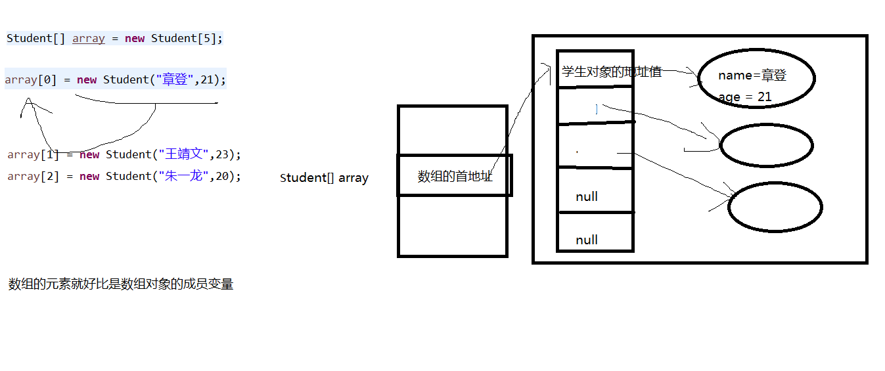

```java
import java.util.Arrays;

public class TestStudent {
    public static void main(String[] args) {
        //存储本组成员的信息
        //创建容器对象
        Student[] array = new Student[5];

        System.out.println(Arrays.toString(array));
        //为数组的容器赋值
        array[0] = new Student("张登",22);
        array[1] = new Student("朱霞",23);
        array[2] = new Student("王政",24);
        System.out.println(Arrays.toString(array));

        for (int i = 0; i < array.length; i++) {
            if (array[i] != null) {
                System.out.println(array[i].getName() + ":" + array[i].getAge());//array[i]是对象
                System.out.println(array[i].getInfo());
            }
        }

        array[3] = new Student("张三",20);
        array[4] = new Student("李四",21);
        //对这个数组按照年龄从小到大排序，并显示
        //直接选择排序
//        for (int i = 0; i < array.length-1; i++) {
//            //1.找出本次的最小值
//            int min = array[i].getAge();
//            int index = i;
//
//            for (int j = i+1; j < array.length; j++) {
//                if (min > array[j].getAge()) {
//                    min = array[j].getAge();
//                    index = j;
//                }
//            }
//            //2.交换
//            if (index != i) {
//                Student temp = array[i];
//                array[i] = array[index];
//                array[index] = temp;
//            }
//        }
//        //排序后打印
//        for (int i = 0; i < array.length; i++) {
//            System.out.println(array[i].getInfo());
//        }
        //冒泡排序
        for (int i = 1; i < array.length; i++) {
            for (int j = 0; j < array.length-i; j++) {
                if (array[j].getAge() > array[j+1].getAge()) {
                    Student temp = array[j];
                    array[j] = array[j+1];
                    array[j+1] = temp;
                }
            }
        }
        for (int i = 0; i < array.length; i++) {
            System.out.println(array[i].getInfo());
        }
    }
}

class Student {
    private String name;
    private int age;

    public Student(String name, int age) {
        this.name = name;
        this.age = age;
    }

    public Student() {
    }

    public String getName() {
        return name;
    }

    public void setName(String name) {
        this.name = name;
    }

    public int getAge() {
        return age;
    }

    public void setAge(int age) {
        this.age = age;
    }

    public String getInfo() {
        return name +":" + age;
    }
}
```

##### 二维数组

1. 二维数组的声明格式：

   ```java
   数组元素的数据类型[][] 数组名;//或
   数组元素的数据类型[] 数组名[];//或
   数组元素的数据类型 数组名[][];
   ```

2. 初始化方式：

   + 静态初始化：

     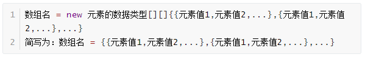

     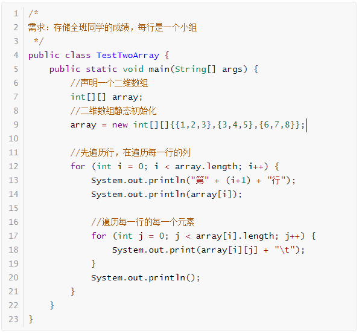

   + 动态初始化：

     + 规则的矩阵：创建数组对象，确定有几行几列；为每一个元素赋值

       ```java
       int[][] array = new int[3][5];
       ```

     + 每一行的列数是不同的：

       + 创建数组对象；
       + 为每一行确定列数，即创建每一行的一维数组；
       + 为每一个元素赋值

       ```java
       int[][] arr = new int[3][];
       
       for (int i = 0; i < arr.length; i++) {
       	arr[i] = new int[i+1];
       }
       
       for (int i = 0; i < arr.length; i++) {
       	for (int j = 0; j < arr[i].length; j++) {
       		arr[i][j] = i+1;
       	}
       }
       ```

     ```java
     /**
      * 二维数组的动态初始化
      */
     
     public class TestTwoArray2 {
         public static void main(String[] args) {
             //规则矩阵
             int[][] array = new int[3][5];//行数是3，每一行的列数是5
             
             array[0][0] = 4;
             array[2][3] = 5;
     
             for (int i = 0; i < array.length; i++) {
                 for (int j = 0; j < array[i].length; j++) {
                     System.out.print(array[i][j]);
                 }
                 System.out.println();
             }
     
             //列数不确定
             int[][] arr = new int[3][];
     
             for (int i = 0; i < arr.length; i++) {
                 //每一行是一个一维数组
                 arr[i] = new int[i+1];
             }
     
             //为元素赋值
             for (int i = 0; i < arr.length; i++) {
                 for (int j = 0; j < arr[i].length; j++) {
                     arr[i][j] = i+1;
                 }
             }
             for (int i = 0; i < arr.length; i++) {
                 for (int j = 0; j < arr[i].length; j++) {
                     System.out.print(arr[i][j]);
                 }
                 System.out.println();
             }
         }
     }
     ```

3. 如何表示二维数组的行数，即二维数组的长度：

   ```java
   二维数组名.length;
   ```

4. 如何表示一行：一行就是一个一维数组对象

   ```java
   二维数组名[行标/行索引]  //行标的范围：[0，行数-1]
   ```

5. 如何表示一个元素：

   ```java
   二维数组名[行标/行索引][列索引];
   ```

6. 如何表示每一列的行数，就是每一列的长度，每一行的元素的个数：

   ```java
   二维数组名[行标/行索引].length;
   ```

7. 如何遍历：双重for循环

   ```java
   for(int i=0; i<二维数组的行数; i++) {
       //二维数组的i表示一行
       for(int j = 0; j<每一行的列数; j++) {
           //二维数组名[i][j]表示每一个元素
       }
   }
   ```
   
   ```java
   /**
   打印：
    1
    2 2
    3 3 3
    4 4 4 4
    5 5 5 5 5
   */
   public class TestExer {
       public static void main(String[] args) {
           //每一行的列数不同，先确定行数
           int[][] array = new int[5][];
   
   //        //为每一行分配列数
   //        for (int i = 0; i < array.length; i++) {
   //            array[i] = new int[i+1];
   //        }
   //
   //        //为元素赋值
   //        for (int i = 0; i < array.length; i++) {
   //            for (int j = 0; j < array[i].length; j++) {
   //                array[i][j] = i+1;
   //            }
   //        }
   //
   //        //遍历数组进行打印
   //        for (int i = 0; i < array.length; i++) {
   //            for (int j = 0; j < array[i].length; j++) {
   //                System.out.print(array[i][j] + "\t");
   //            }
   //            System.out.println();
   //        }
   
           //合并在一起
           for (int i = 0; i < array.length; i++) {
               array[i] = new int[i+1];
               for (int j = 0; j < array[i].length; j++) {
                   array[i][j] = i+1;
                   System.out.print(array[i][j] + "\t");
               }
               System.out.println();
           }
       }
   }
   /**
   打印：
    1 1 1 1 1
    2 2 2 2 2
    3 3 3 3 3
    4 4 4 4 4
    5 5 5 5 5
   */
   public class TestExer2 {
       public static void main(String[] args) {
           int[][] array = new int[5][5];
   
           for (int i = 0; i < array.length; i++) {
               for (int j = 0; j < array[i].length; j++) {
                   array[i][j] = i+1;
                   System.out.print(array[i][j] + "\t");
               }
               System.out.println();
           }
   
           //二维数组的foreach循环遍历
           //外层循环：把二维数组看出是一维数组，元素是一个一维数组，类型是int[]
           for (int[] hang: array) {
               //内存循环：每一行就是一个一维数组
               for (int column:hang) {
                   System.out.print(column + "\t");
               }
               System.out.println();
           }
       }
   }
   /**
   打印10行的杨辉三角
   1
   1 1
   1 2 1
   1 3 3  1
   1 4 6  4  1
   1 5 10 10 5 1
   */
   public class TestExer3 {
       public static void main(String[] args) {
           int[][] array = new int[10][];
   
           //每一行的列数
           for (int i = 0; i < array.length; i++) {
               array[i] = new int[i+1];
           }
   
           //为元素赋值
           for (int i = 0; i < array.length; i++) {
               //每一行的第一个元素和最后一个元素都是1
               //第一个元素
               array[i][0] = 1;
               array[i][i] = 1;
               //除了第一个元素和最后一个元素，
               for (int j = 1; j < array[i].length-1; j++) {
                   array[i][j] = array[i-1][j-1] + array[i-1][j];
               }
           }
   
           //遍历显示
           for (int i = 0; i < array.length; i++) {
               for (int j = 0; j < array[i].length; j++) {
                   System.out.print(array[i][j] + "\t");
               }
               System.out.println();
           }
       }
   }
   ```

#### 关键字

##### this:当前对象

1. 位置：
   + 在构造器中：表示正在创建的那个对象；
   + 在成员方法/实例方法中，表示调用该方法的那个对象
2. this.属性：可以在构造器或方法中，调式当前对象的属性，这个属性先在本类中进行查找，如果本类中没有会从父类（或父类的父类...）中查找；
   + 当成员变量与局部变量同名时，那么使用this.属性来表示属性(成员变量)，进行区分；
   + 访问本类的属性，包括自己声明的属性，还包括从父类继承的非private的属性；
3. this.方法：可以在构造器或方法中，表示访问当前对象的方法，这个方法先在本类中进行查找，如果本类中没有会从父类（或父类的父类...）中查找；
   + 用于调用本类的其他方法，当然可以省略this.
4. this()或this(实参列表)：只能在构造器中，表示访问当前类的构造器
   + this()：调用本类的无参构造；
   + this(实参列表)：调用本类的有参构造
5. 要求：
   + this()和this(实参列表)只能出现在本类的构造器中；
   + this()和this(实参列表)必须在构造器的第一句；
   + 不要出现递归调用；

```java
public class TestThis {
    public static void main(String[] args) {
        Teacher teacher = new Teacher();
        teacher.setName("张登");
        teacher.setAge(18);

        System.out.println("姓名：" + teacher.getName());
        System.out.println("年龄：" + teacher.getAge());
        System.out.println("详细信息：" + teacher.getInfo());

        Teacher t = new Teacher("朱霞");
        System.out.println("姓名：" + t.getName());

        System.out.println("---------------");

        Teacher t1 = new Teacher("张三",23);
        System.out.println("姓名：" + t1.getName());
        System.out.println("年龄：" + t1.getAge());
        System.out.println("详细信息：" + t1.getInfo());

    }
}

class Teacher {
    private String name;
    private  int age;
    private char gender;
    private String address;
    private String tel;
    private String wechat;

    //get/set
    public String getName() {
        return name;
    }
    //变量名：尽量见名知意
    public void setName(String name) {
        //左右两边都是代表的是形参name，是局部变量，和成员变量name无关
        name = name;

        //希望左边代表的是当前对象的属性、成员变量name
        //this当前对象，调用setName()方法的对象就是当前对象
        this.name = name;
    }

    public int getAge() {
        return age;
    }
    public void setAge(int age) {
        age = age;

        this.age = age;
    }

    public String getInfo() {
        //如果没有属性与局部变量重名的问题，那么this可以省略
        //return "姓名：" + name + ",年龄：" + age;
        return "姓名：" + this.name + ",年龄：" +this. age;
        //调用本类的方法，this.可以省略
        //return "姓名：" + this.getName() + ",年龄：" + this.getAge();
    }

    //如果需要无参构造，那么此时需要手动编写，因为一旦声明了其他构造器，比那一起不会自动增加无参构造
    Teacher() {
        System.out.println("没有参数的构造器");
    }

    Teacher(String name) {
        //this()调用本类的没有参数的构造器
        this();

        //this当前对象，代表的是正在创建的那个对象
        //方法一：this.属性
        //this.name = name;

        //方法二：this.方法
        //用正在创建的那个对象的setName方法，为自己的name属性赋值
        this.setName(name);

        System.out.println("一个参数的构造器");

    }

    Teacher(String name, int age) {

        //方法三：this(实参列表)
        //调用本类的一个参数的构造器
        this(name);


        this.name = name;
        this.age = age;

        System.out.println("两个参数的构造器");
    }


    public Teacher(String name, int age, char gender, String address) {
        this.name = name;
        this.age = age;
        this.gender = gender;
        this.address = address;
    }

    public Teacher(String name, int age, char gender, String address, String tel, String wechat) {
        this(name,age,gender,address);
        this.tel = tel;
        this.wechat = wechat;
    }
}
```

##### 访问控制修饰符

+ private：私有的，可用于修饰属性、方法。只能在本类中可见，本类以外的地方不可见。
+ 缺省：可用于修饰类、属性、方法。表示在本包下可见。
+ protected：受保护的，可用于修饰属性、方法。表示在本包或其他包的子类中可见。
+ public：公共的，可用于修饰类、属性、方法。表示在其他任何想要使用的地方都可见。

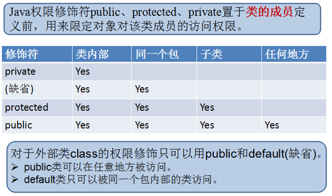

+ 说明：
  + 如果类是非public修饰的即是缺省的，那么该类只能在本包中可见；
  + 当类是public的，可以导包，但是如果父类的构造器是缺省的，那么其他包的子类是无法调用的，不能继承；
  + 如果父类的构造器是protected，那么其他包的子类也可以调用；
  + 如果属性是protected，那么表示在本包或其他包的子类中可以直接访问；
  + 如果属性是缺省的，那么在本包中的子类或其他类中可以直接访问，但是跨包不行；

##### super:表示父类的引用

1. super.属性：
   + 表示访问父类的属性：先从直接父类中查找，如果直接父类没有，那么从父类的父类中查找，大多数情况下可以省略，但是当本类中有与父类同名的属性，那么此时需要在父类的属性前面加super.用于区分；
     + 该属性不能是private的；
     + 一般情况下在子类中可以不用super.属性也可以访问父类的非private属性，因为子类继承了父类的属性；
     + 当子类和父类的属性重名，那么使用super.属性表示父类的属性；
2. super.方法：
   + 表示访问父类的方法：先从直接父类中查找，如果直接父类没有，那么从父类的父类中查找；
     + 该方法不能是private；
     + 如果子类没有重写该方法，那么可以省略super；
     + 如果子类重写了方法，那么只能使用super.方法，来访问被重写的父类的方法；
     + B继承A重写A的方法，C继承B，则C中不能跨过父类重写的方法，去访问祖父类中的方法；
3. super()或super(实参列表) ：
   + super()：访问父类的无参构造，默认调用，也可以手动调用；
   + super(实参列表)：访问父类的有参构造，必须手动调用（如果父类没有无参构造，在子类的构造器首行必须使用它来调用父类的有参构造）；也必须在构造器中，而且必须在首行

```java
package day11;

public class TestSuper {

    public static void main(String[] args) {
//        Son son = new Son();
//        son.test();
//        son.set("欧阳");

        SubClass subClass = new SubClass();
        subClass.test();
        System.out.println(subClass.getInfo());

    }
}

class Father {
    private String str1 = "hello";
    protected String str2 = "world";
    protected String str3 = "java";
}

class Son extends Father{
    private String str3 = "OK";

    public void test() {
        //System.out.println(str1);
        System.out.println(str2);
        System.out.println(super.str2);
        System.out.println(this.str2);//因为子类继承了父类的属性，那就可以当作自己的一样
        System.out.println(str3);
        System.out.println(super.str3);
    }

    public void set(String str3) {
        System.out.println(str3);
        System.out.println(this.str3);
        System.out.println(super.str3);
    }

}

class SperClass {
    private String name = "张登";
    public void test() {
        System.out.println("姓名：" + name);
        System.out.println("父类的方法");
    }

    public String getInfo() {
        return "姓名:" + name;
    }
}

class SubClass extends SperClass{
    private int age;
    @Override
    public void test() {
        System.out.println("子类的方法");
    }
    @Override
    public String getInfo() {
        return super.getInfo() + "，年龄：" + age;
    }
}

class A {
    public void method() {
        System.out.println("A");
    }
}

class B extends A{
    @Override
    public void method() {
        System.out.println("B");
    }
}

class C extends B{
    @Override
    public void method() {
        //super.super.method();//不能跨过父类重写的方法，访问祖父类中的方法
        super.method();
        System.out.println("C");
    }
}
```

##### instanceof

1. 作用：

   + 判断某个对象/某个实例是否属于某种类型，即检验x是否是类A的对象，运算结果是true或false

2. 格式：

   ```java
   对象 instanceof 类型
   ```

3. 要求：

   + x所属的类与A类必须是子类和父类的关系，否则编译报错；
   + 如果x属于A的子类B，x instanceof A的值也为true；

   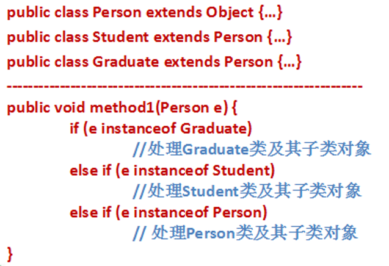

   ```java
   /*
   有一个图形类：Graphic
   有两个子类：Circle和Rectangle，希望打印其面积
    */
   
   public class TestUse {
       public static void main(String[] args) {
           print(new Graphic());//new Graphic()：匿名对象，实参的值赋值给形参，Graphic g = new Graphic();  本态引用
   
           Graphic g = new Graphic();//父类的对象
           Circle c = (Circle)g;//向下转型，报ClassCastException，类型转换异常
   
           Graphic g3 = new Circle();
           Circle cc = (Circle)g3;
           System.out.println(cc.getArea());
       }
   
       //声明一个方法，可以打印图形的面积，但是如果是原型，那么显示一下它的半径，如果是矩形，显示一下它的长和宽
       public static void print(Graphic g) {
           //子类的对象也属于父类的对象，if判断时如果判断父类应放在最后，否则子类的对象将不会执行
           if (g instanceof Circle) {
               System.out.println("g是一个圆形");
               Circle c = (Circle) g;
               System.out.println("圆的半径是：" + c.getRadius());
           } else if(g instanceof Recaangle) {
               System.out.println("g是一个矩形");
               Recaangle r = (Recaangle) g;
               System.out.println("矩形的长是：" + r.getLength() + "宽是：" + r.getWidth());
           } else if (g instanceof Graphic) {
               System.out.println("g是一个图形");
           }
           System.out.println("面积" + g.getArea());
       }
   }
   
   class Graphic{
       private int num;
   
       public int getNum() {
           return num;
       }
   
       public void setNum(int num) {
           this.num = num;
       }
   
       public double getArea() {
           return 0;
       }
   }
   
   class Circle extends Graphic {
       private double radius;
   
       public Circle() {
       }
   
       public Circle(double radius) {
           super();
           this.radius = radius;
       }
   
       public double getRadius() {
           return radius;
       }
   
       public void setRadius(double radius) {
           this.radius = radius;
       }
   
       @Override
       public double getArea() {
           return Math.PI * radius * radius;
       }
   }
   
   class Recaangle extends Graphic{
       private double length;
       private double width;
   
       public Recaangle() {
       }
   
       public Recaangle(double length, double width) {
           super();
           this.length = length;
           this.width = width;
       }
   
       public double getLength() {
           return length;
       }
   
       public void setLength(double length) {
           this.length = length;
       }
   
       public double getWidth() {
           return width;
       }
   
       public void setWidth(double width) {
           this.width = width;
       }
   
       @Override
       public double getArea() {
           return length * width;
       }
   }
   ```

##### static

属于修饰符的一种，表示静态的、共享的，可以用来修饰属性、方法、代码块、内部类；

1. static修饰属性：

   + 非static的属性是每个实例对象独享的，存储在堆区；
   + static的属性是该类所有对象共享的，存储在方法区，其中一个对象对其进行修改，会影响其他对象；
   + 非static的属性的get/set是非静态的，只能通过对象调用，在set方法当中，使用的是this.属性 = 值；static的属性的get/set是静态的，可以通过对象调用，也可以通过类名调用，建议通过类名调用，在set方法中使用的是类名.静态属性 = 值；
   + static修饰的属性也称为类变量，非static修饰的属性称为成员变量；
     + 类变量的赋值：
       + 显示初始化；
       + 静态代码块；（显示初始化和静态代码块按顺序执行 ）
       + 通过set进行修改；
   + 非静态的属性只能在本类的非静态方法中使用或者通过对象.属性使用，static的属性既可以在静态方法中使用，也可以在非静态方法中使用；
   + 非静态的属性只有在创建对象时，才会在堆中分配空间，并赋值；static的属性在类加载和使用时就在方法中分配空间，并赋值，而此时可能没有实例对象；
   + static的属性和方法先出生（先加载和初始化），非static的属性和方法后出生

   结论：在静态方法中是不能使用本类的非静态的属性和方法的；

   ```java
   public class TestStatic {
       public static void main(String[] args) {
           Student1 stu1 = new Student1("张登");
           Student1 stu2 = new Student1("朱一龙");
   
           //stu1.setCountry("China");
           Student1.setCountry("China");
           System.out.println(Student1.getCountry());
           //stu2.setCountry("中国");
           Student1.setCountry("中国");
           System.out.println(Student1.getCountry());
           System.out.println(Student1.getCountry());
       }
   }
   
   class Student1 {
       private String name;
       private static String country;
   
       public Student1() {
       }
   
       public Student1(String name) {
           this.name = name;
       }
   
       public String getName() {
           return name;
       }
   
       public void setName(String name) {
           this.name = name;
       }
   
       public static String getCountry() {
           return country;
       }
   
       public static void setCountry(String country) {
           Student1.country = country;
           //this.country = country;//不能使用this，因为它不属于某一个对象，而是属于所有对象，属于类
       }
   
       @Override
       public String toString() {
           return "姓名：" + name;
       }
   
       public static void method() {
           System.out.println("国家：" + country);
           //System.out.println("国家：" + name);//name需要通过对象调用，不能通过类名调用
       }
   }
   ```

2. static修饰方法：

   + static修饰属性表示是属于类的，一般用于声明工具类的方法或者是static的属性的相关方法，在方法体中只能使用静态的属性；
   + 非static的方式是属于某个对象的，只能通过对象调用，在方法体中既可以使用static的属性，也可以使用非static的属性；
   + static修饰的方法既可以使用对象调用，也可以使用类名调用，建议使用类名调用；
   + static的方法中不能使用非静态的属性和方法；

3. static修饰代码块：

4. static修饰内部类：

##### final

是一个修饰符，表示最终的

1. final修饰类：
   + 用final修饰的类不能被继承，不能有子类；
   + 例如String
2. final修饰方法：
   + 用final修饰的方法，不能被重写；
3. final修饰变量：
   + 用final修饰的变量就变成了常量（命名大写），它的值不能被修改，必须手动赋值；
   + 成员变量：成员常量和普通的变量不同，它必须初始化；
     + 显式初始化；
     + 构造块中初始化；
     + 构造器中初始化，保证能够通过哪个构造器创建对象，都要为这个成员变量赋值；
     + 不能有set方法赋值；

##### native

​	原生方法，非Java语言实现，最终编译为.dll文件供Java调用，对使用者来说，可以把它当作Java的方法一样使用；


#### Object类

1. Object属于java.lang.Object，是所有类的根父类，包括接口、数组也是其子类；如果一个类没有指明它的父类是谁，那么就默认继承Object类，如果一个类B继承了类A，那么它会继承Object类中没有被A重写的方法；

   + java.lang.Object类中所有的属性和方法都会继承到子类中；
   + 所有类型的构造器中最终都会使用java.lang.Object的无参构造；
   + java.lang.Object类型的变量，可以接收任意类型的对象，构成多态引用；
     + 应用数据类型：类、接口、数组；

2. Object类的多态性：

   + Object类型的引用变量可以接收任何类型的对象；
   + Object类型的形参可以接收任何类型的实参；
   + 当数组的元素的数据类型是Object时，表示这个数组可以存放任意类型的对象；

3. java.lang.Object方法：

   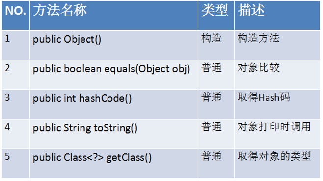

   + clone()：必须要求这个类是要支持克隆的，要实现Cloneable接口；

   + equals(object o)：只是其他对象某个对象是否与此对象相等；

     某个对象：o

     此对象：当前对象，调用equals方法的对象；

     stu1.equals(stu2)：stu2是某个对象，stu1是此对象

     ```
     java.lang.Object类中的equals方法的功能适合==相同的，比较的是对象的地址；
     如果子类中希望比较的是属性的内容，而不是对象的地址值，那么子类就应该重写Object类中的方法
     例如：像String类等就重写了Object类中的方法
     ```

     ```java
     import java.util.Objects;
     
     public class TestObject {
         public static void main(String[] args) throws CloneNotSupportedException {
             String str = "hello";
             int[] arr = new  int[5];
     
             Object obj1 = "hello";
             Object obj2 = new int[5];
     
             Student stu1 = new Student("张登", 21);
             Student stu2 = new Student("张登", 21);
             //如果使用==来比较对象，是比较这两个对象的地址值
             System.out.println(stu1==stu2);
             //equals(Object obj)：只是其他某个对象是否与此对象相等
             //某个对象：obj
             //此对象：当前对象，调用equals方法的对象
             //java.lang.Object类中的equals方法的功能适合==相同的，比较的是对象的地址；
             //如果子类中希望比较的是属性的内容，而不是对象的地址值，那么子类就应该重写Object类中的方法
             //例如：像String类等就重写了Object类中的方法
             System.out.println(stu1.equals(stu2));
             //此时obj对象是一个String对象，stu1是student对象，报错java.lang.ClassCastException
             System.out.println(stu1.equals("彰化"));
     //        Student student = new Student();
     //        student.clone();
     //        System.out.println(stu1.getINfo());
             System.out.println(stu1);
             System.out.println(stu1.toString());
         }
     }
     
     class Student {
         private String name;
         private int age;
     
         public Student() {
         }
     
         public Student(String name, int age) {
             this.name = name;
             this.age = age;
         }
     
         public String getName() {
             return name;
         }
     
         public void setName(String name) {
             this.name = name;
         }
     
         public int getAge() {
             return age;
         }
     
         public void setAge(int age) {
             this.age = age;
         }
     
     //    @Override
     //    public Object clone() throws CloneNotSupportedException {
     //        return super.clone();
     //    }
         
         //只要名称相同，就认为两个学生对象相等
         //this的名称和Object对象的名称
         //@Override
         //名称是String类型，
     //    public boolean equals(Object obj) {
     //        if(this.name.equals(obj.name))
     //    }
     
     //    //向下转型
     //    public boolean equals(Object obj) {
     //        Student student = (Student) obj;
     //        if (obj instanceof Student) {//避免ClassCastException
     //            if (this.name.equals(student.name)) {
     //                return true;
     //            }else {
     //                return false;
     //            }
     //        } else {
     //            return false;
     //        }
     //    }
         @Override
         public boolean equals(Object o) {
             if (this == o) {//如果this和object的地址值相同，结果肯定相同，因为是同一个对象
                 return true;
             }
             //如果指定对象是null,一定是false，因为此时this一定不为null，否则不会进入代码，报空指针异常
             //obj的编译时类型是Object，obj的运行时类型是具体的类型
             if (o == null || getClass() != o.getClass()) {
                 return false;
             }
             //此时向下转型是安全的，因为如果obj不是Student类型，在上面已经结束
             Student student = (Student) o;
             return getName().equals(student.getName());
         }
     
         @Override
         public int hashCode() {
             return Objects.hash(getName());
         }
     
     //    public String getINfo() {
     ////        return "姓名：" + name + ",年龄：" + age;
     ////    }
     
         @Override
         public String toString() {
             return "Student{" +
                     "name='" + name + '\'' +
                     ", age=" + age +
                     '}';
         }
     }
     ```
     
   + getClass()：返回Object的运行时类型；
   
     ```java
     stu1.equals(stu2);
     ```
   
   + hashCode()：当对象存储到散列结构的容器中时才有用，例如：HashSet\Hashtable\HashMap等；

   + finalize()：是对象“留临终遗言”的方法，当某个垃圾回收机制回收之前，会调用这个方法，实际中一般用于释放一下资源,这个方法只会被调用一次；如果当在finalize方法中，如果使得某个存活的对象，又指向了当前对象，那么当前对象就复活了，复活后，下次如果又没用了，变成垃圾后，就不会子啊调用finalize方法；

     + 什么样的对象会被垃圾回收机制回收：没有任何有用的引用
     + finalize,final，finally的区别：
   
+ toString()：java.lang.Object类的toString()：getClass().getName() + ‘@’ + Integer.toHexString(hashCode())：
  
  + 类名@对象的哈希值的十六进制表示形式；
     + 当打印一个对象或者一个对象与字符串拼接，默认都是调用这个对象的toString()方法；
  + 在开发中往往利用这一点，对类型的toString()方法进行重写，返回对象的信息

#### 代码块

##### 静态代码块

1. 位置：

   类中方法外；

2. 格式：

   ```java
   【修饰符】class 类名 {
       static {
           静态代码块
       }
   }
   ```

3. 作用：

   为类变量（静态属性）初始化；

   因为非静态变量，一般使用构造器进行初始化；而类变量是在创建对象之前就有的，这个时候还没有构造器，所以它要初始化，就可以使用静态代码；

4. 特点：

   + 随着类的加载而加载；
   + 静态代码块的代码只会被执行一次；
   + 静态代码块先于构造器执行，先于构造代码块(非静态代码块)执行；
   + 如果静态变量的显示初始化和静态代码块都存在，那么静态变量的赋值按顺序执行；
+ 如果父类也有静态代码块，那么先执行父类的静态代码块；
   + 在静态代码块中不能访问非静态的成员。
   
   ```java
   import java.io.IOException;
   import java.util.Properties;
   
   public class TestStaticBlock {
       public static void main(String[] args) {
           //局部代码块
           //Student2 student2 = new Student2();
   
           //Student2 stu = new Student2();
           System.out.println(Student2.getCountry());
       }
   }
   
   class Person {
       static {
           System.out.println("父类的静态代码块");
       }
   }
   
   class Student2 {
       //private static String country = "China";//显式初始化
       private static String country;
   
       public static String getCountry() {
           return country;
       }
   
       public static void setCountry(String country) {
           Student2.country = country;
       }
   
       static {
           System.out.println("子类的静态代码块");
   
           //作用：读取info.properoties文件中的内容为country赋值
           Properties properties = new Properties();
           try {
               properties.load(ClassLoader.getSystemResourceAsStream("info.properties"));
           } catch (IOException e) {
               e.printStackTrace();
           }
   
           country = properties.getProperty("guojia");
       }
   }
   ```

##### 非静态代码块

1. 位置：

   类中方法外；
   
2. 格式：

   ```java
   【修饰符】class 类名 {
       //方法外
       {
           非静态代码块,又称为构造块;
       }
   }
   ```

3. 特点：

   + 每创建一个对象执行一次；
   + 比静态代码块执行要晚，在静态代码块执行之后执行；
   + 在构造器之前运行；
   + 当构造块和显示初始化同时存在时，按顺序执行；

4. 作用：

   + 为非静态变量赋值：当所有构造器重复的代码，可以提取到构造快中；

5. 为非静态变量赋值：

   + 显式初始化；
   + 构造块；
   + 构造器；
   + set方法；

   执行顺序：1和2看谁在前面>3>4

```java
import java.io.IOException;
import java.util.Properties;

public class TestBlock {
    public static void main(String[] args) {
        Employee employee = new Employee("张登");
        Employee employee2 = new Employee("朱一龙");
        Employee employee3 = new Employee("宋康");

        Employee.method();

        System.out.println(employee);
        System.out.println(employee2);
        System.out.println(employee3);
    }
}

class Employee {
    private String name;
    //private String school = "北京大学";
    private String school;//每创建一个对象都有值，而且从infog.properties赋值

    {
        System.out.println("构造代码块，构造快，非静态代码块");
        //作用：读取info.properoties文件中的内容为school赋值
        Properties properties = new Properties();
        try {
            properties.load(ClassLoader.getSystemResourceAsStream("info.properties"));
        } catch (IOException e) {
            e.printStackTrace();
        }

        school = properties.getProperty("xuexiao");
    }

    static {
        System.out.println("静态代码块");
    }

    public Employee() {
        System.out.println("子类的静态代码块");
    }

    public Employee(String name) {
        this.name = name;
    }

    public String getName() {
        return name;
    }

    public void setName(String name) {
        this.name = name;
    }

    public static void method() {
        System.out.println("静态方法");
    }

    @Override
    public String toString() {
        return "Employee{" +
                "name='" + name + '\'' +
                ", school='" + school + '\'' +
                '}';
    }
}
```

##### 局部代码块

```java
public class TestBlock {
    public static void main(String[] args) {
        //局部代码块
    }
}
```

#### 变量总结

##### 变量的分类

根据变量的声明的位置分为局部变量和成员变量：

1、局部变量

（1）方法体中；

（2）方法的签名中()，就是形参；

（3）代码块中

2、成员变量

在根据是否有static修饰：

（1）静态变量：又称为类变量

（2）非静态变量：又称为实例变量

##### 局部变量和成员变量的区别

1、声明的位置不同；

2、存储的位置不同：

（1）局部变量：栈中；

（2）成员变量：堆中，如果是类变量，在方法区；

3、初始化的方式：

（1）局部变量：必须手动初始化；

（2）成员变量：可以使用默认值，也可以手动初始化

4、声明周期：

（1）局部变量：方法或代码块被执行时分配，执行完了就结束；

（2）成员变量：类变量，在类加载和初始化时出生，类被卸载时结束；

​							实例变量：在创建对象时出生，在对象被垃圾回收机制回收时结束

5、作用域：

（1）局部变量：从声明开始到所属的“}”结束

（2）成员变量：在本类中

#### 面向对象的高级特性

##### 抽象类与抽象方法

当父类需要描述它的子类应该具备什么样的方法，例如：Graphic图形类中应该描述它的子类需要具有一个求面积的方法，但是不能够明确知道如何实现方法，这个时候，就需要将父类中的方法，设计为抽象的；

此外，如果一个类表示一个抽象的概念，不希望被实例化，只希望被继承来使用，那么也定义为抽象类；

###### 抽象方法

1. 语法格式：

   ```java
   【修饰符】abstract 返回值类型 方法名(【形参列表】);
   ```

2. 说明：

   + 抽象方法的前面有abstract修饰；
   + 抽象方法没有方法体；
   + 抽象方法必须在抽象类、接口中；
   + 如果子类继承了抽象类，并且子类如果不是抽象类，那么子类一定要重写（实现）该抽象方法；

###### 抽象类

1. 语法格式

   ```java
   【修饰符】abstract class 类名 {
       
   }
   ```

2. 说明：

   + 抽象类是不能直接创建对象的；
   + 如果子类继承了抽象类，并且子类如果不是抽象类，那么子类一定要重写（实现）该抽象方法；
   + 抽象类与子类的对象之间构成多态引用；
   + 抽象类本身可以有如下内容：
     + 非抽象方法；
     + 属性；
     + 构造器：为父类的属性初始化，由子类调用；
     + 静态属性、静态方法、静态代码块等：因为它的使用不需要抽象类本身的对象，通过类名就可以使用；
+ 抽象方法必须被子类重写，因此抽象方法的前面不能用private、static、final修饰；
  
   ```java
   public class TestAbstract {
       public static void main(String[] args) {
   //        Graphic g = new Graphic();
   //        double area = g.getArea();
   //        System.out.println("面积：" + area);
   
           Graphic g = new Circle(3);
           double area = g.getArea();//运行时执行的是Circle重写的getArea()方法
           System.out.println("面积：" + area);
   
           Graphic[] array = new Graphic[2];//创建容器对象
           array[0] = new Circle(2);//创建圆对象，档到array[0]的位置
           array[1] = new Rectangle(3,5);
           //显示所有图形的面积
       }
   }
   
   abstract class Graphic {
       //父类有一个方法，表示所有的的图形都有求面积的方法
       //但是这个方法又无法给出合理的实现
   //    public double getArea() {
   //        return 0;
   //    }
   
       public abstract double getArea();
   }
   
   class Circle extends Graphic {
       private double radius;
   
       public Circle() {
       }
   
       public Circle(double radius) {
           this.radius = radius;
       }
   
       public double getRadius() {
           return radius;
       }
   
       public void setRadius(double radius) {
           this.radius = radius;
       }
   
       //对父类的抽象方法进行重写
       @Override
       public double getArea() {
           return Math.PI * radius * radius;
       }
   }
   
   class Rectangle extends Graphic {
       private double length;
       private double width;
   
       public Rectangle() {
       }
   
       public Rectangle(double length, double width) {
           this.length = length;
           this.width = width;
       }
   
       public double getLength() {
           return length;
       }
   
       public void setLength(double length) {
           this.length = length;
       }
   
       public double getWidth() {
           return width;
       }
   
       public void setWidth(double width) {
           this.width = width;
       }
   
       //对父类的抽象方法进行重写
       @Override
       public double getArea() {
           return width * length;
       }
   }
   ```

###### 特殊的抽象类：没有抽象方法的抽象类

如果一个类包含抽象方法，那么这个类必须是抽象类；但是，一个抽象类可以没有抽象方法，目的在于不让创建对象，抽象类就是用来被继承的；

```java
public class TestAbstractClass {
}

abstract class Person {

}

class Student extends Person {

}

class Employee extends Person {

}
```

###### abstract关键字

abstract关键字只能用来修饰类和方法，抽象方法必须被子类重写，因此抽象方法的前面不能用private、static、final修饰；

###### 抽象类应用：模板设计模式

1. 设计模式：套路（Java中常用的设计模式：23种）==>设计模式、数据结构、算法、高效开发

2. 含义：

   + 它定义了一个操作的算法骨架，将某些步骤延迟到子类中实现。这样，新的子类可以在不改变一个算法结构的前提下重写定义该算法的某些特定步骤。
   + 在父类种有个方法（功能），它实现代码只是定义和规定了算法的骨架，而将其中的一个或者几个小的步骤定义为抽象方法，然后由子类实现，那么子类只是实现这几个小的步骤的抽象方法，而不会影响大的算法结构；
   + 例如：有一个功能能够计算任意一段代码的运行时间；
     + 在代码开始运行前获取一个时间节点；
     + 运行代码；
     + 在代码结束后获取另一个时间节点；
     + 计算这两个时间节点的差值；

   ```java
   public class TestTemplate {
       public static void main(String[] args) {
           CalTime c = new MyCalTime();
           long time = c.getTime();
           System.out.println(time);
       }
   }
   
   abstract class CalTime {
       //1、获取开始时间
       /**
        * 使用final表示该方法不允许子类重写
        * @return
        */
       public final long getTime() {
           //这个方法返回的是long类型，是举例计算机时间：1970-1-1，00:00:00
           //返回的是当前系统时间距离这个时间的毫秒数
           long start = System.currentTimeMillis();
   
           //2、运行代码
           doWork();
   
           //3、在代码结束后，获取另一个时间节点
           long end = System.currentTimeMillis();
   
           //4、计算差值
           return end - start;
       }
   
       //在子类中实现这个方法，方法体即你要计算运行时间的代码
       protected abstract void doWork();
   }
   
   class MyCalTime extends CalTime{
   
       //子类重写父类中需要运行的代码
       @Override
       protected void doWork() {
           long sum = 0;
           for (int i = 0; i < 1000000001; i++) {
               sum += i;
           }
           System.out.println("和是" + sum);
       }
   }
   ```

##### 接口

###### 接口介绍

当多个类没有共同的特征，但是它们需要在某个功能的操作上，要统一标准，那么只能把这个标准设计为一个接口，然后由这些类来实现它。

1. 声明格式：

   ```java
   【修饰符】interface 接口名{
       
   }
   ```

2. 特点：

   + jdk1.8之前：

     + 接口中有且只能有公共的抽象方法，其中public abstract可以省略；

       ```java
       public abstract 返回值类型 方法名(形参列表);
       ```

     + 接口中只能有全局的静态的常量，其中public static final可以省略；

       ```java
       public static final int MAX_VALUE = 10;
       ```

     + 接口不能有构造器；

     + 接口本身也不能创建对象；

3. 接口的使用：

   + 类如何实现接口：

     ```java
     【修饰符】class 类名 implements 接口名1,接口名2,... {
         
     }
     ```

     + 说明：
       + 一个类实现了接口，如果这个类不是抽象类，那么这个类必须实现接口中的抽象方法；
       + 一个类可以同时实现多个接口，如果实现了多个接口，需要实现所有接口的所有方法；
       + 一个类可以同时继承一个父类，又实现多个接口；要求必须先继承后实现；
       + 接口就是用来被实现的，当类实现了接口时，该类需要实现接口的所有抽象方法，否则该类也得是抽象类，不然编译报错；

   + 接口不可以继承和实现类；

   + 接口与接口之间可以继承，而且可以多继承；

   + 接口中的方法都是public的；

4. 接口与实现类的对象的关系：多态引用

   接口本身不能实例化，但是可以通过它的实现类创建对象；

```java
public class TestInterface {
    public static void main(String[] args) {
        Computer c = new Computer();
        c.join(new Mouse());
        c.join(new KeyBord());
    }
}

class Computer {
    public void join(USB usb) {
        usb.doWork();
    }
}

interface USB {
    //public static final int MAX_VALUE = 10;
    int MAX_VALUE = 10;

    //public abstract void doWork();
    void doWork();
}

//Mouse符合USB接口标准
class Mouse implements USB {
    @Override
    public void doWork() {
        System.out.println("鼠标开始工作");
    }
}

class KeyBord implements USB {
    @Override
    public void doWork() {
        System.out.println("键盘开始工作");
    }
}

class Phone {

}

//一个类可以同时实现多个接口
class Mobile extends Phone implements USB,Net {
    @Override
    public void doWork() {
        System.out.println("手机开始工作");
    }

    @Override
    public void internet() {
        System.out.println("上网");
    }
}

interface Net {
    void internet();
}
```

###### 接口的经典代表:Comparable

```java
import java.util.Arrays;
/**
 * 在java.util.Arrays工具类中有一个方法：public static void sort(Object[] a)，用来给数组排序
 */
public class TestComparable {
    public static void main(String[] args) {
        Employees[] array = new Employees[5];
        array[0] = new Employees(22);
        array[1] = new Employees(21);
        array[2] = new Employees(23);
        array[3] = new Employees(25);
        array[4] = new Employees(28);

        Arrays.sort(array);
        for (Employees employee:
             array) {
            System.out.println(employee);
        }
    }
}

//实现java.lang.Comparable接口
//这个接口有一个抽象方法，int comparableTo(Object obj)
class Employees implements Comparable{
    private int age;

    public Employees() {
    }

    public Employees(int age) {
        this.age = age;
    }

    @Override
    public String toString() {
        return "Employees{" +
                "age=" + age +
                '}';
    }

    //规则：this大于obj返回正整数，this小于obj返回负整数；this等于obj返回0
    @Override
    public int compareTo(Object obj) {
        //按照年龄比较
        Employees other = (Employees)obj;
        if (this.age > other.age) {
            return 1;
        }else if(this.age < other.age) {
            return -1;
        }
        return 0;
    }
}
```

```java
import day10.MyArrayList;
/*
需求：编写一个数组的工具类
包含一个方法，可以为任意类型的数组进行排序

为所有可排序的类型制定一个标准，例如：
两个对象比较大小，this当前对象大于指定对象，就返回正整数，如果this当前对象小于指定对象，就返回负整数，如果this当前对象等于指定对象，就返回0；

jdk中提供了这样的标准接口，java.lang.Comparable
抽象方法：int compareTo(Object obj)
 */
public class TestMyCompare {
    public static void main(String[] args) {
        Student[] array = new Student[5];
        array[0] = new Student(22);
        array[1] = new Student(25);
        array[2] = new Student(23);
        array[3] = new Student(21);
        array[4] = new Student(20);
        MyArrays.sort(array);

        for (Student student:
             array) {
            System.out.println(student);
        }
    }
}
//对象比较大小的标准
interface MyCompare{
    //当前对象this和obj比较，如果this当前对象大于指定对象obj，就返回正整数；如果小于返回负整数；如果等于返回0
    int compare(Object obj);
}

//希望学生对象可以比较大小，可以让学生类实现MyCompare接口
class Student implements MyCompare{
    private int age;

    public Student() {
    }

    public Student(int age) {
        this.age = age;
    }

    @Override
    public int compare(Object obj) {
        //按照年龄比较
        Student other = (Student)obj;
        //当前对象的年龄与other的的年龄比较
        if (this.age > other.age) {
            return 1;
        } else if(this.age < other.age) {
            return -1;
        } else {
            return 0;
        }
    }

    @Override
    public String toString() {
        return "Student{" +
                "age=" + age +
                '}';
    }
}

class MyArrays {
    //参数：为哪个数组进行排序
    public static void sort(Object[] args) {
        //传进来的可能是字符串数组、学生数组、图形数组...
        //冒泡
        for (int i = 1; i < args.length; i++) {
            for (int j = 0; j < args.length-i; j++) {//每一轮：n-第几轮
                //相邻元素比较大小
               MyCompare before = (MyCompare)args[j];
               MyCompare after = (MyCompare)args[j+1];
               if (before.compare(after) > 0) {
                   //交换
                   Object temp = args[j];
                   args[j] = args[j+1];
                   args[j+1] = temp;
               }
            }
        }
    }
}
```

```java
public class TestFly {
    public static void main(String[] args) {
        Object[] array = new Object[3];
        array[0] = new Bird();
        array[1] = new Plane();
        array[2] = new Person();

        test(array);
    }

    //声明一个方法，可以让数组中的每一个元素飞起来
    public static void test(Object[] array) {
        for (Object object:array
             ) {
            Flyable f = (Flyable)object;
            f.fly();
        }

    }
}

interface Flyable {
    void fly();
}

class Bird implements Flyable{
    @Override
    public void fly() {
        System.out.println("展翅高飞");
    }
}

class Plane implements Flyable{
    @Override
    public void fly() {
        System.out.println("隐形的翅膀");
    }
}

class Person implements Flyable{
    @Override
    public void fly() {
        System.out.println("借助滑翔机飞起来");
    }
}
```

###### jdk1.8的新特性

jdk1.8对接口进行了一些修改，接口中还可以声明默认方法，静态方法；

1. 默认方法：不是抽象方法，有方法体；

   + 格式：

     ```java
     public default 返回值类型 方法名(形参列表) {
         默认实现;
     }
     ```

   + 什么时候需要默认方法：

     + 当接口的多种实现类，它们对某个抽象方法的实现的代码是一致的，那么就可以在接口中给出默认实现；

   + 说明：

     + 如果实现类实现这个接口，它可以接受接口的默认方法的实现，也可以重写该方法的实现，这样比抽象方法更灵活；
     + public可以省略，但是default不能省略

2. 静态方法：

   + 格式：

     ```java
     public static 返回值类型 方法名(形参列表) {
         方法体;
     }
     ```

   + 说明：

     + 接口的静态方法，只能通过接口名调用，不能通过实现类名或实现类的对象调用；
     + 当某一个标准的某个行为（功能）和实现类无关时，这个方法通常设计为静态方法；

   ```java
   public class TestJDK18 {
       public static void main(String[] args) {
           MyClass1 m = new MyClass1();
           m.method();
           MyInter.test();
       }
   }
   
   interface MyInter {
       default void method() {
           System.out.println("接口中的默认实现");
       }
   
       public static void test(){
           System.out.println("接口的静态方法");
       }
   }
   
   class MyClass1 implements MyInter {
       @Override
       public void method() {
           System.out.println("实现类可以重写实现接口中的默认方法");
       }
   }
   
   class MyClass2 implements MyInter {
       @Override
       public void method() {
           System.out.println("实现类可以重写实现接口中的默认方法");
       }
   }
   ```
   
3. 特殊情况：类优先原则

   + 当一个类实现了多个接口，多个接口中的默认方法的签名是一样的：

     + 方案一：两者都不要，实现类对该方法重新实现；
     + 方案二：留下其中一个，在实现类的方法体中：接口名.super.方法名；

     ```java
     public class TestJDK182 {
         public static void main(String[] args) {
             MyImp1 m = new MyImp1();
             m.test();
         }
     }
     
     interface A{
         default void test() {
             System.out.println("A");
         }
     }
     
     interface B{
         default void test() {
             System.out.println("B");
         }
     }
     
     class MyImp1 implements A,B {
     
         //解决方案一：两者皆可抛
     //    @Override
     //    public void test() {
     //        System.out.println("C");
     //    }
     
         //解决方案二：留下一个
         @Override
         public void test() {
             A.super.test();
         }
     }
     ```

   + 当一个类继承了父类又实现了接口，这个时候如果父类中出现了和接口的默认方法签名一样的方法：

     + 方案一：默认继承父类的；
     + 方案二：可以在接口的实现类的方法体中，通过接口名.super.方法名，保留接口的实现；
     + 方案三：两者都不要，实现类对该方法进行重新实现；

     ```java
     public class TestJDK183 {
         public static void main(String[] args) {
             MySub mySub = new MySub();
             mySub.test();
         }
     }
     
     interface InterA{
         default void test(){
             System.out.println("A");
         }
     }
     
     class SuperClass{
         public void test() {
             System.out.println("B");
         }
     }
     
     class MySub extends SuperClass implements InterA {
         //默认保留的是父类的方法
     
         //保留接口的
     //    @Override
     //    public void test() {
     //        InterA.super.test();
     //    }
     
         //自定义
         @Override
         public void test() {
             System.out.println("C");
         }
     }
     ```

###### 接口的应用：工厂设计模式

目的：使得创建对象和使用对象两者分离，“解耦合”

生活中的工厂：生产产品，把产品的生产者和产品的使用者分离；

分类：简单工厂模式、工厂方法设计模式、抽象工厂设计模式

1. 简单工厂设计模式：

   + 产品的标准；
   + 有一个工厂，提供一个静态的方法，用来返回该工厂的对象；
   + 有各种实现标准的产品，根据名称进行区分；
     + 缺点：当增加一个产品，如Car的实现类Audi，那么意味着，，SimpleFactory的getCar要进行修改，才能生产Audi的对象，这样就涉及到原来代码的修改；可以通过反射进行优化

   ```java
   public class TestSimpleFactory {
       public static void main(String[] args) {
           //车的使用者
           Car c = SimpleFactory.getCar("baoma");
           c.run();
       }
   }
   
   interface Car{
       void run();
   }
   
   class SimpleFactory{
       //车的生产者
       public static Car getCar(String type) {
           if ("baoma".equals(type)){
               BMW b = new BMW();
               return b;
           } else if ("benz".equals(type)){
               Benz be = new Benz();
               return be;
           }
           return null;
       }
   }
   
   class BMW implements Car{
       @Override
       public void run() {
           System.out.println("宝马车在开...");
       }
   }
   
   class Benz implements Car{
       @Override
       public void run() {
           System.out.println("奔驰车在开...");
       }
   }
   ```

   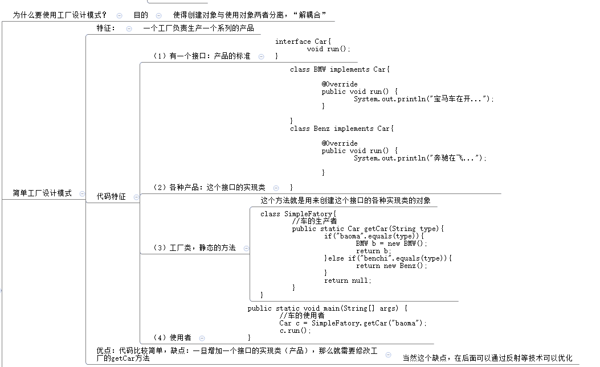

2. 工厂方法设计模式：

   + 一种产品对应一个对应的工厂；
   + 缺点：
     + 类太多；
   + 优点：
     + 灵活，增加新产品不需要修改原来的代码

   ```java
   public class TestFactoryMethod {
       public static void main(String[] args) {
           //产品对象的使用者
           BMWFactory bf = new BMWFactory();
           MyCar m = bf.getCar();
           m.run();
       }
   }
   
   interface MyCar{
       void run();
   }
   
   class MyBMW implements MyCar{
       @Override
       public void run() {
           System.out.println("宝马车在开...");
       }
   }
   
   class MyBenz implements MyCar{
       @Override
       public void run() {
           System.out.println("奔驰车在开...");
       }
   }
   
   //对象的创建者
   interface CarFactory{
       MyCar getCar();
   }
   
   class BMWFactory implements CarFactory {
       @Override
       public MyCar getCar() {
           return new MyBMW();
       }
   }
   
   class BenzFactory implements CarFactory{
       @Override
       public MyCar getCar() {
           return new MyBenz();
       }
   }
   
   //此时如果增加一个新产品Audi，对原来的不影响，只需呀扩展一个工厂即可
   class MyAudi implements MyCar{
       @Override
       public void run() {
           System.out.println("奔驰在行驶");
       }
   }
   
   class AudiFactory implements CarFactory {
       @Override
       public MyCar getCar() {
           return new MyBenz();
       }
   }
   ```

   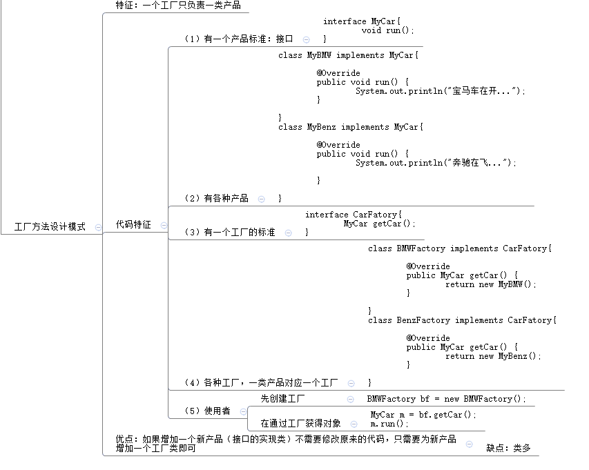

###### 单例设计模式

目标：在整个系统中某个类型只有唯一的对象

思路：

+ 不能让使用者想new就new：
  + 构造器私有化；
+ 给使用者提供一个对象：
  + 在这个类中创建好这个对象；

```java
public class TestSingle {
    public static void main(String[] args) {
        Single s1 = Single.INSTANCE;
        Single s2 = Single.INSTANCE;
        //如果地址值相同，s1和s2即表示一个对象
        System.out.println(s1==s2);
    }
}

class Single{
    //2、提前创建好
    public static final Single INSTANCE = new Single();
    
    //2、构造器私有化
    private Single(){

    }
}
```

1. 饿汉式（恶汉式）：

   + 不管使用者是否需要这个对象，它都一上来就创建好了这个对象，在类加载和初始化时创建

   ```java
   public class TestHungry {
       public static void main(String[] args) {
           Hungry.test();
       }
   }
   //饿汉式一：
   class Hungry{
       //上来就创建对象
       public static final Hungry INSTANCE = new Hungry();
   
       private Hungry(){}
   
       public static void test(){
           System.out.println("静态方法");
       }
   }
   //饿汉式二：
   class Hungry{
       //创建对象私有化，提供公共的get方法
       private static final Hungry INSTANCE = new Hungry();
   
       private Hungry(){}
   
       public static void test(){
           System.out.println("静态方法");
       }
   
       public static Hungry getINSTANCE() {
           return INSTANCE;
       }
   }
   ```

2. 懒汉式：

   + 当获取这个对象时，如果这个对象没有创建，我在创建这个对象；

   ```java
   public class TestLazy {
       public static void main(String[] args) {
           Lazy.test();
   
           //如果需要调用Lazy的method方法，那么此时说明需要Lazy对象；
           //（1）先获取Lazy对象
           Lazy lazy = Lazy.getInstance();
           //（2）调用方法
           lazy.method();
   
           Lazy a = Lazy.getInstance();
           Lazy b = Lazy.getInstance();
           System.out.println(a==b);
       }
   }
   
   class Lazy{
       private static Lazy instance;
       //构造器私有化，因为这样可以阻止外面随意创建对象
       private Lazy(){}
   
       public static Lazy getInstance(){
           //return new Lazy();
           if (instance == null){
               instance = new Lazy();
           }
           return instance;
       }
   
       public void method(){
           System.out.println("非静态方法");
       }
   
       public static void test(){
           System.out.println("静态方法");
       }
   }
   ```

##### 内部类

1. 含义：

   在xxx内部的一个类

2. 分类（根据位置）：

   + 成员内部类：类中方法外；（根据是否有static修饰）
     + 静态内部类；
     + 非静态内部类，通常称为成员内部类；
   + 局部内部类：在方法种；（根据是否有名字）
     + 有名字的局部内部类，简称为局部内部类；
     + 没名字的局部内部类，简称为匿名内部类；

   所以通常说，内部类有四种，静态内部类、成员内部类、局部内部类、匿名内部类；

3. 为什么要定义内部类：

   当一个类内部，其中包含某个特征，这个特征也是一个完整的结构，那么也需要一个内部类来描述；而且这个内部类只为外部类提供服务；

4. 定义内部类的好处/什么情况下使用内部类：

   + 可以表示为这个内部类仅为外部类服务；
     + 集合中的迭代器；
     + 链表等集合中的Node类型
   + 这个内部类可以使用外部类的所有成员，包括私有的；

###### 静态内部类

1. 语法格式：

   ```java
   【修饰符】class 外部类{
       【修饰符】static class 内部类{
           
       }
   }
   ```

2. 特点：

   + 外部类只能使用public和缺省的权限修饰符，但是内部类可以使用4种权限修饰符；
   + 内部类可以有如下：-->静态内部类的成员和原来的类一样，所有的成员都可以有；
     + 属性：静态属性和非静态属性；
     + 方法静态方法和非静态方法、抽象方法（如果静态内部类有抽象方法，那么静态内部类需要是一个抽象类）；
     + 构造器：无参构造和有参构造；
     + 代码块：静态代码块和非静态代码块；
     + 内部类(语法上允许但不这样写)；
   + <font color='red'>静态内部类可以使用外部类的所有静态成员，包括私有的；</font>
   
   + 如何使用静态内部类：
     + 在外部类里面使用：
       + 在外部类的静态方法中，可以使用；
       + 在外部类的非静态方法中，可以使用；
       + 看你使用静态内部类的什么成员，如果是使用静态内部类的静态成员，就用静态内部类名.，如果是使用非静态成员，就需要创建静态内部类的对象；
     + 在外部类外面使用：
       + 如果使用静态内部类的静态成员：外部类名.静态内部类名.静态成员；
       + 如果使用静态内部类的非静态成员：先创建静态内部类的对象，Outer.Inner in = new Outer.Inner();在用对象调用：in.innerTest();
     + 静态内部类是否可以继承父类、实现接口：
       + 可以；
     + 总规则：
       + 静态不能用非静态的东西；
       + 使用别人的静态的东西，使用类名；使用费静态的，使用对象；

```java
public class TestStaticInnerClass {
    public static void main(String[] args) {
        //在这里调用Outer的outTest方法
        Outer.outTest();

        //在外部类外面使用
        //在这里使用Inner的inerTTest()方法
        //分析:Inner是Outer的成员，而且是静态成员
        //分析：innerTest()是Inner的非静态方法
        Outer.Inner in = new Outer.Inner();//创建的是静态内部类的对象
        in.innerTest();

        //在这里使用Inner的inTest()
        //分析:Inner是Outer的成员，而且是静态成员
        //分析：inTest()是Inner的静态方法
        Outer.Inner.inTest();
    }
}

class Outer{
    private String name;
    private static String info;

    static class Inner{

        public void innerTest(){
            /*
            System.out.println("外部类的私有的非静态属性：" + name);不可以使用外部类中非静态的成员
            */
            System.out.println("外部类的私有的静态属性：" + info);
        }

        public static void inTest(){
            System.out.println("内部类的静态方法");
        }
    }

    public static void outTest(){
        /*
        System.out.println("姓名：" + name);不可以使用外部类中非静态的成员
        */
        System.out.println("信息：" + info);

        //在这里是否可以使用Inner
        //如果想要调用Inner的innerTest方法
        //分析：这个方法属于非静态方法，那么它需要Inner的对象
        Inner in = new Inner();
        in.innerTest();

        //调用Inner的inTest方法
        //分析：inTest()是个静态方法，直接通过类名调用
        Inner.inTest();
    }

    public void outMethod(){
        //在这里是否可以使用Inner,可以，因为非静态使用静态的成员是可以的，后出生的用先出生的，OK
        //如果想要调用Inner的innerTest方法
        Inner in = new Inner();
        in.innerTest();

        //调用Inner的inTest方法
        //分析：inTest()是个静态方法，直接通过类名调用
        Inner.inTest();
    }
}
```

###### 成员内部类

1. 语法格式：

   ```java
   【修饰符】class 外部类{
       【修饰符】class 内部类{
           
       }
   }
   ```

2. 特点：

   + 成员内部类的权限修饰符仍然是4种；
   + <font color='red'>成员内部类种的成员：成员内部类中不允许出现静态成员；</font>
     + 属性：可以有非静态方法；
     + 方法：允许非静态方法和抽象方法（如果有抽象方法，那么成员内部类也必须是抽象类）；
     + 构造器：无参构造和有参构造都可以；
     + 代码块：允许非静态代码块；

3. <font color='red'>在成员内部类中使用外部类的成员，包括私有的、静态的、非静态的都可以；</font>

4. 如何使用成员内部类：

   + 在外部类中使用：只能在外部类的非静态方法中使用；
   + 在外部类的外面使用：
     + 先创建外部类的对象；Outer out = new Outer();
     + 获得内部类的对象；Outer.Inner in = out.new Inner();
       + <font color='red'>访问静态内部类的构造器：外部类名.静态内部类的构造器()；</font>
       + <font color='red'>访问成员内部类的构造器：因为成员内部类不是静态的，需要外部类的对象，才能调用内部类的构造器;</font>
     + 调用成员内部类的方法；

```java
public class TestMemberInner {
    public static void main(String[] args) {
        //在这里使用InnerOne,调用InnerMethod()
        //分析：innerMethod()属于InnerOne的非静态方法，需要InnerOne的对象
        //分析：innerOne是OuterOne的非静态成员，需要外部类的对象；
        //（1）先创建外部类的对象
        //字节码文件名：外部类名$内部类名.class   代码中：外部类名.内部类
        //构造器：访问静态内部类的构造器，是通过外部类名.静态内部类的构造器()
        OuterOne out = new OuterOne();
        //（2）在创建成员内部类的对象
        //右边是调用成员内部类的构造器：因为成员内部类不是静态的，那么需要外部类的对象，才能调用内部类的构造器
        OuterOne.InnerOne in = out.new InnerOne();
        //因为这种写法会让人不适，需要换种写法：
        //上面这句代码的目的是得到一个成员内部类的对象；
        OuterOne.InnerOne inn = out.getInnerOne();

        //（3）调用innerMethod()方法
        in.innerMethod();
        inn.innerMethod();
    }
}

class OuterOne{
    private String info;
    private static String name;

    class InnerOne{
        private int num;
        /*
        private static int shuzi;//不允许
        */

        public int getNum() {
            return num;
        }

        public void setNum(int num) {
            this.num = num;
        }
        /*
        public static void test(){
            System.out.println("不能有静态方法");//不允许
        }
        */

        public void test(){}

        public InnerOne() {
        }

        public void innerMethod(){
            System.out.println(info);
            System.out.println(name);
        }
    }

    public void outMethod(){
        InnerOne in = new InnerOne();
        in.innerMethod();
    }

    //声明一个方法，返回内部类的对象供外部类的外部调用成员内部类
    public InnerOne getInnerOne(){
        return new InnerOne();
    }

    public static void outTest(){
        /*
        //此处想要使用InnerOne：不可以
        InnerOne in = new InnerOne();
        */
    }
}
```

###### 局部内部类

1. 语法格式：

   ```java
   【修饰符】class 外部类{
       【修饰符】 返回值类型 方法名(形参列表){
           【修饰符】class 内部类{
               
           }
       }
   }
   ```

2. 特点：

   + 局部内部类是不能加权限修饰符的，因为它和局部变量一样；
   + 局部内部类不能加static，因为static是成员修饰符；
   + 局部内部类能够使用abstract，表示包含抽象方法；
   + 局部内部类可以使用final；

3. 局部内部类可以有哪些成员：

   + <font color='red'>不能有静态的成员，其余均可以；</font>

4. 在哪里可以使用局部内部类：

   + 有特殊的作用域：只能在声明处开始到所属的”}“结束；

5. 在局部内部类中使用外部类的东西：

   + 属性等成员：局部内部类是否可以使用外部类的属性等成员，受到它所在的方法影响：
     + 如果所在的方法是个静态方法，那么只能使用外部类的静态成员；
     + 如果所在的方法是个非静态的方法，那么可以使用外部类的所有成员；
   + <font color='red'>所在方法的局部变量：可以使用所在方法的局部变量，但是这个局部变量必须是final修饰；jdk1.8之前必须显示声明这个变量是final的，即常量；jdk1.8之后，只要在局部内部类中使用，编译器默认就会把这个变量修改为final；</font>
     + 因为局部变量是这个方法执行完，就被回收了；而对象，局部内部类的对象，有可能还在堆中没有被回收，这个时候，如果它访问这个局部变量，就无处可找了；

```java
public class TestLocalInner {
    public static void main(String[] args) {
        OuterTwo outerTwo = new OuterTwo();
        outerTwo.method();
    }
}

class OuterTwo{
    private String name;
    private static String info;

    public void method(){
        int a = 10;

        //局部内部类
        class InnerTwo{
            public void innerTest(){
                System.out.println("内部类的方法");
                System.out.println("姓名：" + name);
                System.out.println("info:" + info);
                System.out.println("a:" + a);
            }
        }

        //可以在这里使用
        InnerTwo in = new InnerTwo();
        in.innerTest();
    }

    public static void run(){
        class InnerTwo{
            public void innerTest(){
                System.out.println("内部类的方法");
                /*
                System.out.println("姓名：" + name);//处于静态的方法中，不能使用外部类的非静态成员
                */
                System.out.println("info:" + info);
            }
        }
    }
}
```

###### 匿名内部类

1. 语法格式：

   ```java
   【修饰符】class 外部类{
       【修饰符】返回值类型 方法名(形参列表){
           //匿名内部类
           //形式一：
           父类 对象名 = new 父类(形参lie'b)/父接口(){
               //...
           };
       }
   }
   ```

2. 特点：

   + 匿名内部类没有修饰符；
   + 因为匿名内部类没有名字，所以在声明时就要创建它的对象；
   + 匿名内部类也属于局部内部类，那么局部内部类的限制对它来说也是一样的；
     + 不能有静态成员，因为是局部的；
     + 不能有构造器，因为没有名字，构造器需要与类名相同；
     + 在匿名内部类中使用所在方法的局部变量：这个变量必须是final修饰
   + 一次性的，只有一个对象，如果在new，就是另一个匿名内部类的对象；
   + 匿名内部类是否可以继承父类或者实现接口：
     + 匿名内部类要么继承父类，要么实现接口；

```java
public class TestAnnoymousInner {
    public static void main(String[] args) {
        //形式一：多态引用
        Father f1 = new Father(){
            @Override
            public void test(){
                System.out.println("子类重写的方法一");
            }
        };
        Father f2 = new Father() {
            @Override
            public void test() {
                System.out.println("子类重写的方法二");
            }
        };
        System.out.println(f1.getClass() == f2.getClass());

        //接口，多态引用
        Car car = new Car() {
            @Override
            public void run() {
                System.out.println("宝马车");
            }
        };
        car.run();

        //形式二：匿名内部类的匿名对象调用方法
        new Car(){
            @Override
            public void run() {
                System.out.println("奔驰车");
            }
        }.run();

        //形式三：匿名内部类的对象作为实参
        test(new Car() {
            @Override
            public void run() {
                System.out.println("宝马车");
            }
        });
    }

    public static void test(Car car){
        car.run();
    }
}

abstract class Father{
    public abstract void test();
}

interface Car{
    void run();
}
```

```java
import java.util.Arrays;
import java.util.Comparator;

/*
（1）声明一个学生类Student，属性有String  name,int  age,int  score。
（2）要求Student类实现java.lang.Comparable接口，要求按照学生的年龄进行排序
（3）在主方法中声明一个Student数组，创建5个对象遍历数组，显示学生信息。
（4）在主方法中调用Arrays的sort方法进行排序，并遍历显示结果。
	public static void sort(Object[] a)
（5）在主方法中调用Arrays的sort方法进行排序，并遍历显示结果。
	public static void sort(Object[] a,Comparator c)
要求使用匿名内部类的形式来为Comparator参数赋值。按照学生的成绩排序，不需要修改Student类型
java.util.Comparator也是一个接口类型，它有一个抽象方法：public int compare(Object o1, Object o2)
如果o1大于o2返回正整数，小于返回负整数，等于返回0
 */
public class TestExer3 {
    public static void main(String[] args) {
        Student[] array = new Student[5];
        array[0] = new Student("张登",25,80);
        array[1] = new Student("张帆",20,80);
        array[2] = new Student("成登",23,90);
        array[3] = new Student("朱一龙",28,85);
        array[4] = new Student("张胜",21,83);
        for (Student s:array) {
            System.out.println(s);
        }

        for (int i = 0; i < array.length; i++) {
            System.out.println(array[i]);
        }

        System.out.println("------------------------------------");

        //(4)进行排序
        Arrays.sort(array);//按照元素的自然顺序，即实现java.lang.Comparable接口，重写int compareTo(Object o)；
        for (Student s:array) {
            System.out.println(s);
        }

        System.out.println("**************************");
        Arrays.sort(array,new MyComparator());
        //匿名内部类
        Arrays.sort(array,new Comparator(){

            @Override
            public int compare(Object o1, Object o2) {
                Student stu1 = (Student)o1;
                Student stu2 = (Student)o2;
                return stu1.getScore() - stu2.getScore();
            }
        });
        for (Student s:array) {
            System.out.println(s);
        }
    }
}

//用它来比较两个学生对象
class MyComparator implements Comparator{

    @Override
    public int compare(Object o1, Object o2) {
        Student stu1 = (Student)o1;
        Student stu2 = (Student)o2;
        return stu1.getScore() - stu2.getScore();
    }
}

class Student implements Comparable{
    private String name;
    private int age;
    private int score;

    public Student() {
    }

    public Student(String name, int age, int score) {
        this.name = name;
        this.age = age;
        this.score = score;
    }

    public String getName() {
        return name;
    }

    public void setName(String name) {
        this.name = name;
    }

    public int getAge() {
        return age;
    }

    public void setAge(int age) {
        this.age = age;
    }

    public int getScore() {
        return score;
    }

    public void setScore(int score) {
        this.score = score;
    }

    @Override
    public String toString() {
        return "Student{" +
                "name='" + name + '\'' +
                ", age=" + age +
                ", score=" + score +
                '}';
    }

    //按照学生的年龄进行比较
    @Override
    public int compareTo(Object o) {
        Student stu = (Student) o;
        if (this.age > stu.age){
            return 1;
        }else if (this.age < stu.age){
            return -1;
        }
        return 0;
    }
}
```

###### 代理设计模式

代理可以被代理者办事，被代理者只负责最核心的业务逻辑，例如：签合同、付钱、拿钥匙、入住，至于其他的如寻找房源都交给代理；

开发中，很多类的方法只关心自己的业务功能，例如：登录、注册、购买商品、查询商品，例如在核心业务功能之外可能有如下工作：计算一个功能耗时多久、这个用户是否有权限访问这个功能、这个用户什么时候访问这个功能，什么时候结束相关日志的记录...

结论：代理类可以替被代理类的对象完成一些辅助工作，可以说前置工作，也可以是后置工作

1. 代理设计模式有三个角色：
   + 主题：接口；
   + 代理者；
     + 代理类中有一个属性，用来保存被代理者的对象用（代理类中持有被代理者的引用）；
     + 在代理方法中把核心业务功能交给被代理者自己完成；
   + 被代理者；
     + 核心业务功能；

```java
public class TestProxy {
    public static void main(String[] args) {
        Rentable rent = new Proxy(new Customer());
        rent.rent();
    }
}

//1.主题
interface Rentable{
    void rent();
}

//2.被代理者
class Customer implements Rentable{

    @Override
    public void rent() {
        System.out.println("签合同、付钱、拿钥匙、入住");
    }
}

//3、代理者
class Proxy implements Rentable{

    //在代理类中持有被代理类的引用
    //替谁代理
    private Rentable target;

    //通常选择用构造器为target赋值
    public Proxy(Rentable target) {
        this.target = target;
    }

    @Override
    public void rent() {
        //替被代理者：寻找房源、鉴别房源
        System.out.println("寻找房源");
        System.out.println("确定房源是否真实、调查是否是二房东");

        //核心业务功能是交给被代理者
        target.rent();

        System.out.println("收尾工作");
    }
}
```

##### 枚举

1. 含义：

   当某个类型的对象是有限个，例如：星期（7个对象），订单状态（新订单、未付款、已付款...），支付方式（现金、银行卡、支付宝、微信），则称为枚举，也成为列举，一一列出这个类型的所有对象。

2. 语法格式：

   + jdk1.5之前，如果想要实现这种需求？单例模仿

     + 构造器私有化；
     + 在类中创建好几个对象；

     ```java
     public class TestEnumType {
         public static void main(String[] args) {
        Week w1 = Week.Mon;
             Week w11 = Week.Mon;

             System.out.println(w1 == w11);
         }
     }
     
     class Week{
         public static final Week Mon = new Week("星期一");
         public static final Week Tues = new Week();
         public static final Week Wed = new Week();
         public static final Week Thur = new Week();
         public static final Week Fri = new Week();
         public static final Week Sat = new Week();
         public static final Week Sun = new Week();
         private String dexcription;
     
         private Week(){
     
         }
     
         public Week(String dexcription) {
             this.dexcription = dexcription;
         }
     
         @Override
         public String toString() {
             return "Week{" +
                     "dexcription='" + dexcription + '\'' +
                     '}';
         }
     }
     ```
     
   + jdk1.5之后：
   
     ```java
     【修饰符】enum 枚举类型名{
         常量对象列表;
     }
     ```
   
3. 特点：

   + 枚举类型的构造器，默认就是私有化，也只能是私有化的，private可以省略；
   + 如果常量对象列表后面还有其他的代码，那么在常量对象列表后面必须加“；”进行分割；
   + 枚举的常量列表必须在首行；
   + 常量对象列表默认调用的是无参构造；
   + 枚举类型也可以有：属性、构造器等；
   + 枚举类型不能继承父类，它的父类是java.lang.Enum类型；

4. java.lang.Enum类型：

   + 这个父类实现了Comparable接口，默认是按照对象的声明顺序比较大小；
   + name()：返回对象的常量名；
   + ordinal()：返回声明对象的序号，第一个是0；
   + toString()：Enum中的toString和name()一样，当然自己的枚举类型中可以再次重写；
   + 两个API中没有的方法：
     + 枚举类型名[] values()：返回枚举类的所有常量对象组成的数组；
     + 枚举类型名 valueOf(常量名)：根据常量名获取某一个指定的常量对象；

   ```java
   public class TestEnumType2 {
       public static void main(String[] args) {
           Season s = Season.WINTER;
           Season ss = Season.WINTER;
   
           System.out.println(s == ss);
           System.out.println(s);
   
           Season s1 = Season.WINTER;
           Season s2 = Season.SPRING;
           System.out.println(s1.compareTo(s2));//返回正整数3，s1 > s2
           System.out.println(s1.ordinal());//3
           System.out.println(s2.ordinal());//0
           System.out.println(s1.name());//常量名
   
           Season[] values = Season.values();
           for(Season season:values) {
               System.out.println(season);
           }
   
           Season sp = Season.valueOf("SPRING");
           System.out.println(sp);
       }
   }
   
   enum Season{
       /**
        * SPRING,SUMMER,AUTUMN是调用无参构造创建的对象；
        * WINTER("白雪皑皑")是调用有参构造创建的对象；
        */
       SPRING,SUMMER,AUTUMN,WINTER("白雪皑皑");
       private String description;
   
       Season(){
   
       }
   
       Season(String description) {
           this.description = description;
       }
   
       @Override
       public String toString() {
           return "Season{" +
                   "description='" + description + '\'' +
                   '}';
       }
   }
   ```


##### 注解Annotation

注解也成为注释，是由代码来读取的，又称为代码级注解；

1. 注解的三个要素：

   一个完整的注解包含以下三个部分：

   + 声明一个注解；
   + 使用注解；
   + 由注解处理程序去读取它；

2. 系统提供的三个基本的注解：

   + @Override：
     + 声明：java.lang包；
     + 使用注解：再重写的方法上面加这个注解；
     + javac.exe读取它：读取后会对这个方法进行格式检查，看它是否满足重写的要求（两同、两小、一大）；
   + @SuppressWarnings("...")：抑制警告
     + 声明：在java.lang包；
     + 使用：在任何需要抑制警告的位置都可以使用；
     + javac.exe读取它：读取之后就不弹出对应的警告信息了；
   + @Deprecated：表示某个东西已过时了
     + 声明：在java.lang包；
     + 使用：在任何标记为已过时的元素上都可以加；
     + javac.exe读取它：读取后，如果有程序员使用了这个已过时的东西（方法、类等），编译器就会弹出警告，告知程序员该内容已过时，不建议使用了；如果继续使用，后果自负；

   ```java
   import java.util.Comparator;
   import java.util.Date;
   
   public class TestAnnotation {
       public static void main(String[] args) {
           int a = 10;
   
           @Deprecated
           Date date = new Date();
           System.out.println(date.getYear());
       }
   }
   
   class Father{
       public void eat(){
           int a = 3;
       }
   }
   
   class Son extends Father implements Comparator {
       @Override
       public void eat(){
   
       }
   
       @Override
       public int compare(Object o1, Object o2) {
           return 0;
       }
   }
   ```

3. 文档注释与注解

   + 可用于生成API：
     + Tools>generaljavadoc;
     + other command line arguments:：-encoding utf-8 -charset utf-8;
     + OK;
     
   + 和文档相关的注解：
   
     @author 标明开发该类模块的作者，多个作者之间使用,分割；
   
     @version 标明该类模块的版本；
   
     @see 参考转向，也就是相关主题；
   
     @since 从哪个版本开始增加的；
   
     @param 对方法中某参数的说明，如果没有参数就不写；
   
     @return 对方法返回值的说明，如果没有返回值就不写；
   
     @exception 对方法可能抛出的异常进行说明 ，如果没有抛出的异常就不写；
   
     其中 @param @return 和 @exception 这三个标记都是只用于方法的。
   
     javadoc.exe就是这些注解的信息处理流程；

###### JUnit中的@Test

1. @Test是Junit测试框架的一个注解，用于表示某个方法是测试方法；
2. 注解：
   + 声明：JUnit框架声明；
   + 使用它；
   + 读取它：Junit读取；
3. 要求：
   + 标记了@Test方法的类必须是public；
   + 用@Test标记的方法必须是public；
   + 用@Test标记的方法必须是void；
   + 用@Test标记的方法必须是无参的；
4. 运行：
   + 如果没有选择一个方法，那么表示所有标记为@Test的方法都要运行；
   + 如果只想要运行其中一个方法，那么选中标记为@Test的那个方法名运行；

```java
import org.junit.Test;

/**
 * @Test是Junit测试框架的一个注解，用于表示某个方法是测试方法
 */
public class TestJUnit {
    @Test
    public void test(){
        int a = 10;
        int b = 20;
        System.out.println("a+b=" +(a+b));
    }

    @Test
    public void test2(){
        int a = 10;
        int b = 10;
        System.out.println("a/b=" +(a/b));
    }
}
```

###### 元注解

1. 含义：注解的注解，给注解添加的注解，在自己声明注解时采用；

2. 分类：

   + @Target：表示该注解可以用在哪个元素上；
   + @Retention：表示该注解的生命周期；
   + @Doucmented：表示可以被javadoc.exe读取到帮助文档中；
   + @Inherited：表示该注解可以被子类继承；

3. 自定义注解声明格式：

   ```java
   【修饰符】@interface 注解名{
       
   }
   ```

4. @Target：表明某个注解可以用到哪些元素上；

   + 语法格式：

     ```java
     @Target(ElementType.METHOD)
     @Target({ElementType.METHOD,ElementType.TYPE})
     ...
     ```

   + ElementType是一个枚举类型，它的常量对象一共有：

     + TYPE：可以在类、接口、枚举的声明上使用；
     + METHOD：可以在方法的声明上使用；
     + FIELD：可以在属性上使用，包括枚举常量对象；
     + CONSTRUCTOR：在构造器上使用
     + PARAMETER：
     + LOCAL_VARIABLE：在局部变量上使用；
     + ANNOTATION_TYPE：
     + PACKAGE：在包上使用；
     + TYPE_PARAMETER：
     + TYPE_USE：

5. @Retention：表明这个注解的生命周期，能活到什么时候；

   + 语法格式：

     ```java
     @Retention(RetentionPolicy.SOURCE)
     ...
     ```

   + RetentionPolicy是一个枚举类型，它的常量对象一共有三个：

     + SOURCE：
     + CLASS：
     + RUNTIME：

   + 如果想要在反射中读取到某个注解信息，只有RUNTIME才可以，否则是不行的；

   ```java
   import java.lang.annotation.*;
   
   public class TestMetaAnnotation {
       public static void main(String[] args) {
           //3、读取注解，需要用到反射
           Class clazz = MyClass.class;
           Annotation annotation = clazz.getAnnotation(MyAnnotation.class);
           System.out.println(annotation);//如果是null，说明没有读取到，可能它的生命周期没有指明到RUNTIME
       }
   }
   
   //2、使用注解
   @MyAnnotation
   class MyClass{
       @MyAnnotation
       public void test(){
   
       }
   }
   
   //1、声明注解
   @Target({ElementType.METHOD,ElementType.TYPE})
   @Retention(RetentionPolicy.RUNTIME)//只有配置了元注解，并指明了RUNTIME，才能在反射中读取到
   @interface MyAnnotation{
   
   }
   ```


###### 注解的配置参数/自定义注解

一个注解一个是否需要传参数，和声明注解时是否指定需要传参数有关系；

1. 配置参数的声明：

   ```java
   @元注解
   【修饰符】@interface 注解名{
       //配置参数
       数据类型 参数名() default 默认值;
   }
   ```

2. 如何使用带参数的注解：

   ```java
   @注解名(参数名 = 参数值)
   ```

3. 特点：

   + 声明的时候指明了几个配置参数，使用时就要为几个参数赋值；
   + 当注解中只有一个配置参数，而且它的名称是value，那么在赋值时可以省略value；
   + 如果配置参数有默认值，那么可以不需要指定参数；
   + 参数的类型只能是八种基本数据类型、String类型、Class类型、enum类型、Annotation类型、以及以上所有类型的数组。

```java
import java.lang.annotation.ElementType;
import java.lang.annotation.Target;

public class TestParams {
    public static void main(String[] args) {

    }
}

@MyAnnotation2(info = "INIT",num = 3)
class MyClass2{

}

@Target(ElementType.TYPE)
@YourAnnotation("hello world")
@HisAnnotation()
@interface MyAnnotation2{
    String info();
    int num();
}

@Target(ElementType.TYPE)
@interface YourAnnotation{
    String value();
}

@Target(ElementType.TYPE)
@interface HisAnnotation{
    String value() default "java";
}
```
