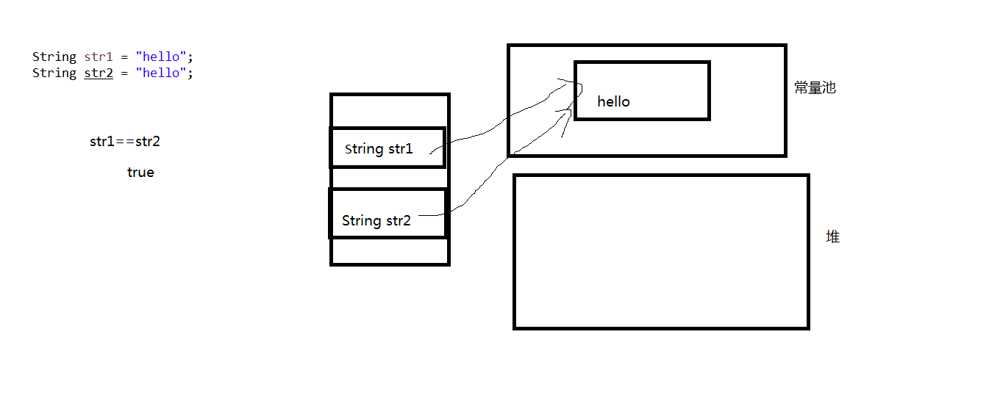
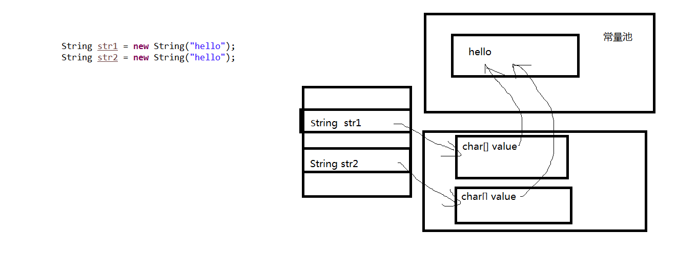
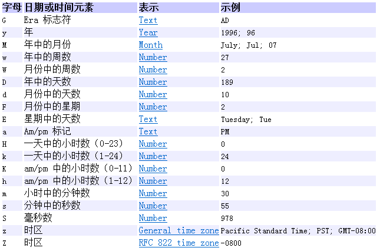
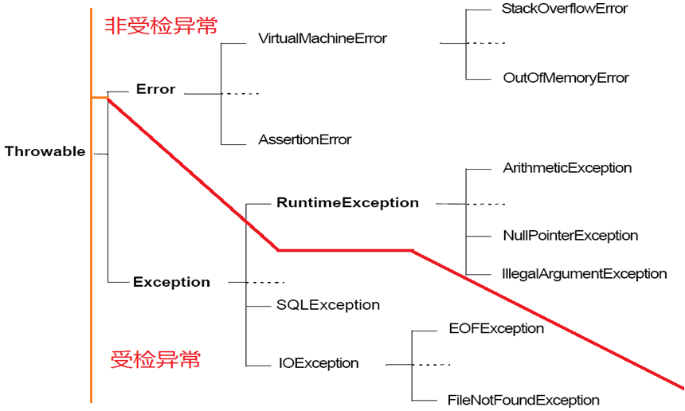
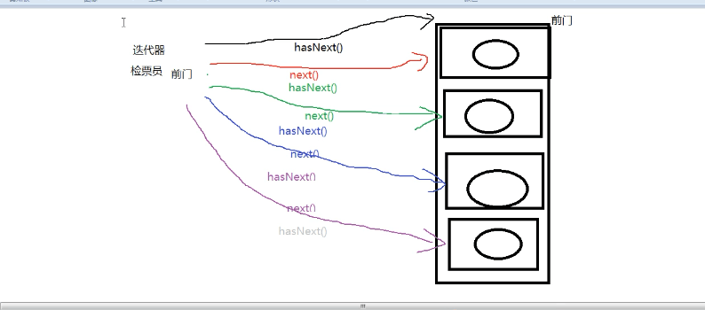
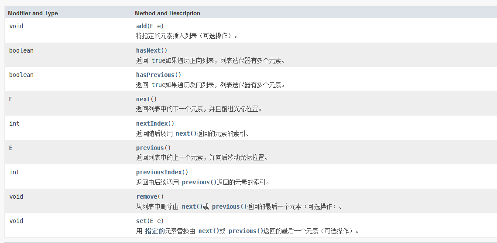
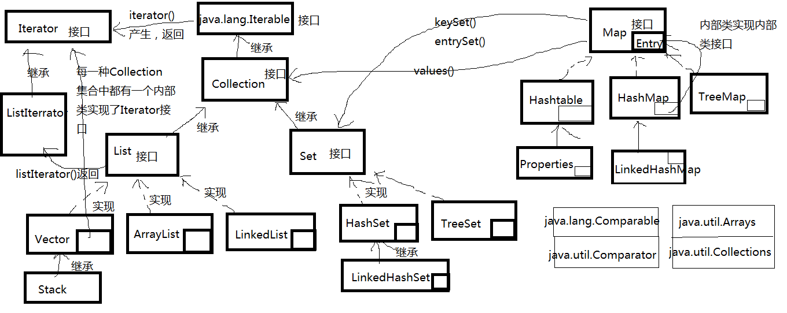

# javaSE二

<!-- toc -->

### 面向对象OOP

#### 面向对象的高级特性

##### 包装类和字符串

###### 包装类

1. Java是面向对象的语言，但是不纯，它仍然保留C语言的八种基本数据类型，除了八种基本数据类型之外，都是引用数据类型，所以，后面涉及到的集合、泛型、...设计只针对引用数据类型，不允许基本数据类型的数据参与，为了八种基本数据类型也能和后面的技术融合为一体，Java想了一个办法，为八种基本数据类型设计了对应的包装类；

   byte-->Byte；

   short-->Short；

   int-->Integer；

   long-->Long；

   float-->Float；

   double-->Double；

   char-->Character；

   boolean-->Boolean；

2. 在jdk1.5之前，基本数据类型与包装类之间需要手动进行转换，之后的版本支持自动转换；

   + 装箱：基本数据类型-->包装类对象；目的是某些地方不支持基本数据类型，只支持引用数据类型；

     + 手动：
     + 自动：

   + 拆箱：包装类对象-->基本数据类型；目的是运算方便；

     + 手动：
     + 自动：

     ```java
     import org.junit.Test;
     
     public class TestWrapper {
         @Test
         public void test(){
             int a = 10;
             //手动装箱
             Integer in = new Integer(a);
             System.out.println(in);
             //手动装箱
             Integer of = Integer.valueOf(a);
             System.out.println(of);
         }
     
         @Test
         public void test1(){
             int a = 10;
             //自动装箱
             Integer in =a;
             System.out.println("in=" + in);
     
             //先自动装箱成Integer的对象，后向上转型成Object
             Object obj = a;
             System.out.println("obj=" + obj);
         }
     
         @Test
         public void test3(){
             Integer in = new Integer(20);
             //手动拆箱
             int num = in.intValue();
         }
     
         @Test
         public void test4(){
             Integer in = new Integer(20);
             //自动拆箱
             int num = in;
         }
     }
     ```

   数据类型转换：

   + 基本数据类型转换：自动类型转换与强制转换；
   + 引用数据类型转换：向上转型与向下转型；
   + 基本数据类型与包装类之间：装箱与拆箱；

3. 基本数据类型与字符串的转换：

   + 基本数据类型-->字符串：
   + 字符串-->基本数据类型：可以借助包装类的方法；

   ```java
   import org.junit.Test;
   
   /*
   基本数据类型与字符串之间的转换：
    */
   public class TestWrapperAPI {
       public static void main(String[] args) {
           for (int i = 0;i < args.length;i++){
               System.out.println(args[i]);
           }
   
           int a = 10;
           //基本数据类型-->字符串
           String str = a + "";
           String str2 = String.valueOf(a);
   
           //字符串-->基本数据类型
           int num1 = Integer.parseInt(args[0]);
           int num2 = Integer.parseInt(args[1]);
           System.out.println(num1 + num2);
   
           double num3 = Double.parseDouble(args[3]);
           double num4 = Double.parseDouble(args[4]);
           System.out.println(num3 + num4);
       }
   }
   ```

4. 包装类的作用：

   + 数据类型的范围：
     + Float和Double中还有正无穷大POSITIVE_INFINITY、负无穷大NEGATIVE_INFINITY，还有NaN，是Not a Number的缩写。NaN 用于处理计算中出现的错误情况，比如 0.0 除以 0.0 或者求负数的平方根。程序员可以利用这种定制的 NaN 值中的特定位模式来表达某些诊断信息。
   + 数据类型的转换：
     + 见上基本数据类型与字符串的转化；

5. 包装类的其他方法：

   + Integer类型：
     + public static String toBinaryString(int i) //把十进制转成二进制
     + public static String toHexString(int i)   //把十进制转成十六进制
     + public static String toOctalString(int i)  //把十进制转成八进制
   + Character类型：
     + public static char toUpperCase(char ch) //转成大写字母
     + public static char toLowerCase(char ch) //转成小写字母
   + equals：
     + 按照包装的基本数据类型的值比较；
   + comparaTo：
     + 按照包装的基本数据类型的值比较；

6. 缓存问题：

   我们在编程时大量需要值在-128到127范围之间的Integer对象。如果只能通过new来创建，需要在堆中开辟大量值一样的Integer对象。这是相当不划算的，IntegerCache.cache很好的起到了缓存的作用。

   ​	缓存

   ​	byte Byte -128–127

   ​	short Short -128–127

   ​	int Integer -128—127

   ​	long Long -128—127

   ​	float Float 不缓存

   ​	double Double 不缓存

   ​	char Character 0–127

   ​	boolean Boolean TURE，FALSE

###### String类型

1. String类概述：

   + java.lang.String：字符串对象；
     + 是引用数据类型；
     + 任何在程序种出现的“xxxx”都是String类的对象；
     + 字符串是常量，他们的值在创建之后不能修改==>所有对字符串的更改，都会产生新的对象；
     + 因为String对象是不可变的，所以可以共享==>字符串常量对象是共享的，存储在字符串常量池中；
     + String底层是用什么存储的：
       + jdk1.9之前：字符数组存储；
         + "hello"-->{'h','e','l','l','o'}
       + jdk1.9之后：字节数组存储；
   + 字符串常量池在哪里？
     + jdk1.6及之前：字符串常量池在方法区；
     + jdk1.7：字符串常量池在堆中；
     + jdk1.8：字符串常量池在元空间

   ```java
   import org.junit.Test;
   
   public class TestString {
       @Test
       public void test1(){
           //str是一个对象，因为字符串太频繁了，所以Java简化了它的对象创建；
           String str = "hello";
           String string = new String("world");
       }
   
       @Test
       public void test2(){
           String str = "";//空字符串对象
           String str2 = "2";
       }
   
       @Test
       public void test3(){
           //这里面有3个对象：hello,world,helloworld
           String str = "hello";
           str = str + "world";
       }
   
       @Test
       public void test4(){
           String s1 = "hello";
           String s2 = "hello";
   
           System.out.println(s1 == s2);//true
   
           String s3 = new String("hello");
           String s4 = new String("hello");
   
           System.out.println(s3 == s4);//false
           System.out.println(s1 == s3);//false
       }
   }
   ```

2. String的对象与比较：

   

   

   + 常量池+常量池一定在常量池中，常量池是共享的；

   + “+”左右两边只要有一个不是常量池中的对象进行拼接，结果一定在堆中，堆中不是共享的；

     ```java
     import org.junit.Test;
     
     import java.util.Scanner;
     
     public class TestStringInstance {
         @Test
         public void test1(){
             String str1 = "hello";
             String str2 = "hello";
             System.out.println(str1 == str2);//true
         }
     
         @Test
         public void test2() {
             String str1 = new String("hello");
             String str2 = new String("hello");
             System.out.println(str1 == str2);//false
         }
     
         @Test
         public void test3(){
             String str1 = new String("hello");
             String str2 = new String("hello");
     
             //问有几个对象?
             //3个
         }
     
         @Test
         public void test4(){
             String str1 = "hello";//常量池
             String str2 = "world";//常量池
             String str3 = "helloworld";//常量池
     
             String str4 = "hello" + "world";//常量 + 常量，结果还在常量池
             String str5 = str1 + "world";//str1是变量，变量+常量，结果在堆中
             String str6 = "hello" + str2;//常量+变量，结果在堆中
     
             System.out.println(str3 == str4);//true
             System.out.println(str3 == str5);//false
             System.out.println(str3 == str6);//false
     
             final String str7 = "hello";
             final String str8 = "world";
             String str9 = str7 + str8;//常量+常量，结果在常量池
             System.out.println(str3 == str9);//true
     
             final String str10 = new String("hello");
             final String str11 = new String("world");
             String str12 = str10 + str11;//堆中常量+堆中常量，结果在堆中
             System.out.println(str3 == str12);//false
         }
     
         @Test
         public void test5(){
             String str1 = "hello";
             String str2 = "world";
             String str3 = "helloworld";
     
             String str4 = str1 + str2;
             System.out.println(str3 == str4);//false
     
             String str5 = (str1 + str2).intern();//intern():把结果存储到常量池中
             System.out.println(str3 == str5);//true
         }
     
         @Test
         public void test6(){
             Scanner sc = new Scanner(System.in);
             System.out.println("用户名:");
             String user = sc.next();
     
             System.out.println("密码：");
             String password = sc.next();
     
             //假设用户名是admin,用户名是123
             //如果用户名密码正确，打印登录成功，否则登录失败
             if ("admin".equals(user) && "123".equals(password)){
                 System.out.println("登录成功");
             } else{
                 System.out.println("登录失败");
             }
         }
     }
     ```

3. String的API方法：

   + char charAt(index)：返回指定索引处的字符；

   + int length()：获取字符串的长度

   + boolean equals(Object obj)：重写了Object的equals方法，用来比较字符串的内容，区别大小写；

   + boolean equalsIngoreCase(Object obj)：忽略大小写比较；

   + String trim()：去掉字符串前后空格；

   + String concat()：拼接，等价于“+”；

     ```java
     import org.junit.Test;
     
     import java.util.Scanner;
     
     public class TestStringAPI {
         @Test
         public void test1(){
             Scanner sc = new Scanner(System.in);
             System.out.println("请输入性别：");
             //char gender = sc.next().charAt(0);
             String str = sc.next();
             char gender = str.charAt(0);//取字符串的第一个字符
     
             System.out.println("性别：" + gender);
         }
     
         @Test
         public void test2(){
             String name = "迪丽热巴";
             int length = name.length();
             System.out.println("字符串的长度：" + length);
         }
     
         @Test
         public void test3(){
             String name = "Alice";
             String str = "alice";
             System.out.println(name.equals(str));//false,区别大小写，例如用户名密码比较
             System.out.println(name.equalsIgnoreCase(str));//true,忽略大小写，例如验证码比较
         }
     
         @Test
         public void test4(){
             //web页面，文本框
             String userInput = "chai   ";
             String user = userInput.trim();//去掉前后空格，不会去掉中间的空格
             System.out.println(userInput.trim());
         }
     
         @Test
         public void test5(){
             String str1 = "hello";
             String str2 = "world";
             String string = str1.concat(str2);
             System.out.println(string);
         }
     }
     ```
     
   + 常用：
   
     + isEmpty()：判断是否是空字符串；
     + toLowerCase()：使用默认的语言环境将此String中的所有字符转换为小写；
     + toUpperCase()：使用默认的语言环境将此String中的所有字符转换为大写；
     + char[] toCharArray()：将此字符串转换为一个新的字符数组
   
     ```java
     public class testString {
         public static void main(String[] args) {
             Student stu = new Student();
             //stu.setName("");
             //stu.setName(new String(""));
             String name = stu.getName();
     
             if (name == null){
                 System.out.println("名字没有赋值");
             }
             if ("".equals(name)){
                 System.out.println("名字赋值为空字符串1");
             }
             if (name.isEmpty()){
                 System.out.println("名字赋值为空字符串2");
             }
             if ("" == name){
                 System.out.println("名字赋值为空字符串3");
             }
         }
     }
     ```
   
   + 和字符相关：
   
     + startWith()：是否以...开头；
   
     + endWith()：是否以...结尾；
   
     + replace系列：替换；
   
     + indexOf()：查找某个字符或子串在当前字符串中的索引位置，如果该子串不存在，返回-1；
   
     + lastIndexOf()：
   
     + subString(int begin)和subString(int begin, int end)：截取；
   
     + spilt()：拆分；遇到“.”和“|”的正则问题需要加“\ \”；
   
       ```java
       import org.junit.Test;
       
       import java.sql.SQLOutput;
       
       public class TestStringAPI2 {
           @Test
           public void test1(){
               String name = "欧阳桦";
               boolean flag = name.startsWith("欧");
               System.out.println(flag);
           }
       
           @Test
           public void test2(){
               String str = "好好学习，天天向上、向上、向上";
               String all = str.replaceAll("向上", "up");
               System.out.println(all);
           }
       
           @Test
           public void test3(){
               String str = "好好学习，天天向上、向上、向上";
               boolean b = str.contains("向上");
               System.out.println(b);
       
               int index = str.indexOf("向上");
               System.out.println(index);
       
               int index2 = str.lastIndexOf("向上");
               System.out.println(index2);
           }
       
           @Test
           public void test4(){
               String file = "E:\\newstart\\src\\day016\\test.txt";
               //截取出文件的后缀名
               int index = file.lastIndexOf(".");
               String ext = file.substring(index);
               System.out.println(ext);
               //截取出文件名，不带扩展名
               int index2 = file.lastIndexOf("\\");
               System.out.println(index2);
       
               String fileName = file.substring(index2+1,index);
               System.out.println(fileName);
           }
       
           @Test
           public void test5(){
               String str = "hello,java,hello,world";
               String[] strings = str.split(",");
               for (String string:strings) {
                   System.out.println(string);
               }
           }
       
           @Test
           public void test6(){
               String str = "hello.java.hello.world";
               String[] strings = str.split("\\.");
               for (String string:strings) {
                   System.out.println(string);
               }
           }
       
           @Test
           public void test7(){
               String str = "hello|java|hello|world";
               String[] strings = str.split("\\|");
               for (String string:strings) {
                   System.out.println(string);
               }
           }
       }
       ```
   
       
   
4. String编码与解码：

   + 编码：字符串-->字节；

     ```java
     byte[] getBytes()//默认按照平台的字符集
     byte[] getBytes("编码方式")
     ```

   + 解码：字节-->字符串；

     ```java
     new String(byte[])//默认按照平台的字符集
     new String(byte[],"编码方式")
     ```

   + 乱码的原因：

     + 编码的字符集与解码的字符集不一致；
     + 字节数不全；

     ```java
     import org.junit.Test;
     
     import java.io.*;
     
     public class TestStringAPIencoding  {
         @Test
         public void test1() throws IOException {
             //读取了一个文件的内容
             File file = new File("E:\\newstart\\src\\day016\\test.txt");
             FileInputStream fis = new FileInputStream(file);
             byte[] data = new byte[10];
             int len = fis.read(data);
             //解码
             String info = new String(data,0,10,"UTF-8");
     
             System.out.println(info);
         }
     
         @Test
         public void test() throws UnsupportedEncodingException {
             String str = "欧阳";//UTF-8
     
             //编码
             byte[] bytes = str.getBytes("GBK");
             //解码
             String name = new String(bytes,"GBK");//GBK
             System.out.println(name);
         }
     }
     ```

###### String排序

1. 自然排序：实现了java.lang.Comparable>public int compareTo(Sting anotherString)

   + 如果是ASCII范围内，按照ASCII值的顺序；
   + 按照Unicode编码值进行排序

2. 定制排序：实现了java.util.Comparator，java.text.Collator是属于String的定制比较器：Collator c = Collator.getInstance();；

   ```java
   import java.text.Collator;
   import java.util.Arrays;
   import java.util.Comparator;
   
   public class TestStringCompare {
       public static void main(String[] args) {
           Student[] array = new Student[3];
           array[0] = new Student("章登");
           array[1] = new Student("柴林燕");
           array[2] = new Student("朱一龙");
   
           Arrays.sort(array);
           System.out.println(Arrays.toString(array));
   
           //希望大体上按照汉语拼音，或者字段的顺序
           Arrays.sort(array,new MyComparator());
           System.out.println(Arrays.toString(array));
       }
   }
   
   //定制排序：实现的接口是java.util.Comparator,实现int compare(Object o1,Object o2)
   class MyComparator implements Comparator{
   
       @Override
       public int compare(Object o1, Object o2) {
           //学生的定制排序
           Student s1 = (Student) o1;
           Student s2 = (Student) o2;
           //学生对象转变成学生姓名的字符串对象进行定制排序
           //s1和s2的比较，变成s1.getName()和s2.getName()进行比较
           String name1 = s1.getName();
           String name2 = s2.getName();
           //name1.compareTo(name2)仍是自然排序
           //java.text.Collator是属于String的定制比较器
           Collator c = Collator.getInstance();
           return c.compare(name1,name2);
       }
   }
   
   //学生排序：按照姓名进行排序
   //自然排序规则：学生类型实现java.lang.Comaprable接口,实现compareTo方法
   class Student implements Comparable{
       private String name;
   
       public Student() {
       }
   
       public Student(String name) {
           this.name = name;
       }
   
       public String getName() {
           return name;
       }
   
       public void setName(String name) {
           this.name = name;
       }
   
       @Override
       public String toString() {
           return "Student{" +
                   "name='" + name + '\'' +
                   '}';
       }
   
       @Override
       public int compareTo(Object o) {
           Student other = (Student) o;
   
           //因为name是String类型，String类型实现了java.lang.Comparable接口，表示字符串对象是可以比较大小的
           //暂时没考虑空指针异常
           //本来是this和other的大小比较，现在转换成this.name和other.name比较大小
           return this.name.compareTo(other.name);
       }
   }
   ```


###### StringBuffer和StringBuilder

1. 介绍：java.lang包下；是字符串的兄弟类；和String的最大区别在于是可变的字符序列；
2. StringBuffer和StringBuilder的区别：
   + 完全兼容的API，即方法相同；
   + 不同的是StringBuffer相对老一点，jdk1.0；StringBuilder新一点，jdk1.5；
   + StringBuffer是线程安全的，StringBuilder是线程不安全的；
3. StringBuilder在API中的描述：
   + 一个可变的字符序列。 此类提供与`StringBuffer`的API，但不保证同步。  此类设计用作简易替换为`StringBuffer`在正在使用由单个线程字符串缓冲区的地方（如通常是这种情况）。  在可能的情况下，建议使用这个类别优先于`StringBuffer` ，因为它在大多数实现中将更快。
4. 线程安全问题：
   + 只有在多个线程同时存在时，并操作同一个字符串缓冲区时才存在，即多个线程对同一个StringBuffer或StringBuilder对象操作时才和发生，即多个线程有共享资源；
   + StringBuffer线程安全：即其中一个线程使用时，它会锁上，其他线程进不来；慢
   + StringBuilder线程不安全：即其中一个线程使用时，它没有锁上，其他线程有可能进来；快
5. API：
   + 创建对象不同：
     + String直接创建对象；
     + StringBuffer和StringBuilder通过构造器创建对象；
   + 拼接不同：
     + 方式：
       + String的拼接可以使用+进行直接拼接；
       + StringBuffer和StringBuilder的拼接不能使用+，使用append方法；
     + 结果：
       + String拼接后会产生新的对象；
       + StringBuffer和StringBuilder拼接时直接对源对象进行修改；
     + 效率：
       + StringBuffer和StringBuilder的时间效率和空间效率高于String；
   + 可以修改字符序列：
     + insert()；
     + delete()；
     + append()；
     + reverse()；
   + 其他方法：
     + charAt；
     + indexOf；
     + lastIndexOf；

```java
import org.junit.Test;

public class TestStringBrother {
    @Test
    public void test1(){
        String str = "hello";
        StringBuilder sb= new StringBuilder("hello");
    }
    @Test
    public void test2(){
        String str = "hello";
        String str2 = str + "world";
        System.out.println("str = " + str);
        System.out.println("str2 = " + str2);

        StringBuilder sb= new StringBuilder("hello");
        StringBuilder sb2= new StringBuilder("world");
        //append()之后sb被修改；
        StringBuilder sb3 = sb.append(sb2);
        System.out.println(sb);
        //支持连写
        StringBuilder sb4 = sb.append(true).append(12345).append(sb2);
        System.out.println(sb4);
    }
}
```

##### 时间日期类

###### jdk1.8之前的日期类

1. System.currentTimeMillis()：获取当前时间的毫秒数；

2. java.util.Date类：
   + 构造器：
     + Date()；
     + Date(long 毫秒)；
   + long getTime()：把Date对象转成毫秒数；
   
3. java.util.Calendar类：
   + 创建对象：
     + new GregorianCalendar()；
     + getInstance()；
   + 获取具体的某个时间：
     + get(field)；
   
4. 日期时间的格式化：java.text.SimpleDateFormat

   + 构造器：SimpleDateFormat sf = new SimpleDateFormat("格式");

   + format：格式化，把日期转成字符串，public final String format(Date date)；
   + parse：解析，把字符串转成日期，public Date parse(String source)；

   

```java
import com.sun.scenario.effect.impl.sw.sse.SSEBlend_SRC_OUTPeer;
import org.junit.Test;

import java.text.ParseException;
import java.text.SimpleDateFormat;
import java.util.*;
import java.util.concurrent.CancellationException;

public class TestDate {
    @Test
    public void test(){
        long millis = System.currentTimeMillis();
        System.out.println(millis);
    }

    @Test
    public void test1(){
        Date date = new Date();
        System.out.println(date);

        Date d = new Date(100000);
        System.out.println(d);

        Date d2 = new Date(Integer.MAX_VALUE);
        System.out.println(d2);
        Date d3 = new Date(Long.MAX_VALUE);
        System.out.println(d3);
    }

    @Test
    public void test2(){
        Date date = new Date();
        System.out.println(date.getTime());
    }

    @Test
    public void test3(){
        //Calendar c = new GregorianCalendar();
        Calendar c = Calendar.getInstance();
        System.out.println(c);
        int year = c.get(Calendar.YEAR);
        int month = c.get(Calendar.MONTH)+1;//1月份从0开始
        int day = c.get(Calendar.DATE);
        System.out.println(year +"年"+ month + "月" + day + "日");

        int hour = c.get(Calendar.HOUR);
        int minute = c.get(Calendar.MINUTE);
        int second = c.get(Calendar.SECOND);
        System.out.println(hour + "时" + minute + "分" + second + "秒");
    }

    @Test
    public void test4(){
        int year = 2017;
        int month = 11;//月份是从0开始的
        int day = 15;

        Calendar c = Calendar.getInstance();
        c.set(year,month,day);
        int i = c.get(Calendar.DAY_OF_YEAR);
        System.out.println(i);
    }

    @Test
    public void test5(){
        Calendar c = Calendar.getInstance(TimeZone.getTimeZone("America/New_York"), Locale.US);

        int year = c.get(Calendar.YEAR);
        int month = c.get(Calendar.MONTH)+1;//1月份从0开始
        int day = c.get(Calendar.DATE);
        System.out.println(year +"年"+ month + "月" + day + "日");

        int hour = c.get(Calendar.HOUR_OF_DAY);
        int minute = c.get(Calendar.MINUTE);
        int second = c.get(Calendar.SECOND);
        System.out.println(hour + "时" + minute + "分" + second + "秒");

//        String[] availableIDs = TimeZone.getAvailableIDs();
//        for (String string:
//             availableIDs) {
//            System.out.println(string);
//        }
    }

    @Test
    public void test6() throws ParseException {
        Date date = new Date();
        System.out.println(date);

        //希望显示的格式是：2018-1-13
        SimpleDateFormat sf = new SimpleDateFormat("yyy-MM-dd");
        //把日期转成字符串：格式化
        String string = sf.format(date);
        System.out.println(string);

        String str = "1996-5-7";
        SimpleDateFormat sf2 = new SimpleDateFormat("yyy-MM-dd");
        //把字符串转成日期：解析
        Date date2 = sf2.parse(str);
        System.out.println(date2);
    }

    @Test
    public void test7(){
        Date date = new Date();
        SimpleDateFormat sf = new SimpleDateFormat("yyyy-MM-dd HH:mm:ss SSS毫秒 E 是这一年的第D天");
        String string = sf.format(date);
        System.out.println(string);
    }
}
```

###### jdk1.8的日期时间

1. 本地日期（LocalDate）、本地时间（LocalTime）、本地日期时间（LocalDateTime）：

   + LocalDate代表IOS格式（yyyy-MM-dd）的日期,可以存储 生日、纪念日等日期；
   + LocalTime表示一个时间，而不是日期；
   + LocalDateTime是用来表示日期和时间的，这是一个最常用的类之一。

   | 方法                                                         | **描述**                                                     |
   | ------------------------------------------------------------ | ------------------------------------------------------------ |
   | now() / now(ZoneId zone)                                     | 静态方法，根据当前时间创建对象/指定时区的对象                |
   | of()                                                         | 静态方法，根据指定日期/时间创建对象                          |
   | getDayOfMonth()/getDayOfYear()                               | 获得月份天数(1-31) /获得年份天数(1-366)                      |
   | getDayOfWeek()                                               | 获得星期几(返回一个 DayOfWeek 枚举值)                        |
   | getMonth()                                                   | 获得月份, 返回一个 Month 枚举值                              |
   | getMonthValue() / getYear()                                  | 获得月份(1-12) /获得年份                                     |
   | getHours()/getMinute()/getSecond()                           | 获得当前对象对应的小时、分钟、秒                             |
   | withDayOfMonth()/withDayOfYear()/withMonth()/withYear()      | 将月份天数、年份天数、月份、年份修改为指定的值并返回新的对象 |
   | with(TemporalAdjuster t)                                     | 将当前日期时间设置为校对器指定的日期时间                     |
   | plusDays(), plusWeeks(), plusMonths(), plusYears(),plusHours() | 向当前对象添加几天、几周、几个月、几年、几小时               |
   | minusMonths() / minusWeeks()/minusDays()/minusYears()/minusHours() | 从当前对象减去几月、几周、几天、几年、几小时                 |
   | plus(TemporalAmount t)/minus(TemporalAmount t)               | 添加或减少一个 Duration 或 Period                            |
   | isBefore()/isAfter()                                         | 比较两个 LocalDate                                           |
   | isLeapYear()                                                 | 判断是否是闰年（在LocalDate类中声明）                        |
   | format(DateTimeFormatter t)                                  | 格式化本地日期、时间，返回一个字符串                         |
   | parse(Charsequence text)                                     | 将指定格式的字符串解析为日期、时间                           |

   ```java
   import org.junit.Test;
   
   import java.time.LocalDate;
   import java.time.LocalDateTime;
   import java.time.LocalTime;
   
   public class TestLocalDateAndTime {
       @Test
       public void test1(){
           LocalDate date1 = LocalDate.now();
           System.out.println(date1);
           LocalDate date2 = LocalDate.of(2016,12,12);
           System.out.println(date2);
   
           LocalTime time1 = LocalTime.now();
           System.out.println(time1);
           LocalTime time2 = LocalTime.of(12,0,12);
   
           LocalDateTime dt = LocalDateTime.now();
           System.out.println(dt);
       }
   
       @Test
       public void test2(){
           LocalDate date1 = LocalDate.now();
           System.out.println("年：" + date1.getYear());
           System.out.println("月：" + date1.getMonthValue());
           System.out.println("日：" + date1.getDayOfMonth());
           System.out.println("第几天：" + date1.getDayOfYear());
       }
   
       @Test
       public void test3(){
           LocalDate date = LocalDate.now();
           LocalDate localDate = date.withMonth(12);
           System.out.println(date);
           System.out.println(localDate);
       }
   
       @Test
       public void test4(){
           LocalDate date1 = LocalDate.now();
           LocalDate date2 = date1.plusDays(240);
   
           System.out.println(date1);
           System.out.println(date2);
       }
   
       @Test
       public void test5(){
           LocalDate date = LocalDate.now();
           boolean b = date.isLeapYear();
           System.out.println(b);
       }
   }
   ```
   
2. 时间日期的格式化：java.time.DateTimeFormatter

   + format：把日期时间对象转字符串；
   + parse：把字符串转日期时间格式；


##### 数学相关类

1. java.lang.Math：Math类包含用于执行基本数学运算的方法，如初等指数、对数、平方根和三角函数；

2. java.math：
   + BigInteger：大整数
   + BigDecimal：定点数

```java
import org.junit.Test;

import java.math.BigDecimal;
import java.math.BigInteger;

public class TestMath {
    @Test
    public void test(){
        System.out.println(Math.PI);
        System.out.println(Math.sqrt(5));
        System.out.println(Math.pow(2,3));

        System.out.println(Math.ceil(1.567));//天花板，2.0
        System.out.println(Math.round(1.567));//四舍五入，2
        System.out.println(Math.floor(1.567));//地板，1.0

        System.out.println(Math.max(2.6,5));
        System.out.println(Math.min(2.6,5));
    }

    @Test
    public void test1(){
        //12345678998765432345678
        //12345676543234567765432

        //long a = 12345678998765432345678L;超出范围
        BigInteger a = new BigInteger("12345678998765432345678");
        BigInteger b = new BigInteger("12345676543234567765432");

        BigInteger sum = a.add(b);
        System.out.println(sum);
        System.out.println(a.subtract(b));
        System.out.println(a.multiply(b));
        System.out.println(a.divide(b));
        System.out.println(a.remainder(b));
        BigInteger[] array = b.divideAndRemainder(a);
        System.out.println(array[0]);
        System.out.println(array[1]);
    }

    @Test
    public void test2(){
        //12.65432456776543234567
        //56.56865434567896543232
        BigDecimal a = new BigDecimal("12.65432456776543234567");
        BigDecimal b = new BigDecimal("56.56865434567896543232");
        BigDecimal c = new BigDecimal("4");

        System.out.println(a.add(b));
        System.out.println(a.subtract(b));
        System.out.println(a.multiply(b));
        //System.out.println(a.divide(b));//报错，不能够被整除
        System.out.println(a.divide(c));
        System.out.println(a.divide(b,10,BigDecimal.ROUND_FLOOR));
    }
}
```

### 异常处理

异常是指正常情况下程序可以照常运行，只是偶尔因为一些不可控的因素导致程序无法运行；异常不包括语法错误和逻辑错误；

不可控因素：网络中断、用户非法输入、用户硬盘容量已满等；

希望当出现了如上情况时，使得程序能够正常运行，而不是奔溃了，这样的处理称为异常处理；

在Java中如何表示异常，如何处理异常？

Java一切皆为对象，异常也是用对象表示；

Java对异常的处理过程：当某句代码发生异常时，会在该代码处停下来，然后创建一个异常的对象，然后把这个异常的对象抛出来；jvm会检查在这个异常对象的外围是否有try...catch代码，可以捕获这个异常对象，如果可以捕获，那么按照catch中的代码进行处理，然后程序从catch下面开始继续运行；如果没用对应的catch把它捕获，jvm会把这个异常继续往上抛出，抛给调用者，如果调用者可以处理，那么继续，如果调用者也没有处理，一路往上抛，直到main方法，如果main也没用处理，那么回到jvm，程序奔溃。

#### 异常的类型

体系结构：

java.lang.Throwable：Java语言中所有错误或异常的超类；

+ 只有当对象是此类（或其子类之一）的实例时，才能通过Java虚拟机或者Java throw语句抛出；
+ 只有此类或其子类之一才可以是catch子句中的参数类型；
+ 简单的说：只有Throwable类型或它的子类的类型的实例对象才能“抛”，或者被捕获；

Throwable又分为两个类别：

+ 错误：Error，严重的异常称为错误，例如VirtualMachineError包括StackOverflowError栈溢出，OutOfMemoryError堆内存溢出(OOM)；

+ 异常，例外：Exception；

  + 编译时异常，受检异常：FileNotFoundException,SQLException；
  + 运行时异常，非受检异常：RuntimeException或它的子类；例如NullPointerException,ArrayIndexOutOfBoundsException,ClassCastException,ArithmeticException等；

  

#### 异常的处理

##### try...catch

只要是Throwable类型或它的子类，都可以被catch；

1. 语法：

   ```java
   try{
       可能发生异常的代码;
   }catch(异常的类型 e1){
       该异常的处理代码;
   }catch(异常的类型 e2){
       该异常的处理代码;
   }...
    finally{
       不管是否发生异常都要执行的代码（例如：释放资源）;
   }
   ```

2. 运行过程：

   + 如果try中的代码发生异常，那么程序就停下来，跳到对应的catch中处理；如果没有catch能够抓住，就往上抛；
   + catch可以多个，catch()中必须是异常类型；
   + catch的类型如果没有包含关系，顺序随意；如果有包含关系，那么子上父下；
   + finally如果有，那么无论是否发生异常都要执行；

   ```java
   public class TestExceptionExer {
       //从命令行参数传入两个整数，并求出它俩的商
       public static void main(String[] args) {
           try {
               int a = Integer.parseInt(args[0]);
               int b = Integer.parseInt(args[1]);
               int c = a/b;
               System.out.println(c);
           } catch (NumberFormatException e) {
               System.out.println("需要传两个参数");
           } catch (ArrayIndexOutOfBoundsException e){
               System.out.println("需要传两个命令行参数");
           } catch (ArithmeticException e){
               System.out.println("第二个参数不能是0");
           } finally {
               System.out.println("finally块");
           }
       }
   }
   ```

##### throws

throws表示当前方法中不出来某个异常，交由调用者处理；

1. 语法格式(方法的声明格式)：

   ```java
   【修饰符】返回值类型 方法名(形参列表) throws 异常类型1,异常类型2,...{
       
   }
   ```

   + <font color='red'>重写的要求：两同两小一大；</font>
     + 两同：方法名和形参列表必须相同；
     + 两小：
       + 返回值类型：如果是基本数据类型和void必须相同，如果是引用数据类型，<=的关系；
       + 抛出的异常类型是小于等于的关系；
     + 一大：权限修饰符是大于等于的关系；

   ```java
   import java.util.Scanner;
   
   public class TestThrows {
       public static void main(String[] args) {
           try {
               divide();
           } catch (NumberFormatException e) {
               e.printStackTrace();//把异常的详细信息打印出来，包括异常的类型、异常的堆栈信息
               System.out.println("");//当作普通信息打印
               System.err.println("输入的不是数字");
           } catch (ArrayIndexOutOfBoundsException e) {
               e.printStackTrace();
           } catch (ArithmeticException e) {
               e.printStackTrace();
           }
   
           for (int i = 0; i < 5; i++) {
               System.out.println("hello world");
           }
       }
   
       public static void divide() throws NumberFormatException,ArrayIndexOutOfBoundsException,ArithmeticException{
           Scanner sc = new Scanner(System.in);
           System.out.println("请输入第一个数：");
           String s1 = sc.nextLine();
   
           System.out.println("请输入第二个数：");
           String s2 = sc.nextLine();
   
           int a = Integer.parseInt(s1);
           int b = Integer.parseInt(s2);
           int c = a / b;
           System.out.println(c);
       }
   }
   
   class Father{
       public void method() throws RuntimeException{
           
       }
   }
   
   class Son extends Father{
       @Override
       //NullPointerException是小于RuntimeException的
       public void method()throws NullPointerException{
           
       }
   }
   ```


##### 自定义异常与throw

1. 注意：

   + 如果自定义异常继承了RuntimeException，那么这个自定义异常就是运行时异常；如果自定义异常继承了Exception，那么这个异常就是编译时异常；
   + 编译时异常必须在编译阶段，必须加try..catch或throws处理，否则编译不通过，而运行时异常不用非加try...catch或throws；
   + throw可以代替return语句(执行throw语句后，后面的return语句不执行)；

2. 语法结构：

   ```java
   【修饰符】class 自定义异常类型 extends Throwable或它的子类{
       public MyException() {
       }
   
       public MyException(String message) {
           super(message);
       }
   }
   ```

3. 要求：

   + 必须继承Throwable或它的子类，例如：Exception，RuntimeException；

   + 自定义异常的对象，只能通过throw进行抛出，JVM不会自动抛出；

   + 建议自定义异常实现java.io.Serializable，并增加一个版本ID，方便把异常打印到日志中：

       private static final long serialVersionUID = 1L;

   ```java
   import java.util.Scanner;
   
   public class TestMyException {
       public static void main(String[] args) {
           while (true){
               Scanner sc = new Scanner(System.in);
               System.out.println("请输入用户名：");
               String username = sc.nextLine();
               System.out.println("请输入密码：");
               String password = sc.nextLine();
   
               try {
                   login(username,password);
                   break;
               } catch (Exception e) {
                   //e.printStackTrace();
                   System.out.println(e.getMessage());
               }
           }
           System.out.println("...");
       }
   
       public static void login(String username,String password) throws MyException {
           if ("ouyang".equals(username) && "123456".equals(password)){
               System.out.println("登录成功");
           }else {
               System.out.println("登录失败");
               MyException m = new MyException("用户名或密码错误");
               throw m;
           }
       }
   }
   
   class MyException extends Exception{
       public MyException() {
       }
   
       public MyException(String message) {
           super(message);
       }
   }
   ```


##### finalize、final、finally的区别：

finalize：是属于Object的方法，实在对象被垃圾回收之前调用；

final：是一个修饰符，可以修饰类，表示不能被继承，可以修饰方法，表示不能被重写，可以修饰变量，表示值不能被修改；

finally：是属于异常处理的关键字，无论try语句块是否发生异常，finally语句都要执行；

### 集合

集合是在数组或链表这样的物理结构的基础上，重新封装的一种逻辑结构；对于使用这个集合的人来说，是不用考虑集合的扩容、元素的存储，还可以通过size()直接获取有效元素的个数；<font color='red'>对于一组对象来说，选择集合的话，肯定优先考虑集合；集合的元素都是对象，如果存储基本数据类型会自动装箱；</font>

```java
import java.util.ArrayList;

@SuppressWarnings("all")
public class TestCollection {
    public static void main(String[] args) {
        ArrayList list = new ArrayList();

        list.add(12);
        list.add((new Integer(15)));

        for (Object obj:
             list) {
            //getClass()获取对象的运行时类型，运行时类型就是它的实际类型
            System.out.println(obj.getClass());
        }
    }
}
/**
class java.lang.Integer
class java.lang.Integer
*/
```

#### 动态数组

数组：一种容器，可以用来装一组数据，多个数据；元素可以是基本数据类型，也可以是对象；

特点：一旦创建，它的长度不能修改；无法通过数组直接获取有效元素的个数；可以通过索引、下标直接定位到某个元素；

在实际开发中，更多的用来处理基本数据类型数据；

在数组的基础上，可以设计更灵活的容器；

+ 物理结构：数组、链表；
+ 逻辑结构：动态数组、双向链表、栈、队列、树（二叉树）...

String：底层使用char[]或者byte[]存储；

```java
import java.util.Arrays;
/**
 * MyArrayList是我们自己设计的一种新容器
 * MyArrayList的一个对象就是一个容器，这个容器可以放很多对象、元素
 */
public class MyArrayList {
    private Object[] data = new Object[5];//这个数组就是物理结构，真正数据的存储位置
    private int total;

    /**
     * 往MyArrayList容器中添加元素的方法
     * @param element Object元素的类型是任意类型
     */
    public void add(Object element){
        if (total >= data.length){
            //数组已满时扩容
            data = Arrays.copyOf(data, data.length * 2);
        }
        data[total++] = element;
    }

    /**
     * 从MyArrayList容器中移除元素
     * @param index 移除元素的下标
     */
    public void delete(int index){
        checkIndex(index);
        System.arraycopy(data,index+1,data,index,total-index-1);
        data[--total] = null;
    }

    /**
     * 检查索引的范围是否合理
     * @param index 元素的索引
     */
    public void checkIndex(int index) {
        if (index < 0 || index >= total){
            throw new IndexOutOfBoundsException(index + "索引越界");
        }
    }

    /**
     * 返回index位置的元素
     * @param index 元素的索引
     * @return Object 是index位置的元素
     */
    public Object get(int index){
        checkIndex(index);
        return data[index];
    }

    /**
     * 返回当前元素中有效元素的个数
     * @return 实际存储的元素的个数
     */
    public int size(){
        return total;
    }

    /**
     * 返回元素中实际存储的元素
     */
    public Object[] getAll(){
        return Arrays.copyOf(data,total);
    }

    /**
     * 从MyArrayList容器中移除一个元素,只能删除找到的第一个
     * param obj 需要删除的元素对象
     */
    public void delete(Object obj){
        //1、找到bbj的位置index
        int index = find(obj);

        //2、删除index位置的元素
        delete(index);
    }

    /**
     * 用value替换index为主的元素
     * @param index 被替换元素的位置下标
     * @param value 新的元素
     */
    public void set(int index, Object value){
        //1、检查index
        checkIndex(index);

        //2、直接替换
        data[index] = value;
    }

    /**
     * 只替换找到的第一个元素，把MyArrayList中找到第一个old，替换为value
     * @param old
     * @param value
     */
    public void set(Object old, Object value){
        //1、找到old的位置
        int index = find(old);
        //2、替换为value
        set(index,value);
    }

    /**
     * 在MyArrayList中查找第一个obj的索引，如果没有这个元素就返回-1
     * @param obj
     */
    public int find(Object obj){
        int index = -1;
        if (obj ==null){
            for (int i = 0; i < total; i++) {
                if (data[i] == obj){
                    index = i;
                    break;
                }
            }
        }else{
            for (int i = 0; i < total; i++) {
                if (obj.equals(data[i])){
                    index = i;
                    break;
                }
            }
        }
        return index;
    }

    /**
     * 在index位置插入value元素
     * @param index 新插入的位置
     * @param value 新插入的元素
     */
    public void insert(int index,Object value){
        //先判断当前数组是否已满，如果满了，就扩容
        if (total >= data.length){
            data = Arrays.copyOf(data,data.length*2);
        }

        checkIndex(index);

        //1、先把index以及之后的元素往右移动
        System.arraycopy(data,index,data,index+1,total-index);

        //2、把index位置放入value
        data[index] = value;

        //3、元素个数增加
        total++;
    }

    /**
     * 在第一个target元素的位置插入value，然后target及右边的元素右移
     * @param target 被插入的目标元素
     * @param value 插入的新元素
     */
    public void insert(Object target, Object value){
        //1、找到target的index
        int index = find(target);
        checkIndex(index);

        //2、在index位置插入value
        insert(index,value);
    }
}
```

测试类：

```java
public class TestMyArrayList {
    public static void main(String[] args) {
        MyArrayList m = new MyArrayList();//创建一个容器对象
        //容器可以装、拿、查看等操作

        m.add("hello");
        m.add("world");
        m.add("java");
        m.add("mysql");
        m.add("oracle");
        m.add("php");

        System.out.println("实际存储的元素个数是："+ m.size());

        Object object = m.get(3);
        System.out.println(object);

        m.delete(3);
        System.out.println("实际存储的元素个数是："+ m.size());

        Object[] all = m.getAll();
        for (Object element:
             all) {
            System.out.println(element);
        }

        System.out.println("-----------------------------");
        m.delete("oracle");
        System.out.println("实际存储的元素个数是："+ m.size());

        all = m.getAll();
        for (Object element:
                all) {
            System.out.println(element);
        }

        System.out.println("-----------------------------");
        m.insert(2,"html");
        all = m.getAll();
        for (Object element:
                all) {
            System.out.println(element);
        }

        System.out.println("-----------------------------");
        m.insert("world","js");
        all = m.getAll();
        for (Object element:
                all) {
            System.out.println(element);
        }
    }
}
```

#### 链表

物理结构：链表

逻辑结构：链表的容器

特点：方便插入和删除；获取数据麻烦，需要遍历查找，比数组慢；

链表的实现原理：

+ 创建一个节点类，其中节点类包含两个部分，第一个是数据域（在节点里面存储的信息），第二个是引用域（相当于指针，单向链表有一个指针，指向下一个节点；双向链表有两个指针，分别指向下一个和上一个节点）；
+ 创建一个链表类，其中链表类包含三个属性：头节点、尾节点和大小，方法包含添加、删除、插入等方法；

##### 双向链表

```java
/**
 * MyLinkedList的一个对象就是一个容器，容器中可以存储各种类型的元素
 * MyLinkedList的元素实际上是一个个Node类型，通过first往右一个个串起来，或者从last往左一个个找到
 */
public class MyLinkedList {
    private Node first;
    private Node last;

    public void addLast (Object element){
        //默认添加到last的后面
        //新节点的上一个元素是last

        //1、创建新节点
        Node node = new Node(last,element,null);

        if (first == null){//说明当前链表是空链表
            //新节点是第一个节点
            first = node;
        }else {
            last.next = node;
        }

        //新节点变成了最后一个节点
        last = node;
    }

    /*
   	获得链表中的所有元素
    */
    public Object[] getAll(){
        Object[] all = new Object[3];

        Node node = first;
        for (int i = 0; i < all.length; i++) {
            all[i] = node.data;
            node = node.next;
        }
        return all;
    }

    public Object getFirst(){
        return first.data;
    }

    public Object getLast(){
        return last.data;
    }

    /**
    *创建双向链表的节点类
    */
    private class Node{
        private Node prev;
        private Object data;
        private Node next;

        public Node() {
        }

        public Node(Node prev, Object data, Node next) {
            this.prev = prev;
            this.data = data;
            this.next = next;
        }
    }
}
```

测试类：

```java
public class TestMyLinkedList {
    public static void main(String[] args) {
        MyLinkedList m = new MyLinkedList();
        m.addLast("hello");
        m.addLast("world");
        m.addLast("java");

        Object[] all = m.getAll();
        for (Object obj:
             all) {
            System.out.println(obj);
        }

        System.out.println("----------------------");
        System.out.println(m.getFirst());
        System.out.println(m.getLast());
    }
}
```

##### 单向链表

```
1、空链表：first = null;
2、只有一个节点：first != null,first.next = null;
3、多个节点：first != null，最后一个节点的next = null;
```

```java
public class OneWayLinked {
    private Node first;//只有链表头
    private int total;//记录有效元素的个数

    //所有的操作，都要从表头开始

    /**
     * 向链表中添加元素
     * @param element
     */
    public void add(Object element){
        //因为在链表中所有的元素都是节点，所以第一步要先创建节点
        //1、新建节点
        Node newNode = new Node(element,null);

        //2、把新节点和原来链表中的节点连起来
        //(1)当前链表是空的
        if (first == null){
            //新的节点就是链表头
            first = newNode;
        }else {
            //(2)当前链表不是空的
            //新节点要连接到原来的链表的最后一个节点的后面
            //（A）找到链表的最后一个节点
            Node temp = first;
            while (temp.next != null){//如果temp.next是空，退出循环，temp就是最后一个节点
                temp = temp.next;
            }

            //temp就是原来的最后一个节点
            temp.next = newNode;//把当前新节点连接到原来最后一个节点的后面
        }

        //3、元素的个数增加
        total++;
    }

    /**
     * 返回链表中元素的个数
     * @return
     */
    public int size(){
        return total;
    }

    /**
     * 返回链表的元素
     * @return
     */
    public Object[] getAll(){
        Object[] all = new Object[total];

        if (first != null){//表示当前链表不是空链表
            Node temp = first;
            for (int i = 0; i < total; i++) {
                all[i] = temp.data;
                temp = temp.next;
            }
        }
        return all;
    }

    /**
     * 删除节点中的元素
     * @param target 被删除元素的位置
     */
    public void delete(Object target){
        //找到target的位置
        if (first != null){//表示当前链表不是空链表
            Node temp = first;
            int index = -1;
            for (int i = 0; i < total; i++) {
                if (temp.data.equals(target)){//如果temp.data是和target一样的，那么temp是要被删除的节点
                    //index是temp的位置
                    index = i;
                    break;
                }
                temp = temp.next;
            }
            //确定的是：temp是要被删除的节点，它的位置是index
            if (index != -1){
                if (index == 0){//要被删除的是第一个
                    first = first.next;
                }else {
                    //要删除的不是第一个
                    //把temp的前一个的next指向temp的下一个节点
                    //（1）先找到temp的前一个节点
                    Node dropLeft = first;
                    for (int i = 0; i < index-1; i++) {
                        dropLeft =dropLeft.next;
                    }

                    //(2)重新指向
                    dropLeft.next = temp.next;

                    //(3)把temp变成垃圾可以回收的节点
                    temp.data = null;
                    temp.next = null;

                    //(4)元素的数量减少
                    total--;
                }
            }
        }
    }

    /**
     * 创建单向链表的节点类
     */
    private class Node{
        Object data;
        Node next;

        public Node() {
        }

        public Node(Object data, Node next) {
            this.data = data;
            this.next = next;
        }
    }
}
```

测试类：

```java
public class TestOneWayLinked {
    public static void main(String[] args) {
        //1、创建容器
        OneWayLinked my = new OneWayLinked();

        my.add("hello");
        my.add("world");
        my.add("java");
        my.add("mysql");

        System.out.println("元素的个数是："+ my.size());
        Object[] all = my.getAll();
        for (Object obj:
             all) {
            System.out.println(obj);
        }

        my.delete("java");
        System.out.println("元素的个数是："+ my.size());
        all = my.getAll();
        for (Object obj:
                all) {
            System.out.println(obj);
        }
    }
}
```

#### Collection:单值集合

数组的缺点：容量不可变；无法直接获取有效元素的个数；

jdk中提供了更多的容器：

+ Collection：这个系列的容器都是存储一个个对象的；
  + List：有序的（和添加的顺序有关）、可重复的；
    + 动态数组；
    + 链表；
    + 队列；堆栈
  + Set：无序的（和添加的顺序无关），不可重复的：相当于数学中集合的概念；
    + HashSet：
    + TreeSet：
    + LinkedHashSet：

+ Map：这个系列的容器都是存储一对一对的关系的；
  + HashMap：
  + Hashtable：
  + TreeMap：
  + LinkedHashMap：
  + Properties：

Collection层次结构的根接口，Collection表示一组对象，这些对象也称为collection的元素；一些collection允许有重复的元素，而另一些则不允许；一些collection是有序的，而另一些是无序的；jdk不提供次接口的任何直接实现：它提供更具体的子接口（如Set和List）实现；

List：有序的，可重复的；

Set：无序的、不可重复的；

##### Collection方法

###### ArrayList：动态数组

+ API（Collection中没有关于删除的方法）：
  + add(Object obj)：添加元素；
  + size()：获取有效元素的个数；
  + Object[] toArray()：返回所有元素；
  + remove()：删除元素，如果有重复的元素，只删除第一个；
  + clear()：清空集合；
  + contains(Object o)：是否包含某个元素；
  + isEmpty()：判断集合是否为空；
  + 和All相关：
    + addAll(Collection other)：把另一个集合中的所有元素，一一添加到当前集合中;
    + containsAll(Collection other)：当前集合中是否包含另一个集合的所有元素；
    + removeAll(Collection other)：从当前集合中移除和另一个集合中的元素中一样的元素：A = A - A∩B；
    + retainAll()：把当前集合与指定集合的交集保留到当前集合中：A = A ∩ B；

  ```java
  import org.junit.Test;
  
  import java.util.ArrayList;
  import java.util.Collection;
  
  public class TestCollectionInter {
      @Test
      public void test(){
          Collection coll = new ArrayList();//多态引用
  
          //添加元素
          coll.add("hello");
          coll.add("world");
          coll.add("java");
  
          System.out.println("有效元素的个数是:" + coll.size());
  
          Object[] all = coll.toArray();
          for (Object obj:
               all) {
              System.out.println(obj);
          }
  
          coll.remove("hello");
          System.out.println("有效元素的个数是:" + coll.size());
  
          coll.clear();
          System.out.println("有效元素的个数是:" + coll.size());
      }
  
      @Test
      public void test1(){
          Collection coll = new ArrayList();
  
          //添加元素
          coll.add("hello");
          coll.add("world");
          coll.add("java");
  
          boolean result = coll.contains("java");
          System.out.println(result);
  
          boolean res1 = coll.isEmpty();
          System.out.println(res1);
      }
  
      @Test
      public void test3(){
          Collection c1 = new ArrayList();
          c1.add("1");
          c1.add("2");
          c1.add("3");
  
          Collection c2 = new ArrayList();
          c2.add("3");
          c2.add("4");
          c2.add("5");
  
          c1.addAll(c2);
          System.out.println("c1的元素的个数是：" + c1.size());
          System.out.println("c1的元素的个数是：" + c2.size());
      }
  
      @Test
      public void test4(){
          Collection c1 = new ArrayList();
          c1.add("1");
          c1.add("2");
          c1.add("3");
          c1.add("4");
  
          Collection c2 = new ArrayList();
          c2.add("1");
          c2.add("2");
          c2.add("3");
  
          boolean b = c1.containsAll(c2);
          System.out.println(b);
      }
  
      @Test
      public void test5(){
          Collection c1 = new ArrayList();
          c1.add("1");
          c1.add("2");
          c1.add("3");
          c1.add("4");
  
          Collection c2 = new ArrayList();
          c2.add("1");
          c2.add("2");
          c2.add("3");
  
          c1.removeAll(c2);
          System.out.println("c1的元素的个数是：" + c1.size());
          System.out.println("c1的元素的个数是：" + c2.size());
      }
  
      @Test
      public void test6() {
          Collection c1 = new ArrayList();
          c1.add("1");
          c1.add("2");
          c1.add("3");
          c1.add("4");
  
          Collection c2 = new ArrayList();
          c2.add("1");
          c2.add("2");
          c2.add("3");
  
          c1.retainAll(c2);
  
          System.out.println("c1的元素的个数是：" + c1.size());
  
          Object[] obj1 = c1.toArray();
          for (Object obj:
               obj1) {
              System.out.println(obj);
          }
  
          System.out.println("c1的元素的个数是：" + c2.size());
          Object[] obj2 = c1.toArray();
          for (Object obj:
               obj2) {
              System.out.println(obj);
          }
      }
  }
  ```

+ 集合遍历：

  + foreach遍历：for(元素的类型  元素名:数组/集合名)

    + 如果只看，用foreach更简洁，效率更高
  + 在遍历的同时是不能做修改元素的个数这样的事情的，可以理解为foreach是得到一个匿名迭代器，它只是在一开始获得集合中的元素信息，如果遍历过程中修改了元素个数等，那么通过集合的remove()方法删除了元素，而迭代器不知道就会出问题；
  
    ```java
    @Test
    public void test7() {
        Collection c1 = new ArrayList();
        c1.add("1");
        c1.add("2");
        c1.add("3");
        c1.add("4");
    
        //for(元素的类型  元素名:数组/集合名)
        for (Object obj:
             c1) {
            System.out.println(obj);
        }
    }
    ```
  
+ Iterator迭代：
  
  + 如果在遍历的同时，想要删除元素、添加元素等，只能使用迭代器，不能使用foreach；
  
    ```java
    @Test
    public void test8() {
        Collection c1 = new ArrayList();
        c1.add("1");
        c1.add("2");
        c1.add("3");
        c1.add("4");
    
        //Iterator迭代器，专门用来遍历，迭代集合用；
        //
        Iterator iter = c1.iterator();
        while (iter.hasNext()){
            Object next = iter.next();
            if ("4".equals(next)){
                //通过迭代器对象对集合元素进行删除
                iter.remove();
            }
            System.out.println(next);
        }
        System.out.println("元素个数：" + c1.size());
    }
    ```

###### 迭代器



每一个Collection集合中都有一个关于Iterator接口的实现类，是作为内部类来实现的；

+ 迭代器的方法：
  + hasNext()：用于判断集合是否还有下一个元素；
  + Next()：取出下一个元素；
  + remove()：删除刚刚被迭代器访问的那个元素；通过迭代器自己的方法remove()删除了集合中的元素，那么迭代器自己知道，所以不会报错；

```java
import java.util.ArrayList;
import java.util.Iterator;

@SuppressWarnings("all")
public class TestIterator {
    public static void main(String[] args) {
        ArrayList list = new ArrayList();

        //左边是接口，右边的iterator()方法中返回了Iterator的实现类Itr的对象
        Iterator iter = list.iterator();
    }
}
```

##### List接口

List是collection中的一个分支，有序的、可重复的；它的实现类有：

（1）ArrayList：新版动态数组；

（2）Vector：旧版动态数组；

（3）LinkedList：双向链表；

（4）Stack：栈；

（5）Queue：队列；

List的方法：比Collection多了关于索引index的信息；

###### ArrayList

+ 添加：add(Object)；addAll(Collection)；

  + add(index , Object)：吧obj添加到当前集合的index位置；
  + addAll(index, Collection)：是other集合中的元素一一添加到当前集合中的index位置，一次添加多个；

+ 删除：remove(Object)；removeAll(Collection)；clear()；

  + remove(int index)：删除指定位置的元素；

+ 查找：contains(Object)；containsAll(Collection)；isEmpty()；

  + indexOf(Object)：返回Object的下标，如果有重复的元素，只返回第一个，如果没有返回-1；
  + lastIndexOf(obj)：功能同indexOf，只是从右边往左边找；
  + get(index)：获取指定索引处的元素；

+ 替换、修改：set(index, Object)：把index位置的元素修改为obj；

+ 其他方法：

  + 获取有效元素个数：size()；
  + 获取所有元素：Object[] toArray()；

+ 遍历集合：

  + foreach：

  + Iterator迭代：

    ```java
    @Test
    public void test4(){
        List list = new ArrayList();
            
        list.add("hello");
        list.add("world");
    
        Iterator iter = list.iterator();
        while (iter.hasNext()){
            Object next = iter.next();
            System.out.println(next);
    }
    ```

  + ListIterator迭代：是Iterator的子接口；

    + 比Iterator多的方法：
      + 从后往前迭代：
    + hasPrevious：判断是否有前一个元素；
        + previous：取出前一个元素；
    + nextIndex：返回下一个元素的索引；
        + previousIndex：获取前一个元素的索引；
      + 在遍历集合的同时增加、删除、修改集合的元素：
        + add：
        + set：
    + next()：不包含index
    + previews()：包含index
    
    
    
    ```java
    import org.junit.Test;
    
    import java.util.ArrayList;
    import java.util.Iterator;
    import java.util.List;
    import java.util.ListIterator;
    
    @SuppressWarnings("all")
    public class TestListImpl {
        @Test
        public void test4(){
            List list = new ArrayList();
    
            list.add("hello");
            list.add("world");
    
            Iterator iter = list.iterator();
            while (iter.hasNext()){
                Object next = iter.next();
                System.out.println(next);
            }
        }
    
        @Test
        public void test5(){
            List list = new ArrayList();
    
            list.add("hello");
            list.add("world");
    
            ListIterator iter = list.listIterator();
            //从前往后迭代
            while (iter.hasNext()){
                Object next = iter.next();
                System.out.println(next);
            }
    
            //从后往前迭代，iter的指针指向最后一个元素
            System.out.println("从后往前迭代");
            while (iter.hasPrevious()){
                Object previous = iter.previous();
                System.out.println(previous);
            }
        }
    
        @Test
        public void test6() {
            List list = new ArrayList();
    
            list.add("hello");
            list.add("world");
    
            ListIterator iter = list.listIterator(list.size());
            //从后往前迭代
            System.out.println("从后往前迭代");
            while (iter.hasPrevious()){
                Object previous = iter.previous();
                System.out.println(previous);
            }
        }
    
        @Test
        public void test7() {
            List list = new ArrayList();
    
            list.add("hello");
            list.add("world");
            list.add("A");
            list.add("B");
            list.add("C");
    
            ListIterator iter = list.listIterator(3);
            System.out.println("从中间往前迭代");
    //        while (iter.hasPrevious()){
    //            Object previous = iter.previous();//不包含index:3
    //            System.out.println(previous);
    //        }
    
            System.out.println("从中间往后迭代");
            while (iter.hasNext()){
                System.out.println(iter.next());//包含index:3
            }
        }
    }
    ```

###### List实现类的区别

1. ArrayList（使用频率最高）：新版动态数组；
   
   + jdk1.2才有；线程不安全的；
   + 不够了扩容的算法是1.5倍；
   + 只支持新的迭代，不再支持Enumration迭代；
   + 初始容量：新版本中如果用无参构造创建集合对象，一开始是创建长度为0的数组，在添加第一个元素时，初始化为长度为10的数组；
2. Vector：旧版动态数组；
   
   + jdk1.0就有，最早的集合，线程安全的；
   + 不够了扩容的算法是2倍；
   + 支持旧版的迭代器Enumration迭代和新版本的Iterator迭代；
   + 初始容量：如果用无参构造创建集合对象，直接创建长度为10的数组；
3. LinkedList：物理结构是双向链表；
   + 双向链表与动态数组一起比较：
     + 动态数组的物理结构是数组；双向链表的物理结构是链表，元素是节点Node；
     
       ```java
       Node{
           Node pre;
           Object element;
           Node next;
       }
       ```
     
     + 在增加、删除、插入时，动态数组涉及到大量元素的复制、移动等，效率比较低；而双向链表的增加、删除、插入，只会涉及到它的前后节点，和其他元素无关，效率比较高；（元素的动态数组的插入和删除要涉及到复制移动一些元素，而双向链表在插入和删除时只要关注它的前后节点的修改即可）
     
     + 在查找、替换时，动态数组效率高，可以直接通过index获取；双向链表要通过first或last一一链接，统计才能定位到index位置；
4. Stack：栈；
   
   + 先进后出（后进先出）；
5. Queue：队列；
   
   + 先进先出；

##### Set系列集合

Set接口也是Collection的一种：无序的、不重复的；Set都继承Collection接口，与Collection的方法一致；

判断对象是否相等的依据是equals（如果是Object中的equals，和==的效果一样），即通过equals方法决定了不可重复；

无序：根据hashcode值来决定存储的位置，散列存储；

Set底层是Map；Map存一对(key,value)；Set存的是(key,固定的Object对象)；

```java
//他们的value是同一个Object常量对象，即private static final Object PRESENT = new Object();
set.add(new String("张三 "));
set.add(new String("李四 "));
set.add(new String("王五 "));
set.add(new String("赵六 "));
```

###### Set的实现类

+ HashSet-->HashMap；
  
  + 按照元素的哈希值散列存储；<元素是通过hashcode值决定了存储的位置，通过equals方法决定了不可重复，换句话说，放到HashSet中的元素，是依赖于它的hashcode和equals方法>
  
+ TreeSet-->TreeMap；
  
  + 按照元素的大小进行排序：依据元素的自然排序或定制排序；
    + <font color='red'>TreeSet set = new TreeSet()：依据元素的自然排序，要求元素类型必须实现java.lang.Comparable接口，重写int compareTo(Object obj)方法；</font>
    + <font color='red'>TreeSet set = new TreeSet(Comparator的实现类对象)：依据元素的定制排序，要求为元素写一个类实现java.util.Comparator接口，重写int Compare(Object o1, Object o2)方法；</font>
    + 它的元素不能重复，依据元素的大小：认为两个元素大小相等，就是相同的元素；
  
+ LinkedHashSet-->LinkedHashMap；

  + 是HashSet的子类，在HashSet的基础上多维护了元素的添加顺序（变成了有序的、不可重复的集合）；

  + 物理结构在HashSet的物理结构的基础上，增加了链表，记录了前后节点的属性；
  
    ```java
    import java.lang.String;
    import org.junit.Test;
    import sun.dc.pr.PRError;
    
    import java.util.*;
    
    @SuppressWarnings("all")
    public class TestSet {
        @Test
        public void test(){
            HashSet set = new HashSet();
            set.add("张三");
            set.add("李四");
            set.add("王五");
            set.add("赵六");
            set.add("赵六");//不可重复
    
            for (Object obj:set) {
                System.out.println(obj);
            }
        }
    
        @Test
        public void test2(){
            ArrayList set = new ArrayList();
            set.add("张三");
            set.add("李四");
            set.add("王五");
            set.add("赵六");
            set.add("赵六");//有序，可重复
    
            for (Object obj:set) {
                System.out.println(obj);
            }
        }
    
        @Test
        public void test3(){
            HashSet set = new HashSet();
    
            set.add(new Teacher("张三"));
            set.add(new Teacher("李四"));
            set.add(new Teacher("王五"));
            set.add(new Teacher("赵六"));
            set.add(new Teacher("赵六"));
    
            Iterator iter = set.iterator();
            while (iter.hasNext()){
                System.out.println(iter.next());
            }
        }
    
        @Test
        public void test4(){
            HashSet set = new HashSet();
    
            set.add(new String("张三 "));
            set.add(new String("李四 "));
            set.add(new String("王五 "));
            set.add(new String("赵六 "));
            set.add(new String("赵六 "));
    
            Iterator iter = set.iterator();
            while (iter.hasNext()){
                System.out.println(iter.next());
            }
        }
    
        @Test
        public void test5(){
            //通过定制比较器比较年龄
            class MyComparator implements Comparator{
    
                @Override
                public int compare(Object o1, Object o2) {
                    Teacher t1 = (Teacher)o1;
                    Teacher t2 = (Teacher)o2;
                    return t1.getAge() - t2.getAge();
                }
            }
    
            TreeSet set = new TreeSet(new MyComparator());//会按照元素大小顺序进行存储，默认按照元素的自然顺序排序，即要求元素实现java.lang.Compare接口
            set.add(new Teacher("Jack",23));
            set.add(new Teacher("Lily ",25));
            set.add(new Teacher("Tom ",26));
            set.add(new Teacher("Alice ",21));
    
            Iterator iter = set.iterator();
            while (iter.hasNext()){
                System.out.println(iter.next());
            }
        }
    }
    
    class Teacher implements Comparable{
        private String name;
        private int age;
    
        public Teacher() {
    
        }
    
        public Teacher(String name) {
            this.name = name;
        }
    
        public Teacher(String name, int age) {
            this.name = name;
            this.age = age;
        }
    
        public String getName() {
            return name;
        }
    
        public void setName(String name) {
            this.name = name;
        }
    
        public int getAge() {
            return age;
        }
    
        public void setAge(int age) {
            this.age = age;
        }
    
        @Override
        public String toString() {
            return "Teacher{" +
                    "name='" + name + '\'' +
                    ", age=" + age +
                    '}';
        }
    
        @Override
        public boolean equals(Object o) {
            if (this == o) {
                return true;
            }
            if (o == null || getClass() != o.getClass()) {
                return false;
            }
            Teacher teacher = (Teacher) o;
            return getName().equals(teacher.getName());
        }
    
        @Override
        public int compareTo(Object o) {
            Teacher other = (Teacher) o;
    
            //有bug，当this.name = null时会报空指针
            return this.name.compareTo(other.getName());
        }
    }
    ```

#### Map:对值集合(映射关系的集合)

Map：存对值，映射关系（key, value）；

说明：Map的key是不能重复的，其他的map是依据key的equals方法判定，如果返回true就认为重复，TreeMap如果两个key通过调用compareTo或compare如果返回0，就认为相等；参加比较的属性，一旦添加到Map中，不要修改，修改会影响比较值；

实现类：HashMap等；

##### Map方法

+ API：

  + put(key,value)：添加，key不能重复；

  + putAll(Map other)：把另一个map的映射关系添加到当前Map中；key不能重复；

  + size()：有效关系的映射的个数；

  + remove(Object key)：根据key删除一对映射关系，返回被删除map的value；

  + get(Object key)：根据key获取对应的value；

  + containsKey(Object key)：是否包含某个key；

  + containsValue(Object value)：是否包含某个value；

  + clear()：移除所有映射关系；

  + isEmpty()：如果集合不包含映射关系，返回true；

  + Set keySet()：返回Map集合中包含key的Set视图；

  + Collection values()：返回Map集合中包含value的Collection视图；

  + Set entrySet()：返回Map集合中包含映射的Set视图；

    ```java
    import org.junit.Test;
    
    import java.util.HashMap;
    import java.util.Map;
    
    @SuppressWarnings("all")
    public class TestMap {
        @Test
        public void test1(){
            Map map = new HashMap();
            map.put("1","张登");//key是1，value是张登，这里key是字符串类型，value是字符串类型
            map.put("2","如花");
    
            map.size();
            System.out.println(map.size());//两对
        }
    
        @Test
        public void test2(){
            Map map = new HashMap();
            map.put("1","张登");
            map.put("2","如花");
    
            map.remove("1");//根据key删除value
            System.out.println(map.size());
        }
    
        @Test
        public void test3() {
            Map map = new HashMap();
            map.put("1", "张登");
            map.put("2", "如花");
    
            Object o = map.get("1");
            System.out.println(o);
        }
    
        @Test
        public void test4(){
            Map map = new HashMap();
            map.put("1", "张登");
            map.put("2", "如花");
    
            Map map2 = new HashMap();
            map2.put("3","哈嘿");
            map2.put("4","world");
    
            map.putAll(map2);
            System.out.println(map.size());//4对
        }
    
        @Test
        public void test5(){
            Map map = new HashMap();
            map.put("1", "张登");
            map.put("2", "如花");
    
            Map map2 = new HashMap();
            map2.put("1","哈嘿");
            map2.put("2","world");
    
            map.putAll(map2);
            System.out.println(map.size());//2对，key不能重复
        }
    }
    ```

+ 遍历：

  + Map本身是不支持foreach遍历的，原因是它没有继承java.lang.Iterable接口；Collection接口继承了java.lang.Iterable接口，因此Collection系列的集合可以直接foreach遍历；

  + 遍历它的所有的key：

    + Set keySet()：返回Map集合中包含key的Set视图；

    + 遍历set：

      ```java
      @Test
      public void test6() {
          Map map = new HashMap();
          map.put("1", "张登");
          map.put("2", "如花");
      
          Set keySet = map.keySet();
          for (Object key:keySet) {
              System.out.println(key);
          }
      }
      ```
    
  + 遍历它的所有的value：
  
    + Collection values()：返回Map集合中包含value的Collection视图；
  
    + 遍历collection：
  
    ```java
    @Test
    public void test6() {
          Map map = new HashMap();
        map.put("1", "张登");
          map.put("2", "如花");
      
          Collection values = map.values();
          for (Object val:values) {
              System.out.println(val);
          }
      }
    ```
  
  + 遍历成对的映射关系：
  
    + 为了能够用foreach或Iterator来迭代映射关系，只能把Map变成一个Collection系列的集合才可以；因为key不会重复，key+value也不会重复，把映射关系看成一个整体的对象，那么此时Map就变成了一个大的Set；一个key+value就是一个元素，这个元素是一个复杂的类型：Entry类型，这个类型是Map的内部类型；
  
    + Set entrySet()，元素是Entry类型，Entry的Map的内部类：返回Map集合中包含映射的Set视图；
  
    + 遍历Set；
  
    ```java
      @Test
    public void test7() {
          Map map = new HashMap();
        map.put("张登", "如花");
          map.put("季彭","如花");
          map.put("张三","如花");
      
          Set entrySet = map.entrySet();//这个Set中的元素是Entry类型
      
          for (Object obj:entrySet) {
              Map.Entry entry = (Map.Entry) obj;
              System.out.println(entry.getKey() + "->" + entry.getValue());
          }
      }
    ```
  
      ```java
      /*
      存储明星夫妻的姓名到Map中并遍历
      */
    import java.util.Collection;
      import java.util.HashMap;
      import java.util.Map;
      import java.util.Set;
      
      public class TestExer1 {
          public static void main(String[] args) {
              Map map = new HashMap();
              map.put("黄晓明","杨颖");
              map.put("冯绍峰","赵丽颖");
              map.put("邓超","孙俪");
      
              //遍历丈夫>妻子
              Set set = map.entrySet();
              for (Object obj:set) {
                  Map.Entry entry = (Map.Entry) obj;
                  System.out.println(entry.getKey() + ":" + entry.getValue());
              }
      
              //遍历妻子
              Collection values = map.values();
              for (Object val:values) {
                  System.out.println(val);
              }
      
              //遍历丈夫
              Set set1 = map.keySet();
              for (Object se:set1) {
                  System.out.println(se);
              }
          }
      }
      ```
  ```java
      /**
       * 存储学生对象到Map中，并遍历(编号，学生对象)
       * 编号是整数类型，学生对象是Student类型
       *Student{name,age}
     */
      
      import java.util.HashMap;
      import java.util.Map;
      import java.util.Set;
      
      @SuppressWarnings("all")
      public class TestExer2 {
          public static void main(String[] args) {
              Map map = new HashMap();
      
              map.put(1,new Student("张登",20));
              map.put(2,new Student("张锦茹",23));
              map.put(3,new Student("孟子怡",22));
      
              Set entrySet = map.entrySet();
              for (Object obj:entrySet) {
                  System.out.println(obj);
      
                  Map.Entry enty = (Map.Entry)obj;
                  System.out.println(enty);
              }
          }
      }
      
      class Student{
          private String name;
          private int age;
      
          public Student() {
          }
      
          public Student(String name, int age) {
              this.name = name;
              this.age = age;
          }
      
          @Override
          public String toString() {
              return "Student{" +
                      "name='" + name + '\'' +
                      ", age=" + age +
                      '}';
          }
      }
  ```
  
      ```java
  /**
       * 存储小组信息到Map中，并遍历(组号，该组所有学生对象)
       * 组号是整数类型
       * 改组所有学生对象是多少人
       * XueSheng{name,age}
     */
      
      import java.util.ArrayList;
      import java.util.HashMap;
      import java.util.Map;
      import java.util.Set;
      
      @SuppressWarnings("all")
      public class TestExer3 {
          public static void main(String[] args) {
              Map map = new HashMap();
      
              ArrayList list1 = new ArrayList();
              list1.add(new XueSheng("李海",79));
              list1.add(new XueSheng("李恒",75));
      
              ArrayList list2 = new ArrayList();
              list2.add(new XueSheng("张勇",89));
              list2.add(new XueSheng("张锦茹",89));
      
              ArrayList list3 = new ArrayList();
              list3.add(new XueSheng("张登",89));
              list3.add(new XueSheng("珠珠",89));
      
              ArrayList list4 = new ArrayList();
              list4.add(new XueSheng("田硕",89));
              list4.add(new XueSheng("王佳慧",89));
      
              map.put("第一组",list1);
              map.put("第二组",list2);
              map.put("第三组",list3);
              map.put("第四组",list4);
      
              Set set = map.entrySet();
      
              for (Object obj:
                   set) {
                  Map.Entry enty = (Map.Entry)obj;
                  System.out.println("组号:" + enty.getKey());
                  System.out.println("该组的成员有：");
                  Object value = enty.getValue();
                  ArrayList list = (ArrayList) value;
                  for (Object xs:
                       list) {
                      System.out.println(xs);
                  }
              }
          }
      }
      
      class XueSheng{
          private String name;
          private int score;
      
          public XueSheng() {
          }
      
          public XueSheng(String name, int age) {
              this.name = name;
              this.score = age;
          }
      
          @Override
          public String toString() {
              return "XueSheng{" +
                      "name='" + name + '\'' +
                      ", age=" + score +
                      '}';
          }
      }
      ```

##### Map的实现类

###### Properties

+ Map中的一个实现类：java.util.Properties；
+ 特殊：它的key和value都是字符串；通常用在加载配置文件的地方；继承自Hashtable，相对于Hashtable是较新版本，在jdk1.2引入；线程不安全的；
+ 可以通过调用setProperty(key,value)添加一对配置信息，也可以在流中加载配置信息；

```java
import org.junit.Test;

import java.io.IOException;
import java.util.Map;
import java.util.Properties;
import java.util.Set;

@SuppressWarnings("all")
public class TestProperties {
    @Test
    public void test1(){
        Properties pro = new Properties();

        pro.setProperty("user","ouyang");
        pro.setProperty("password","123456");

        System.out.println(pro.getProperty("user"));
        System.out.println(pro.getProperty("password"));
    }

    @Test
    public void test2(){
        Properties pro = new Properties();
        try {
            //从jdbc.properties的文件中加载
            pro.load(ClassLoader.getSystemResourceAsStream("jdbc.properties"));
        } catch (IOException e) {
            e.printStackTrace();
        }

        System.out.println(pro.getProperty("user"));
        System.out.println(pro.getProperty("password"));
    }

    @Test
    public void test3(){
        //系统资源
        Properties pro = System.getProperties();
        Set entries = pro.entrySet();
        for (Object obj:
             entries) {
            System.out.println(entries);
        }
    }
}
```

###### TreeMap

+ 映射关系有顺序，按照key的大小顺序排列：

+ key必须实现java.lang.Comaprable接口，重写compareTo()方法；或在创建TreeMap时传一个实现了java.util.Comparator接口的实现类对象，从写compare(Object O1,Object o2)，作为定制排序的规则，这个方法中是用来为key类型的对象进行排序；

+ key不能重复，认为两个”相等“的key是同一个key，后进去的value会覆盖先添加进去的value；

  ```java
  import org.junit.Test;
  
  import java.util.Comparator;
  import java.util.Set;
  import java.util.TreeMap;
  
  @SuppressWarnings("all")
  public class TestMapImp1 {
      @Test
      public void TreeMap(){
          TreeMap tree = new TreeMap();
  
          //key是String,String实现了Comparable接口
          tree.put("Jack","18110081129");
          tree.put("Alice","18810881120");
          tree.put("Tom","18110081121");
          tree.put("Mack","18110081122");
          tree.put("John","18110081123");
  
          Set entrySet = tree.entrySet();
          for (Object obj:entrySet) {
              System.out.println(obj);
          }
      }
  
      @Test
      public void TreeMap2(){
          TreeMap tree = new TreeMap();
  
          tree.put(new Employee("Jack"),"18110081129");
          tree.put(new Employee("Alice"),"18810881120");
          tree.put(new Employee("Tom"),"18110081121");
          tree.put(new Employee("Mack"),"18110081122");
          tree.put(new Employee("John"),"18110081123");
  
          Set entrySet = tree.entrySet();
          for (Object obj:entrySet) {
              System.out.println(obj);//Employee{name='Jack'}=18110081123：Employee中的compareTo返回0,认为所有key相等;
          }
      }
  
      //通过定制比较器排序，实现了java.util.Compatator接口
      @Test
      public void TreeMap3(){
          TreeMap tree = new TreeMap(new Comparator() {
              @Override
              public int compare(Object o1, Object o2) {
                  Employee e1 = (Employee) o1;
                  Employee e2 = (Employee) o2;
                  return e1.getName().compareTo(e2.getName());
              }
          });
  
          tree.put(new Employee("Jack"),"18110081129");
          tree.put(new Employee("Alice"),"18810881120");
          tree.put(new Employee("Tom"),"18110081121");
          tree.put(new Employee("Mack"),"18110081122");
          tree.put(new Employee("John"),"18110081123");
  
          Set entrySet = tree.entrySet();
          for (Object obj:entrySet) {
              System.out.println(obj);//Employee{name='Jack'}=18110081123：Employee中的compareTo返回0,认为所有key相等;
          }
      }
  }
  
  class Employee implements Comparable{
      private String name;
  
      public Employee(String name) {
          this.name = name;
      }
  
      public String getName() {
          return name;
      }
  
      public void setName(String name) {
          this.name = name;
      }
  
      @Override
      public String toString() {
          return "Employee{" +
                  "name='" + name + '\'' +
                  '}';
      }
  
      @Override
      public int compareTo(Object o) {
          return 0;
      }
  }
  ```

###### LinkedHashMap

+ 是HashMap的子类，在HashMap的基础上又维护了前后映射关系的添加顺序，即遍历时会按照添加的顺序遍历；在添加和删除时，效率比HashMap要低；

###### Hashtable

+ 从jdk1.0开始，哈希表；线程安全的（它的线程安全靠synchronized<同步锁>实现的）；

###### <font color='red'>HashMap</font>

HashMap：散列存储，相对于HashMap的一个改版，jdk1.2引入；线程不安全

1. jdk1.7：底层存储的是数组+链表；

   + 当创建一个HashMap对象时，会先创建一个数组table，初始长度为16；

   + 当添加(put)一对映射关系(key,value)到HashMap中时，会计算出key的hashcode值，即调用hashcode()方法来计算；

   + 根据key的hash值，与数组的长度length进行运算，结果就得到了一个索引index，范围一定在[0，table.length-1]之间；

   + 此时就决定映射关系存入哪个数组的元素中table[index]；

   + 先判断table[index]位置是否为空，如果是空的，那么直接把这对映射关系封装为一个Entry对象放到table[index]中；

   + 如果table[index]不为空，用key和table[index]或者它下面的链表中的元素的key做equals比较，如果其中一个和新添加的key的equals返回true，说明key重复了，直接把新的value替换原来的value；

   + 如果新的映射关系的key和table[index]或者它下面的链表中的元素的key做equals比较，没有一个相等的，那么把新的映射关系封装为Entry的对象，放到table[index]中，原来table[index]及其下面的元素连接到新的这个后面，即新添加的作为链表头，再上面，原来的连接到后面；

   + 如果table这个数组的大部分（长度的0.75倍）都有元素了，这个时候会考虑扩容，数组长度扩大为原来的两倍；如果元素的特别均匀的存放，那么再0.75倍时不会扩容，元素个数与数组长度一致时才会扩容；如果元素不是均匀存放的，那么size达到数组长度的0.75倍时扩容；一旦扩容，原来HashMap中的所有的映射关系要全部重新计算位置。

2. jdk1.8：底层存储是数组+链表/红黑树；

   + 当创建一个HashMap对象时，会先创建一个数组table，初始长度为16；
   + 当添加(put)一对映射关系(key,value)到HashMap中时，会计算出key的hashcode值；
   + 根据key的hash值，与数组的长度length进行运算，结果就得到了一个索引index，范围一定在[0，length-1]之间；
   + 此时就决定映射关系存入哪个数组的元素中table[index]；
   + 先判断table[index]位置是否为空，如果是空的，那么直接把这对映射关系封装为一个Entry对象放到table[index]中；
   + 如果table[index]不为空，用key和table[index]或者它下面的链表、红黑树中的元素的key做equals比较，如果其中一个和新添加的key的equals返回true，说明key重复了，直接把新的value替换原来的value；
   + 如果新的映射关系的key和table[index]或者它下面的链表、红黑树中的元素的key做equals比较，没有一个相等的，那么：
     + 如果table[index]的下面是红黑树，那么把新的映射关系封装为TreeNode叶子节点，连接到这个红黑树的一个叶子节点上；
     + 如果table[index]的下面是链表，要看当前链表的元素的个数是否达到8个：
       + 如果没有达到8个，直接把映射关系封装为Node节点对象，连接到链表的尾部；
       + 如果达到8个，看数组的长度是否达到64，没有达到64，那么先扩容，把新的映射关系封装为Node（也属于Entry类型），连接到链表的后面（下面）；
       + 如果达到8个，而且数组的长度已经达到64，那么把当前的分支的链表，变成一棵树；把新的映射关系封装为TreeNode，连接到叶子上；
     + 如果总的size超过0.75也会扩容；
   + 如果在删除时，有可能存在从树变成链表的过程（当树中的节点个数小于6个，然后再删除时，就会变成链表）

##### hashcode与equals

+ 默认情况下，没有重写Object类中的hashcode与equals方法，那么Object中的hashcode方法根据对象的地址、属性信息等混合运算出来的一个整数值，equals相当于”==“；

+ 如果重写了Object类中的hashcode和equals方法，有一个要求，必须一起重写；而且所有参与equals比较的属性，也要参与hashcode的计算；

+ 如果对象存放到像Hash系列的容器中，如果是作为key放进去的，那么参与hash值计算的属性不能修改；所以实际开发中，一般用String/Integer作为key比较多；

+ hashcode和equals方法的关系的结论：

  + 如果两个对象的equals方法返回true，说明这两个对象是”相等“的，那么他们的hashcode值一定相等；

  + 如果两个对象的hashcode值不相等，那么这两个对象不需要调用equals方法，就算调用equals方法，一定返回false，即两者是不同的对象；

  + 如果两个对象的hashcode值相等，那么这个时候调用equals方法可能返回true，也可能返回false；

  + 不同的对象，hashcode值可能相等；相同的对象，hashcode值一定相等；

    ```java
    import java.util.Objects;
    
    public class TestHashcodeEquals {
        public static void main(String[] args) {
            System.out.println(new Teacher("欧阳"));
            System.out.println(new Teacher("上官"));
            System.out.println(new Teacher("西门"));
    
            Teacher t = new Teacher("欧阳");
            System.out.println(t.hashCode());
    
            String str1 = "Aa";
            String str2 = "BB";
            System.out.println(str1.hashCode());//2112
            System.out.println(str2.hashCode());//2112
        }
    }
    
    class Teacher{
        private String name;
        private int age;
    
        public Teacher(String name) {
            this.name = name;
        }
    
        @Override
        public boolean equals(Object o) {
            if (this == o) {
                return true;
            }
            if (o == null || getClass() != o.getClass()) {
                return false;
            }
            Teacher teacher = (Teacher) o;
            return age == teacher.age &&
                    name.equals(teacher.name);
        }
    
        @Override
        public int hashCode() {
            return Objects.hash(name, age);
        }
    }
    ```

#### 集合框架关系图



### 泛型

+ 泛型：参数化的类型；

+ 语法：

  ```java
  <泛型形参>：声明时叫的；
      class ArrayList<E>{}//E就是泛型形参/类型形参
  <泛型实参>：使用时叫的，必须是引用数据类型
      ArrayList<Integer> list = new ArrayList<Integer>()；//Integer就是泛型实参/类型实参；
      这里的E和Integer都是代表类型；E是代表未知的类型，Integer是具体的类型；
  ```

+ jdk1.5之前：所有的集合的元素都按照Object处理；jdk1.5之后，所有的集合可以通过泛型指定元素的具体类型，如果没有指定，还是按照Object处理；

+ 最初时，泛型是为集合服务，后来延伸到其他地方，只要是类型不确定，那么就可以把类型参数化；

+ 为什么要使用泛型：

  + 安全；
  + 简单；
  + 类型更灵活

#### 泛型的形式

##### 泛型类、泛型接口

###### 系统中的泛型类和泛型接口

java.util.Iterable<E>、

java.util.Collection<E>、

java.util.List<E>、

java.util.ArrayList<E>、

java.util.Vector<E>、

java.util.LinkedList<E>


java.util.Set<E>、

java.util.HashSet<E>、

java.util.TreeSet<E>、

java.util.LinkedHashSet<E>


java.util.Map<K,V>、

java.util.HashMap<K,V>、

java.util.TreeMap<K,V>、

java.util.LinkedHashMap<K,V>、

java.util.HashTable<K,V>


java.util.Iterator<E>、


java.lang.Comparable<T>、

java.util.Comparator<T>

```java
import org.junit.Test;
import sun.reflect.generics.tree.Tree;

import java.util.*;

public class TestGenericFenLei {
    @Test
    public void test(){
        ArrayList<String> list = new ArrayList<String>();
        list.add("Hello");
        list.add("World");

        String s = list.get(0);

        for (String str:list) {
            System.out.println(str);
        }

        Iterator<String> iter = list.iterator();
        while (iter.hasNext()){
            System.out.println(iter.next());
        }
    }

    @Test
    public void test2(){
        HashMap<Integer,Student> map = new HashMap<Integer,Student>();
        map.put(1,new Student("张登",20));

        //遍历所有的key
        Set<Integer> integers = map.keySet();
        for (Integer in:integers) {
            System.out.println(in);
        }

        //遍历所有的value
        Collection<Student> values = map.values();
        Iterator<Student> iterator = values.iterator();
        while (iterator.hasNext()){
            System.out.println(iterator.next());
        }

        //遍历所有的映射关系
        //Set的元素类型是Entry，Entry的key是Integer,value是Student
        Set<Map.Entry<Integer, Student>> entries = map.entrySet();
        for (Map.Entry<Integer, Student> entry : entries) {
            Integer key = entry.getKey();
            Student value = entry.getValue();
            System.out.println(key);
            System.out.println(value);
        }
    }

    @Test
    public void test3(){
        HashMap<String,ArrayList<Employee>> map = new HashMap<String,ArrayList<Employee>>();

        ArrayList<Employee> list = new ArrayList<Employee>();
        list.add(new Employee("张登"));
        list.add(new Employee("王凡"));

        map.put("第一组",list);

        Set<Map.Entry<String, ArrayList<Employee>>> entries = map.entrySet();
        for (Map.Entry<String, ArrayList<Employee>> entry : entries) {
            System.out.println(entry.getKey() + ":" + entry.getValue());
        }
    }

    @Test
    public void test4(){
        TreeSet<Staff> set = new TreeSet<Staff>();

        set.add(new Staff("jack",27));
        set.add(new Staff("Alice",25));

        for (Staff staff : set) {
            System.out.println(staff);
        }
    }
}

class Staff implements Comparable<Staff>{
    private String name;
    private int age;

    public Staff() {
    }

    public Staff(String name, int age) {
        this.name = name;
        this.age = age;
    }

    @Override
    public String toString() {
        return "Staff{" +
                "name='" + name + '\'' +
                ", age=" + age +
                '}';
    }
    
    @Override
    public int compareTo(Staff o) {
        return this.age - o.age;
    }
}
```

###### 自定义的泛型类和泛型接口

+ 语法格式：

  ```java
  【修饰符】 class/interface 类名/接口名称<泛型形参列表>{
      泛型形参在类中可以作为属性的类型，可以作为方法的返回值类型，可以作为方法的形参类型使用；
  }
  ```

+ 类/接口上的泛型形参可以用于哪些位置（只能用于非静态成员中）：

  + 属性的类型
  + 方法的形参类型
  + 方法的返回值类型
  + 局部变量的类型

+ 这个类上的泛型形参：

  + 创建它的对象时，由泛型实参决定或按照Object处理；
  + 当子类继承父类时，可以指定父类的泛型；

+ 要求：

  + 泛型类/接口上的泛型形参，是不能指定为基本数据类型的；

  + 泛型类/接口上的泛型形参，是不能用于静态成员上的；

  + 泛型类/接口上的泛型形参，在声明时可以指定它的上限；

    ```java
    import org.junit.Test;
    
    /**
     * 声明一个学生类型，有姓名和成绩，数学老师登记成绩是按double类型登记，例如：87.5;
     * 语文老师登记成绩按int类型等级，例如：90;
     * 体育老师登记成绩是按照String类型，例如：合格、优秀、不合格；
     * 英语老师登记成绩是按照char类型，例如:A\B\C;
     */
    public class TestMyGenericClass {
        @Test
        public void test1() {
            XS x = new XS();//成绩score按照Object处理
            XS<Integer> xs = new XS<Integer>();//成绩score按照Integer处理
            EnglishXS e = new EnglishXS();//成绩按照Character处理
        }
    
        @Test
        public void test2(){
            //MyClass<String> my = new MyClass<String>();//因为String类型不是Person类型或它的子类,不能指定为String
            //MyClass<Animal> my = new MyClass<Animal>();//因为Animal类型不是Animal类型或它的子类,不能指定为Animal
            MyClass<Person> my1 = new MyClass<Person>();
            MyClass<Man> my2 = new MyClass<Man>();
        }
    }
    
    class XS<T>{
        private String name;
        private T score;
    
        public XS() {
        }
    
        public XS(String name, T score) {
            this.name = name;
            this.score = score;
        }
    
        public String getName() {
            return name;
        }
    
        public void setName(String name) {
            this.name = name;
        }
    
        public T getScore() {
            return score;
        }
    
        public void setScore(T score) {
            this.score = score;
        }
    
        @Override
        public String toString() {
            return "XS{" +
                    "name='" + name + '\'' +
                    ", score=" + score +
                    '}';
        }
    }
    
    class EnglishXS extends XS<Character>{
    
    }
    
    class Animal{
    
    }
    
    class Person extends Animal{
    
    }
    class Man extends Person{
    
    }
    //声明了泛型形参的上限，对应的泛型实参只能是Person或Person的子类
    class MyClass<T extends Person>{
    
    }
    ```


##### 泛型方法

+ 语法格式：

  ```java
  【修饰符】<泛型的形参列表> 返回值类型 方法名(形参列表) 抛出的异常列表{
      
  }
  ```

+ 说明：

  + 泛型方法中的泛型形参，只在这一个方法中有用，和其他方法无关；

  + 泛型方法可以是静态方法，也可以是非静态方法，和类是不是泛型类无关；

  + 泛型方法声明的泛型形参可以用于表示本方法的形参类型、或返回值类型、或局部变量类型；

  + 泛型方法同样不能是基本数据类型；

  + 泛型方法中的泛型形参代表的具体类型，是在调用这个方法时，由实参决定；

    ```java
    import java.util.Date;
    
    public class TestGenericMethod {
        public static void main(String[] args) {
            MyGenericClass m = new MyGenericClass();
            String hello = m.test1("hello");//"hello"是传给t的，那么t的类型T，由实参的类型决定
            Integer integer = m.test2(12);
    
            Date test = test(new Date());
    
            Other<String> t = new Other<String>();
            Integer t1 = Other.test(12);
        }
    
        //形参的值和类型都由实参决定
        public static <T> T  test(T t){
            return t;
        }
    }
    
    class  MyGenericClass{
        //这就是声明了一个泛型方法
        //以下两个方法的T，互不影响
        public <T> T test1(T t){
            return t;
        }
    
        public <T> T test2(T t){
            return t;
        }
    }
    
    class Other<T>{
        //类中的T和方法中的T无关
        //此时泛型方法中的T和类上的T也无关
        public static <T> T  test(T t){
            return t;
        }
    
        //此时用的就是类上的泛型
        public void method(T t){
    
        }
    
        //会引起误解，最好换一个字母
        public <U> void otherMethod(U u){
    
        }
    }
    ```

#### 泛型通配符

##### ?

+ 表示任意类型

+ <font color='red'>泛型的<>是不包含多态的概念的类型，类型必须一致；</font>

+ add()方法只能添加null；

  ```java
  import java.util.ArrayList;
  
  public class TestWildcard {
      public static void main(String[] args) {
          ArrayList<Father> list1 = new ArrayList<Father>();
          ArrayList<Son> list2 = new ArrayList<Son>();
  
          test1(list1);
          test1(list2);
  
          //错误
          //test2(list1);//隐含ArrayList<Object> list = new ArrayList<Father>();
          //test2(list2);//隐含ArrayList<Object> list = new ArrayList<Son>();
          //不属于多态
          //ArrayList<Object> left = new ArrayList<String>();
      }
  
      //?代表这个集合的元素可以是任意类型，但是不确定
      public static void test1(ArrayList<?> list){
          //因为这里不能确定？的具体类型，因此这个list不能添加任何元素，除了null;
          //list.add("hello");//错误
          //list.add(12);//错误
          list.add(null);
  
          //遍历可以，按照Object处理
          for (Object o : list) {
  
          }
      }
  
      //表示元素的类型是Object
      public static void test2(ArrayList<Object> list){
          list.add("hello");
      }
  }
  
  class Father{
  
  }
  
  class Son extends Father{
  
  }
  ```

##### ? extends 父类

+ 表示上限，使用时指定的类型必须是继承某个类，或者实现某个接口，即<=；

+ add()方法只能添加null；

  ```java
  import java.util.ArrayList;
  
  public class TestWildcard2 {
      public static void main(String[] args) {
          ArrayList<Object> list1 = new ArrayList<Object>();
          ArrayList<Fruit> list2 = new ArrayList<Fruit>();
          ArrayList<Apple> list3 = new ArrayList<Apple>();
          ArrayList<HongApple> list4 = new ArrayList<HongApple>();
          ArrayList<Pear> list5 = new ArrayList<Pear>();
  
          //test(list1);//错误，Object不是extends Fruit
          test(list2);
          test(list3);
          test(list4);
          test(list5);
      }
  
      public static void test(ArrayList<? extends Fruit> list){
          //不能添加，因为？不知道是什么类型，可能是Apple，也可能是Pear
          //list.add(new Apple());//错误
          
  		list.add(null);
          //遍历可以，按照Fruit遍历
          for (Fruit fruit : list) {
              
          }
      }
  }
  class Fruit{
  
  }
  
  class Apple extends Fruit{
  
  }
  
  class HongApple extends Fruit{
  
  }
  
  class Pear extends Fruit{
      
  }
  ```

##### ? super 子类

+ 表示下限，使用时指定的类型不能小于操作的类，即>=；

+ add()方法只能添加子类及其子类

  ```java
  import java.util.ArrayList;
  
  public class TestWildcard3 {
      public static void main(String[] args) {
          ArrayList<Object> list1 = new ArrayList<Object>();
          ArrayList<Car> list2 = new ArrayList<Car>();
          ArrayList<BWM> list3 = new ArrayList<BWM>();
          ArrayList<Benz> list4 = new ArrayList<Benz>();
          
          test(list1);
          test(list2);
          test(list3);
          //test(list4);//错误，Benz super BWM,不是
      }
      
      public static void test(ArrayList<? super BWM> list){
          //因为？最低是BWM类型
          list.add(new BWM());
          list.add(new MiniBWM());
  
          //遍历可以，不确定上到谁，按照Object
          for (Object o : list) {
              
          }
      }
  }
  
  class Car{
      
  }
  
  class BWM extends Car{
      
  }
  
  class MiniBWM extends BWM{
      
  }
  
  class Benz extends Car{
      
  }
  ```

#### 泛型的其他小点

+ 泛型没有多态；

+ 建议要么左右两边的泛型都一样，要么都不写；

  + jdk1.7可以进行简化

    ```java
    ArrayList<String> list3 = new ArrayList<>();//元素确定为String类型
    ```

+ 泛型类或接口不适合用于声明数组==>没有泛型数组；

+ 异常类型（try，throws）不能用泛型形参；

  ```java
  public class TestGenericOther {
      public static void main(String[] args) {
          ArrayList<String> list1 = new ArrayList<String>();
          ArrayList list2 = new ArrayList();//按照Object处理
  
          //jdk1.7可以进行简化；
          ArrayList<String> list3 = new ArrayList<>();//元素确定为String类型
  
          //NewPerson<String>[] array = new NewPerson<String>[5];//错误
          //NewPerson[] array2 = new NewPerson[5];//警告
      }
  }
  
  class NewPerson<T>{
  
  }
  ```

#### Collections工具类

Collections 是一个操作 Set、List 和 Map 等集合的工具类；

Collections 中提供了一系列静态的方法对集合元素进行排序、查询和修改等操作，还提供了对集合对象设置不可变、对集合对象实现同步控制等方法；

+ public static <T> boolean addAll(Collection<? super T> c,T... elements)：将所有指定元素添加到指定 collection 中；

  ```java
  @Test
  public void test1(){
      ArrayList<String> list = new ArrayList<String>();
  
      Collections.addAll(list,"hello","world");//T是String类型，?也是String类型
      //Collections.addAll(list,1,2,3);//错误，T是Integer，?是String
  
      ArrayList<Object> list2 = new ArrayList<Object>();
      Collections.addAll(list2,"hello","world");//T是String类型，?是Object类型,? super String
      Collections.addAll(list2,1,2,3);//T是Integer,?是Object，? super Integer
  
      for (Object o : list2) {
          System.out.println(o);
      }
  }
  ```

+  public static <T> int binarySearch(List<? extends Comparable<? super T>> list,T key)：在List集合中查找某个元素的下标，但是List的元素必须是T或T的子类对象，而且必须是可比较大小的，即支持自然排序的。而且集合也事先必须是有序的，否则结果不确定；

+ public static <T> int binarySearch(List<? extends T> list,T key,Comparator<? super T> c)：在List集合中查找某个元素的下标，但是List的元素必须是T或T的子类对象，而且集合也事先必须是按照c比较器规则进行排序过的，否则结果不确定；

+ public static <T extends Object & Comparable<? super T>> T max(Collection<? extends T> coll)：在coll集合中找出最大的元素，集合中的对象必须是T或T的子类对象，而且支持自然排序；

  ```java
  @Test
  public void test2(){
      //public static <T extends Object & Comparable<? super T>> T max(Collection<? extends T> coll)
      //public static T max(Collection coll):在coll集合中找出最大值
      List<Integer> list = Arrays.asList(1, 2, 3, 4, 52, 35, 21, 6);
  
      Integer max = Collections.max(list);
      System.out.println(max);
  
      List<Student> list2 = Arrays.asList(new Student(), new Student(), new Student());
      //Collections.max(list2);//报错的原因是Student没有实现Comparable
  }
  ```

+  public static <T> T max(Collection<? extends T> coll,Comparator<? super T> comp)：在coll集合中找出最大的元素，集合中的对象必须是T或T的子类对象，按照比较器comp找出最大者；

+ public static void reverse(List<?> list)：反转指定列表List中元素的顺序；

+  public static void shuffle(List<?> list) List ：集合元素进行随机排序，类似洗牌；

+ public static <T extends Comparable<? super T>> void sort(List<T> list)：根据元素的自然顺序对指定 List 集合元素按升序排序；

+ public static <T> void sort(List<T> list,Comparator<? super T> c)：根据指定的 Comparator 产生的顺序对 List 集合元素进行排序；

+ public static void swap(List<?> list,int i,int j)：将指定 list 集合中的 i 处元素和 j 处元素进行交换；

+ public static int frequency(Collection<?> c,Object o)：返回指定集合中指定元素的出现次数；

+ public static <T> void copy(List<? super T> dest,List<? extends T> src)：将src中的内容复制到dest中；

+ public static <T> boolean replaceAll(List<T> list，T oldVal，T newVal)：使用新值替换 List 对象的所有旧值；

+ Collections 类中提供了多个 synchronizedXxx() 方法，该方法可使将指定集合包装成线程同步的集合，从而可以解决多线程并发访问集合时的线程安全问题；

  ```java
  @Test
  public void test3(){
      ArrayList<String> list = getList();
          
      //如果下面的操作需要线程安全的
      //把list变成线程安全的
      //其中一种解决方案如下，newList就是线程安全的
      List<String> newList = Collections.synchronizedList(list);
  }
      
  public ArrayList<String> getList(){
      ArrayList<String> list = new ArrayList<>();
      return list;
  }
  ```

+ public static <T> List<T> unmodifiableList(List<? extends T> list)：返回指定列表的不可修改视图。 该方法允许模块向用户提供对内部列表的“只读”访问。将返回的列表上的查询操作“读取”到指定的列表，并尝试修改返回的列表，无论是直接还是通过其迭代器，都会导致UnsupportedOperationException；

  ```java
  @Test
  public void test4(){
      ArrayList<String> list = new ArrayList<String>();
      list.add("Hello");
  
      //希望把list变成只读的集合
      List<String> newList = Collections.unmodifiableList(list);
      newList.add("world");//UnsupportedOperationException,因为newList现在是只读的，不能修改
  }
  ```

### 文件与IO

IO：输入和输出，Input、Output、数据的输入和输出；

其中一种方式就是文件的读和文件的写，从文件输入、输出到文件；

#### java.io.File类

java.io.File类型：文件和目录 路径名的抽象表示形式；

不管是文件还是目录（文件夹）都是用File表示；

不管是文件还是目录都是用路径名表示；

不管是文件还是目录，都是File的对象；

```java
import org.junit.Test;

import java.io.File;

public class TestFile {
    @Test
    public void test1(){
        File dir = new File("F:/notebook/gitbook");
        File file = new File("F:/notebook/gitbook/SUMMARY.md");//绝对路径

        System.out.println(File.separator);

        File dir2 = new File("D:" + File.separator + "notebook" + File.separator + "gitbook");
    }

    @Test
    public void test2(){
        File dir = new File("F:/notebook/gitbook");//绝对路径
        File dir2 = new File("gitbook/SUMMARY.md");//相对路径

        System.out.println(dir2.getAbsolutePath());
        System.out.println(dir2.getPath());
    }
}
```

##### File的常用方法