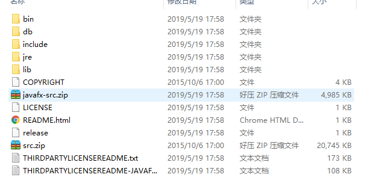

# 序章

<!-- toc -->

### Java简介

#### Java体系平台

1. Java的特点：

   + 面向对象

     + 两个基本概念：类、对象
     + 三大特征：封装、继承、多态

   + 健壮性

     提供了一个相对安全的内存管理和访问机制

   + 跨平台性

2. Java两种核心机制：

   + Java虚拟机

     + jvm是一个虚拟的计算机，具有指令集并使用不同的存储区域，负责执行指令，管理数据、内存、寄存器。

     + 对于不同的平台，有不同的虚拟机；

     + Java虚拟机机制屏蔽了底层运行的差别实现一次编译，到处运行。

       .java文件编译为.class文件，在进行执行：jvm for unix/windows/other

   + 垃圾回收机制

3. Java开发步骤：

   + 编写源代码：

     要求源代码保存到源文件中，源文件以“.java”结尾；

   + 编译：把源文件编译成1个或多个字节码文件

     字节码文件的扩展名是“.class”；

     编译的工具：javac.exe；

     编译命令的格式：javac Java源文件名.java

   + 运行字节码文件：

     运行工具：java.exe

     运行命令格式：java  java类名

     ​							java  字节码文件名

4. Java源文件的编辑：

   + 每一个源文件的格式：

     ```java
     类{
         方法{
             语句;
         }
     }
     ```

   + 类的格式：

     ```java
     class 类名{
         
     }
     ```

     ```java
     class HelloWorld{
         public static void main (String[] args){
             System.out.println("helloworld");
         }
     }
     ```


#### Java环境变量的配置

1. jdk目录结构：

   + jdk和jre：

     + jdk：Java开发工具集，jdk=jre + java开发工具
     + jre：Java运行环境，jre= jvm + 支持jvm的核心类库

   + jdk目录：

     

     + bin：

       二进制目录，在bin目录结构下保存的内容都是Java工具集；

       ​	javac.exe

       ​	java.exe

       ​	javadoc.exe

       ​	javap.exe

     + include：

       Java程序运行使用系统资源的接口文档，C语言；

     + jre：

       Java Runrime Envirment

     + lib：

       Library库，核心类库，支持jvm运行的一些内容

     + src.zip：

       Java源代码

2. Java环境变量配置:

   + JAVA_HOME：

     ​	C:\Java\jdk

   + CLASSPATH(jdk1.5以后不需要)：

     ​    .;%JAVA_HOME%\lib\dt.jar;%JAVA_HOME%\lib\tools.jar;

   + path：

     ​	%JAVA_HOME%\bin;%JAVA_HOME%\jre\bin;

### DOS命令

1. dir:

   查看当前工作目录中的子文件和子文件夹，如果文件之前有< DIR >，这就是一个文件夹;

2. cd：

   切换当前的工作路径；

   .和..的问题：

   ​	. 表示当前的工作目录；

   ​	.. 表示当前工作目录的父目录/上级目录；

3. mkdir：

   创建文件夹，可以同时创建多个文件夹，每一个文件夹的名字使用空格隔开；

4. rd（慎用）：

   a、删除文件夹时直接抹掉数据，而不是存到回收站；

   b、不能操作非空文件夹文件

5. echo：

   使用echo 123 > 1.txt，新建1.txt文件并将123写入到文件中；

6. del（慎用）：

   删除文件：

   ​	a、删除文件不是暂存于回收站，而是直接从硬盘上抹去数据

   ​	b、删除文件，必须是文件后缀名，删除文件是文件名.后缀名的完整格式；

7. *：

   通配符；

8. 方向键上下：

   回顾之前操作的命令

9. exit：

   退出，如果涉及到MySQL操作，一定使用exit；

10. cls：

    清屏；